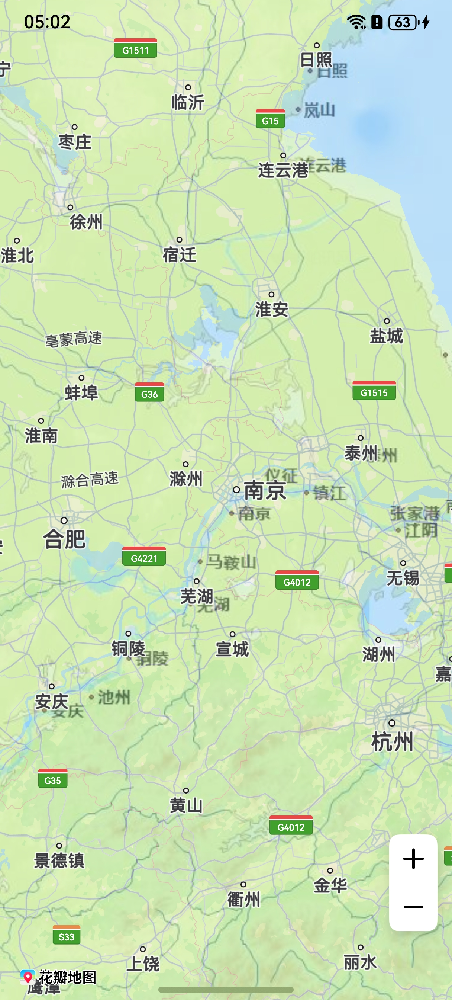

# 瓦片图层

更新时间：2026-05-18 03:44:20

来源：https://developer.huawei.com/consumer/cn/doc/harmonyos-guides/map-tile

#### 场景介绍

新增瓦片图层（TileOverlay）, 该图层支持添加自有瓦片数据，包括在线下载和本地加载两种方式。该图层可随地图的平移、缩放、旋转等操作做相应的变换，它仅位于底图之上（即瓦片图层将会遮挡底图，不遮挡其他图层），瓦片图层的添加顺序不会影响其他图层的叠加关系。

通过瓦片图层可对基础底层地图添加额外的特性，如：某个商场的室内信息、某个景区的详情等等。适用于开发者拥有某一区域的地图，并希望使用此区域地图覆盖相应位置的华为地图。

5.0.3(15)开始，支持瓦片图层功能。

6.0.0(20)开始，支持瓦片数据缓存功能。

从6.1.1(24)开始，支持高层级复用低层级瓦片的规则。





#### 接口说明

瓦片图层功能主要由[TileOverlayParams](https://developer.huawei.com/consumer/cn/doc/harmonyos-references/map-common#tileoverlayparams)、[TileOverlayOptions](https://developer.huawei.com/consumer/cn/doc/harmonyos-references/map-common#tileoverlayoptions)、[addTileOverlay](https://developer.huawei.com/consumer/cn/doc/harmonyos-references/map-map-mapcomponentcontroller#addtileoverlay)和[TileOverlay](https://developer.huawei.com/consumer/cn/doc/harmonyos-references/map-map-tileoverlay)提供，更多接口及使用方法请参见[接口文档](https://developer.huawei.com/consumer/cn/doc/harmonyos-references/map-map-tileoverlay)。

| 接口名 | 描述 |
| --- | --- |
| TileOverlayParams | 瓦片图层参数。 |
| TileOverlayOptions | 瓦片图层参数。 |
| addTileOverlay(params: mapCommon.TileOverlayParams \| mapCommon.TileOverlayOptions): TileOverlay | 为地图增加瓦片图层。 |
| TileOverlay | 瓦片图层，支持更新和查询相关属性。 |


#### 开发步骤

瓦片图层的绘制方式提供两种方式：在线下载和本地加载。


#### 在线下载
1. 导入相关模块。

  
```text
import { map, mapCommon, MapComponent } from '@kit.MapKit';
import { AsyncCallback } from '@kit.BasicServicesKit';
```

2. 增加瓦片图层，在线下载方式需要设置在线瓦片的URL地址。

  
```text
@Entry
@Component
struct TileOverlayDemo {
  private mapOptions?: mapCommon.MapOptions;
  private mapController?: map.MapComponentController;
  private callback?: AsyncCallback<map.MapComponentController>;
  private tileOverlay?: map.TileOverlay;

  aboutToAppear(): void {
    this.mapOptions = {
      position: {
        target: {
          latitude: 31.98,
          longitude: 118.7
        },
        zoom: 7
      }
    }

    this.callback = async (err, mapController) => {
      if (!err) {
        this.mapController = mapController;
        let params: mapCommon.TileOverlayOptions = {
          // 设置地图瓦片图层的地址，必须是以http或者https开头的URL且包含占位符{x}、{y}和{z}
          // 需要替换为开发者自己的在线地址
          tileUrl: "https://xxx/xxx?x={x}&y={y}&z={z}",
          // 透明度
          transparency: 0.5,
          // 开启瓦片图层淡入
          fadeIn: true
        };
        try {
          this.tileOverlay = this.mapController?.addTileOverlay(params);
        } catch (e) {
          console.error(`code:${e.code}, message:${e.message}`);
        }
      } else {
        console.error(`Failed to initialize the map, code is：${err.code}, message is ${err.message}`);
      }
    }
  }

  build() {
    Stack() {
      Column() {
        MapComponent({ mapOptions: this.mapOptions, mapCallback: this.callback })
          .width('100%')
          .height('100%')
      }.width('100%')
    }.height('100%')
  }
}
```


#### 本地加载
1. 导入相关模块。

  
```text
import { mapCommon, map, MapComponent } from '@kit.MapKit';
import { AsyncCallback } from '@kit.BasicServicesKit';
```

2. 增加本地瓦片图层。

  
```text
@Entry
@Component
struct TileOverlayDemo {
  private mapOption?: mapCommon.MapOptions;
  private mapController?: map.MapComponentController;
  private callback?: AsyncCallback<map.MapComponentController>;
  private tileOverlay?: map.TileOverlay;

  aboutToAppear(): void {
    this.mapOption = {
      position: {
        target: {
          latitude: 31.98,
          longitude: 118.7
        },
        zoom: 7
      },
      scaleControlsEnabled: true
    }

    this.callback = async (err, mapController) => {
      if (!err) {
        this.mapController = mapController;
        let tileOverlayOption: mapCommon.TileOverlayOptions = {
          // 根据瓦片坐标获取瓦片，本地获取瓦片方式需开发者自行实现tileProvider方法
          tileProvider: this.tileProviderMethod,
          // 淡入淡出效果 true: 开启, false: 关闭
          fadeIn: true,
          // 透明度, 取值范围 0-1
          transparency: 0.5,
          // 可见性, true: 可见 false: 不可见
          visible: true
        }
        if (this.mapController !== undefined) {
          try {
            this.tileOverlay = this.mapController.addTileOverlay(tileOverlayOption);
          } catch (e) {
            console.error(`code:${e.code}, message:${e.message}`);
          }
        }
      } else {
        console.error(`Failed to initialize the map, code is：${err.code}, message is ${err.message}`);
      }
    }
  }

  // 需要开发者自实现tileProviderMethod方法，负责加载本地项目中的瓦片图资源
  private tileProviderMethod(x: number, y: number, z: number): Promise<ArrayBuffer> {
    return new Promise((resolve, reject) => {});
  }

  build() {
    Stack() {
      Column() {
        MapComponent({ mapOptions: this.mapOption, mapCallback: this.callback })
          .width('100%')
          .height('100%');
      }.width('100%')
    }.height('100%')
  }
}
```


#### 支持瓦片数据缓存
1. 导入相关模块。

  
```text
import { mapCommon, map, MapComponent } from '@kit.MapKit';
import { AsyncCallback } from '@kit.BasicServicesKit';
```

2. 增加瓦片图层。

  
```text
@Entry
@Component
struct TileOverlayDemo {
  private mapOption?: mapCommon.MapOptions;
  private mapController?: map.MapComponentController;
  private callback?: AsyncCallback<map.MapComponentController>;
  private tileOverlay?: map.TileOverlay;

  aboutToAppear(): void {
    this.mapOption = {
      position: {
        target: {
          latitude: 48.87278,
          longitude: 2.33016
        },
        zoom: 4
      },
      scaleControlsEnabled: true
    }

    this.callback = async (err, mapController) => {
      if (!err) {
        this.mapController = mapController;
        let options: mapCommon.TileOverlayOptions = {
          // 设置地图瓦片图层的地址，必须是以http或者https开头的URL且包含占位符{x}、{y}和{z}
          // 需要替换为开发者自己的在线地址
          tileUrl: "https://xxx/xxx?x={x}&y={y}&z={z}",
          // 是否开启磁盘缓存 true: 开启, false: 关闭
          diskCacheEnabled: true,
          // 磁盘缓存大小 默认大小 20480KB, 单位KB
          diskCacheSize: 20480,
          // 存放磁盘缓存的沙箱路径
          diskCachePath: this.getUIContext().getHostContext()?.databaseDir
        };
        if (this.mapController !== undefined) {
          try {
            this.tileOverlay = this.mapController.addTileOverlay(options);
          } catch (e) {
            console.error(`code:${e.code}, message:${e.message}`);
          }
        }
      } else {
        console.error(`Failed to initialize the map, code is：${err.code}, message is ${err.message}`);
      }
    }
  }

  aboutToDisappear(): void {
    if (this.tileOverlay) {
      this.tileOverlay.remove();
      // 清除内存缓存
      this.tileOverlay.clearTileCache();
      // 清除磁盘和内存缓存
      this.tileOverlay.clearDiskCache();
   }
 }

  build() {
    Stack() {
      Column() {
        MapComponent({ mapOptions: this.mapOption, mapCallback: this.callback })
          .width('100%')
          .height('100%');
      }.width('100%')
    }.height('100%')
  }
}
```


#### 支持高层级复用低层级瓦片

高层级复用低层级瓦片能力，可在低性能设备上有效降低计算与渲染负担，并在弱网环境下减少对带宽的依赖，从而实现瓦片的快速加载，提升地图显示的流畅性与响应速度。

定义高层级复用低层级瓦片的规则。

```text
let params: mapCommon.TileOverlayOptions = {
  // 开发者的地图瓦片图层地址，必须使用以http或者https开头的URL地址，且需包含?x={x}&y={y}&z={z}格式的占位符
  tileUrl: "https://xxx/xxx?x={x}&y={y}&z={z}",
  diskCacheEnabled: true,
  diskCacheSize: 20480,
  diskCachePath: '/data/storage/el2/database',
  // 高层级复用低层级瓦片的配置项
  tileDataReuse: [ 2, 3, 4, 5, 6, 6, 6, 6, 6, 6, 6, 6, 7, 7, 7, 7, 7, 7, 7 ]
};
```
