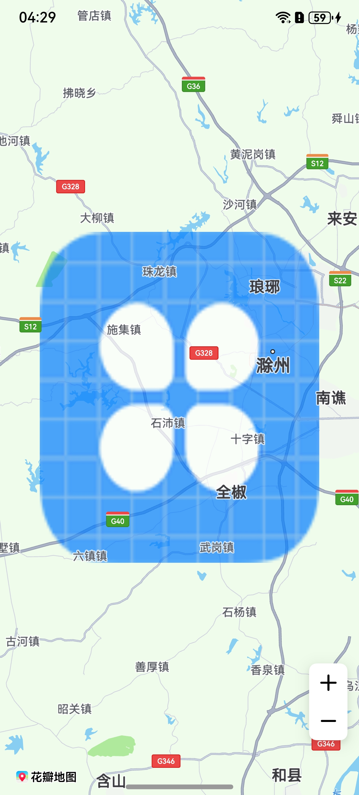

# 覆盖物

更新时间：2026-04-20 06:34:33

来源：https://developer.huawei.com/consumer/cn/doc/harmonyos-guides/map-coverings

## 场景介绍

地图覆盖物是固定在地图上的图片，本章节将向您介绍如何为地图增加覆盖物。 覆盖物，是一种位于底图和底图标注层之间的特殊Overlay，该图层不会遮挡地图标注信息。通过[ImageOverlayParams](https://developer.huawei.com/consumer/cn/doc/harmonyos-references/map-common#imageoverlayparams)类来设置，开发者可以通过[ImageOverlayParams](https://developer.huawei.com/consumer/cn/doc/harmonyos-references/map-common#imageoverlayparams)类设置一张图片，该图片可随地图的平移、缩放、旋转等操作做相应的变换。


## 接口说明

增加覆盖物功能主要由[ImageOverlayParams](https://developer.huawei.com/consumer/cn/doc/harmonyos-references/map-common#imageoverlayparams)、[addImageOverlay](https://developer.huawei.com/consumer/cn/doc/harmonyos-references/map-map-mapcomponentcontroller#addimageoverlay)、[ImageOverlay](https://developer.huawei.com/consumer/cn/doc/harmonyos-references/map-map-imageoverlay)提供，更多接口及使用方法请参见[接口文档](https://developer.huawei.com/consumer/cn/doc/harmonyos-references/map-map-imageoverlay)。
| 接口名 | 描述 |
| --- | --- |
| [ImageOverlayParams](https://developer.huawei.com/consumer/cn/doc/harmonyos-references/map-common#imageoverlayparams) | 覆盖物参数。 |
| [addImageOverlay](https://developer.huawei.com/consumer/cn/doc/harmonyos-references/map-map-mapcomponentcontroller#addimageoverlay)(params: [mapCommon.ImageOverlayParams](https://developer.huawei.com/consumer/cn/doc/harmonyos-references/map-common#imageoverlayparams)): Promise | 为地图增加覆盖物。 |
| [ImageOverlay](https://developer.huawei.com/consumer/cn/doc/harmonyos-references/map-map-imageoverlay) | 覆盖物，支持更新和查询相关属性。 |


## 开发步骤

导入相关模块。
```text
import { map, mapCommon, MapComponent } from '@kit.MapKit';
import { AsyncCallback } from '@kit.BasicServicesKit';
```

增加覆盖物。
```text
@Entry
@Component
struct ImageOverlayDemo {
  private mapOptions?: mapCommon.MapOptions;
  private mapController?: map.MapComponentController;
  private callback?: AsyncCallback;
  private mapEventManager?: map.MapEventManager;

  aboutToAppear(): void {
    this.mapOptions = {
      position: {
        target: {
          latitude: 32.2,
          longitude: 118.2
        },
        zoom: 10
      }
    }

    this.callback = async (err, mapController) => {
      if (!err) {
        this.mapController = mapController;
        this.mapEventManager = this.mapController.getEventManager();
        let imageOverlayParams: mapCommon.ImageOverlayParams = {
          // 覆盖物范围
          bounds: {
            southwest: {
              latitude: 32,
              longitude: 118
            },
            northeast: {
              latitude: 32.4,
              longitude: 118.4
            }
          },
          // 覆盖物图片，图标需存放在resources/rawfile目录下
          image: 'icon/icon.png',
          transparency: 0.3,
          zIndex: 101,
          anchorU: 0.5,
          anchorV: 0.5,
          clickable: true,
          visible: true,
          bearing: 0
        };
        // 添加覆盖物
        try {
          let imageOverlay = await this.mapController?.addImageOverlay(imageOverlayParams);
        } catch (e) {
          console.error(`Failed to create the imageOverlay, code is：${e.code}, message is ${e.message}`);
        }
      } else {
        console.error(`Failed to initialize the map, code is：${err.code}, message is ${err.message}`);
      }
    }
  }
  build() {
    Stack() {
      Column() {
        MapComponent({
          mapOptions: this.mapOptions,
          mapCallback: this.callback,
        })
          .width('100%')
          .height('100%');
      }.width('100%')
    }.height('100%')
  }
}
```

设置覆盖物点击监听事件。
```text
let imageOverlayCallback: Callback = (imageOverlay: map.ImageOverlay) => {
  console.info("imageOverlay callback");
}
// 打开覆盖物的点击监听
this.mapEventManager.on("imageOverlayClick", imageOverlayCallback);
// 关闭覆盖物的点击监听
this.mapEventManager.off("imageOverlayClick", imageOverlayCallback);
```
