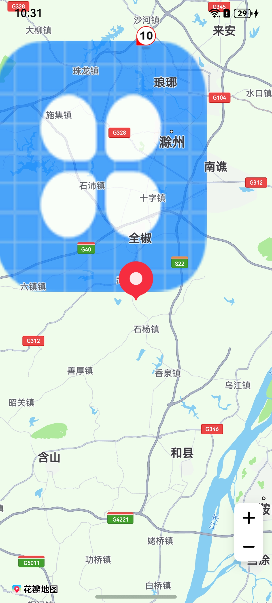

# 设置地图元素压盖顺序

更新时间：2026-04-20 06:34:33

来源：https://developer.huawei.com/consumer/cn/doc/harmonyos-guides/map-display-order

## 场景介绍

本章节将向您介绍如何设置地图元素的层级压盖关系。 设置地图元素的显示顺序，按照从低到高排列，即后面的地图元素会压盖前面的地图元素。

**表1** 地图元素类型压盖顺序
| 枚举 | 枚举值 | 枚举含义 |
| --- | --- | --- |
| OVERLAY | 1 | 覆盖物，包括[MapCircle](https://developer.huawei.com/consumer/cn/doc/harmonyos-references/map-map-mapcircle)、[MapPolygon](https://developer.huawei.com/consumer/cn/doc/harmonyos-references/map-map-mappolygon)、[MapPolyline](https://developer.huawei.com/consumer/cn/doc/harmonyos-references/map-map-mappolyline)、[MapArc](https://developer.huawei.com/consumer/cn/doc/harmonyos-references/map-map-maparc)、[ImageOverlay](https://developer.huawei.com/consumer/cn/doc/harmonyos-references/map-map-imageoverlay)、[TraceOverlay](https://developer.huawei.com/consumer/cn/doc/harmonyos-references/map-map-traceoverlay)。 |
| POI | 2 | 底图[Poi](https://developer.huawei.com/consumer/cn/doc/harmonyos-references/map-common#poi)。 |
| CUSTOM_POI | 3 | 支持碰撞的覆盖物，包括[PointAnnotation](https://developer.huawei.com/consumer/cn/doc/harmonyos-references/map-map-pointannotation)、[Bubble](https://developer.huawei.com/consumer/cn/doc/harmonyos-references/map-map-bubble)。 |
| MARKER | 4 | 包括[Marker](https://developer.huawei.com/consumer/cn/doc/harmonyos-references/map-map-marker)、[ClusterOverlay](https://developer.huawei.com/consumer/cn/doc/harmonyos-references/map-map-clusteroverlay)。 |


## 接口说明

设置层级压盖关系功能主要由[MapElementType](https://developer.huawei.com/consumer/cn/doc/harmonyos-references/map-common#mapelementtype)、[setDisplayOrder](https://developer.huawei.com/consumer/cn/doc/harmonyos-references/map-map-mapcomponentcontroller#setdisplayorder)提供，更多接口及使用方法请参见[接口文档](https://developer.huawei.com/consumer/cn/doc/harmonyos-references/map-map-mapcomponentcontroller#setdisplayorder)。
| 接口名 | 描述 |
| --- | --- |
| [mapCommon.MapElementType](https://developer.huawei.com/consumer/cn/doc/harmonyos-references/map-common#mapelementtype) | 地图元素类型。 |
| [setDisplayOrder](https://developer.huawei.com/consumer/cn/doc/harmonyos-references/map-map-mapcomponentcontroller#setdisplayorder)(types: Array): void | 设置地图元素的显示顺序。 |


## 开发步骤

导入相关模块。
```text
import { mapCommon, map, MapComponent } from '@kit.MapKit';
import { AsyncCallback } from '@kit.BasicServicesKit';
```

设置地图元素层级压盖关系。
```text
@Entry
@Component
struct MarkerDemo {
  private mapOptions?: mapCommon.MapOptions;
  private mapController?: map.MapComponentController;
  private callback?: AsyncCallback;
  private mapEventManager?: map.MapEventManager;
  private marker?: map.Marker;
  private bubble?: map.Bubble;

  aboutToAppear(): void {
    // 地图初始化参数
    this.mapOptions = {
      position: {
        target: {
          latitude: 31.984410259206815,
          longitude: 118.26625379397866
        },
        zoom: 10
      }
    };
    this.callback = async (err, mapController) => {
      if (!err) {
        this.mapController = mapController;
        this.mapEventManager = this.mapController.getEventManager();
        // Marker初始化参数
        let markerOptions: mapCommon.MarkerOptions = {
          position: {
            latitude: 31.984410259206815,
            longitude: 118.26625379397866
          },
          rotation: 0,
          visible: true,
          zIndex: 0,
          alpha: 1,
          anchorU: 0.5,
          anchorV: 1,
          clickable: true,
          draggable: true,
          flat: false
        };
        // 创建Marker
        try {
          this.marker = await this.mapController.addMarker(markerOptions);
        } catch (e) {
          console.error(`Failed to create the marker, code is：${e.code}, message is ${e.message}`);
        }
        let bubbleOptions: mapCommon.BubbleParams = {
          // 气泡位置
          positions: [[{
            latitude: 32.384410259206815,
            longitude: 118.26625379397866
          }]],
          // 设置图标，必须提供4个方向的图标，图标存放在resources/rawfile
          icons: [
            'speed_limit_10.png',
            'speed_limit_20.png',
            'speed_limit_30.png',
            'speed_limit_40.png'
          ],
          // 定义气泡的显示属性，为true时，在被碰撞后仍能显示
          forceVisible: true,
          // 定义气泡碰撞优先级，数值越大，优先级越低
          priority: 3,
          // 定义气泡展示的最小层级
          minZoom: 2,
          // 定义气泡展示的最大层级
          maxZoom: 20,
          // 定义气泡是否可见
          visible: true,
          // 定义气泡叠加层级属性
          zIndex: 1
        }
        // 添加气泡
        try {
          this.bubble = await this.mapController.addBubble(bubbleOptions);
        } catch (e) {
          console.error(`Failed to create the bubble, code is：${e.code}, message is ${e.message}`);
        }
        let imageOverlayParams: mapCommon.ImageOverlayParams = {
          // 覆盖物范围
          bounds: {
            southwest: {
              latitude: 32,
              longitude: 118
            },
            northeast: {
              latitude: 32.4,
              longitude: 118.4
            }
          },
          // 覆盖物图片
          image: 'icon/icon.png',
          transparency: 0.3,
          zIndex: 101,
          anchorU: 0.5,
          anchorV: 0.5,
          clickable: true,
          visible: true,
          bearing: 0
        };
        // 添加覆盖物
        try {
          await this.mapController?.addImageOverlay(imageOverlayParams);
        } catch (e) {
          console.error(`Failed to create the imageOverlay, code is：${e.code}, message is ${e.message}`);
        }

        // 设置压盖顺序，最底层的是覆盖物，后面依次是POI、支持碰撞的覆盖物和Marker，Marker在最表面一层
        let mapElementTypeArr: Array = [
          mapCommon.MapElementType.OVERLAY,
          mapCommon.MapElementType.POI,
          mapCommon.MapElementType.CUSTOM_POI,
          mapCommon.MapElementType.MARKER];
        this.mapController.setDisplayOrder(mapElementTypeArr);
      } else {
        console.error(`Failed to initialize the map, code is：${err.code}, message is ${err.message}`);
      }
    }
  }

  build() {
    Stack() {
      Column() {
        MapComponent({ mapOptions: this.mapOptions, mapCallback: this.callback });
      }.width('100%')
    }.height('100%')
  }
}
```
