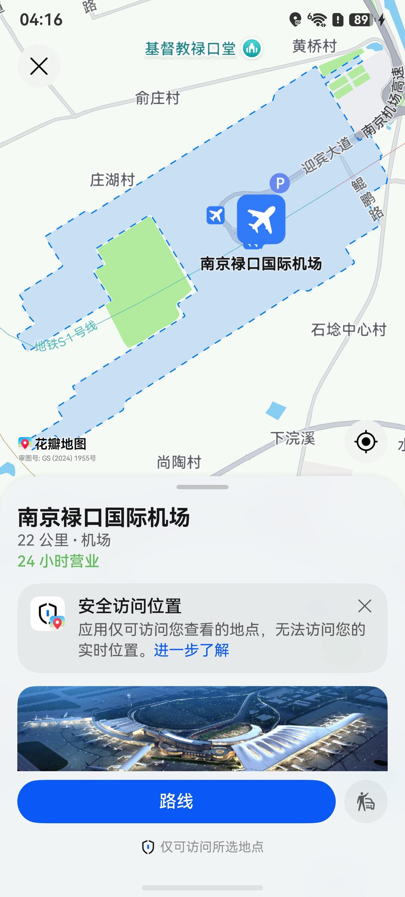

# 地点详情展示

更新时间：2026-04-24 08:10:21

来源：https://developer.huawei.com/consumer/cn/doc/harmonyos-guides/map-location-details

#### 场景介绍

本章节介绍如何集成地点详情展示控件。该控件提供便捷的地点详情展示功能以及导航和打车服务入口，开发者无需自行开发地图页面，即可实现用户点击“路线”按钮启动导航，或点击“打车”按钮发起打车。

**图1** 地点详情





#### 约束与限制

使用该功能需满足以下条件：

 - 仅支持手机、平板和2in1设备。


#### 接口说明

地点详情控件功能主要由[sceneMap](https://developer.huawei.com/consumer/cn/doc/harmonyos-references/map-scenemap)命名空间下的[queryLocation](https://developer.huawei.com/consumer/cn/doc/harmonyos-references/map-scenemap#querylocation)方法提供，更多接口及使用方法请参见[接口文档](https://developer.huawei.com/consumer/cn/doc/harmonyos-references/map-scenemap)。

| 接口名 | 描述 |
| --- | --- |
| LocationQueryOptions | 查询地点详情的参数。 |
| queryLocation(context: common.UIAbilityContext, options: LocationQueryOptions): Promise&lt;void&gt; | 查询地点详情。 |


#### 开发步骤
1. 导入相关模块。

  
```text
import { sceneMap } from '@kit.MapKit';
import { BusinessError } from '@kit.BasicServicesKit';
import { common } from '@kit.AbilityKit';
```

2. 创建查询地点详情参数，调用[queryLocation](https://developer.huawei.com/consumer/cn/doc/harmonyos-references/map-scenemap#querylocation)方法拉起地点详情页。

  
```text
// 方式一：传入siteId
let queryLocationOptions: sceneMap.LocationQueryOptions = {
  siteId: "922207154068557824"
};
// 拉起地点详情页
sceneMap.queryLocation(this.getUIContext().getHostContext() as common.UIAbilityContext, queryLocationOptions)
  .then(() => {
    console.info("QueryLocation", "Succeeded in querying location.");
  })
  .catch((err: BusinessError) => {
    console.error("QueryLocation", `Failed to query Location, code: ${err.code}, message: ${err.message}`);
  });

// 方式二：传入location和name
let queryLocationOptions: sceneMap.LocationQueryOptions = {
  location: {
    latitude: 39.9175,
    longitude: 116.3972
  },
  name: '故宫博物院'
};
// 拉起地点详情页
sceneMap.queryLocation(this.getUIContext().getHostContext() as common.UIAbilityContext, queryLocationOptions)
  .then(() => {
    console.info("QueryLocation", "Succeeded in querying location.");
  })
  .catch((err: BusinessError) => {
    console.error("QueryLocation", `Failed to query Location, code: ${err.code}, message: ${err.message}`);
  });
```
