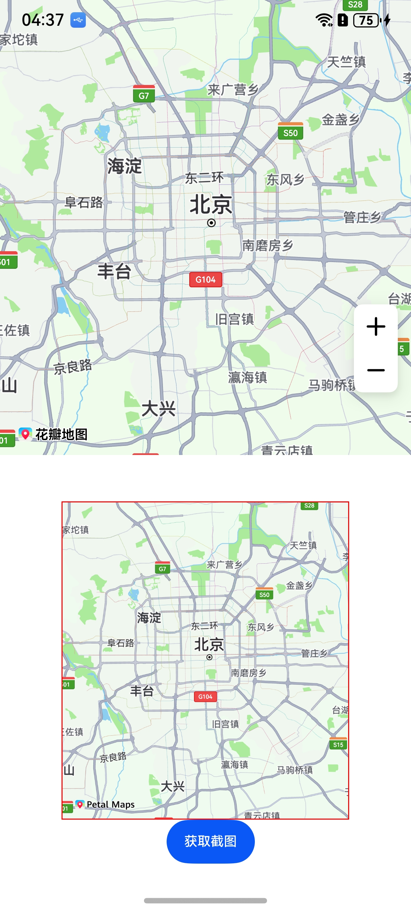

# 地图截图

更新时间：2026-05-18 03:44:20

来源：https://developer.huawei.com/consumer/cn/doc/harmonyos-guides/map-screenshots

本章节将向您介绍如何实现地图截图功能。
地图截图指对当前屏幕显示区域进行截屏，支持对地图、覆盖物、Logo进行屏幕截图。地图截图功能适用于需要将当前地图状态保存为图片的场景，如分享当前位置、生成导航路线图、记录特定视角的地图内容等。该功能可以帮助开发者快速实现地图内容的可视化输出，提升用户体验

#### 接口说明
以下是地图截图相关接口，以下功能主要由[snapshot](https://developer.huawei.com/consumer/cn/doc/harmonyos-references/map-map-mapcomponentcontroller#snapshot)提供，更多接口及使用方法请参见[接口文档](https://developer.huawei.com/consumer/cn/doc/harmonyos-references/map-map-mapcomponentcontroller#snapshot)。

| 接口名 | 描述 |
| --- | --- |
| [snapshot](https://developer.huawei.com/consumer/cn/doc/harmonyos-references/map-map-mapcomponentcontroller#snapshot)(): Promise<[image.PixelMap](https://developer.huawei.com/consumer/cn/doc/harmonyos-references/arkts-apis-image-pixelmap)> | 地图截图。 |

#### 开发步骤
1. 导入相关模块。 import { MapComponent, mapCommon, map } from '@kit.MapKit';
import { AsyncCallback } from '@kit.BasicServicesKit';
import { image } from '@kit.ImageKit';
2. 调用snapshot方法对当前屏幕进行截图。 @Entry
@Component
struct HuaweiMapDemo {
  private mapOptions?: mapCommon.MapOptions;
  private callback?: AsyncCallback&lt;map.MapComponentController&gt;;
  private mapController?: map.MapComponentController;
  @State image?: image.PixelMap = undefined;

  aboutToAppear(): void {
 // 地图初始化参数，设置地图中心点坐标及层级
 this.mapOptions = {
 position: {
 target: {
 latitude: 39.9,
 longitude: 116.4
 },
 zoom: 10
 }
 };

 // 地图初始化的回调
 this.callback = async (err, mapController) => {
 if (!err) {
 // 获取地图的控制器类，用来操作地图
 this.mapController = mapController;
 } else {
 console.error(`Failed to initialize the map, code is：${err.code}, message is ${err.message}`);
 }
 };
  }

  build() {
 Stack() {
 Column() {
 MapComponent({ mapOptions: this.mapOptions, mapCallback: this.callback })
 .width('100%')
 .height('50%');

 Scroll(new Scroller()) {
 Column() {
 Image(this.image)
 .objectFit(ImageFit.Auto)
 .border({ width: 1, color: Color.Red }).width("100%")
 Button("获取截图")
 .margin({ left: 10 })
 .fontSize(12)
 .onClick(async () => {
 if (this.mapController) {
 // 获取截图
 let pixelMap = await this.mapController.snapshot();
 this.image = pixelMap;
 }
 });
 }
 }.width('70%').height("50%")
 }.width('100%')
 }.height('100%')
  }
}