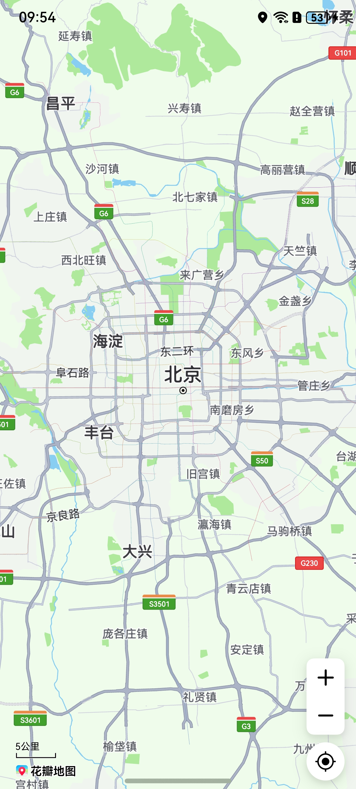

# 手势交互

更新时间：2026-04-20 06:34:33

来源：https://developer.huawei.com/consumer/cn/doc/harmonyos-guides/map-controls-and-gestures

#### 场景介绍

本章节将向您介绍如何使用地图的手势。

Map Kit提供了多种手势供用户与地图之间进行交互，如缩放、滚动、旋转和倾斜。这些手势默认开启，如果想要关闭某些手势，可以通过[MapComponentController](https://developer.huawei.com/consumer/cn/doc/harmonyos-references/map-map-mapcomponentcontroller)类提供的接口来控制手势的开关。





#### 接口说明

以下是地图手势相关接口，该功能有2种实现方式：

 - 地图初始化时，可在初始化参数[MapOptions](https://developer.huawei.com/consumer/cn/doc/harmonyos-references/map-common#mapoptions)中设置是否启用手势功能，详细讲解见[显示地图](https://developer.huawei.com/consumer/cn/doc/harmonyos-guides/map-presenting)章节。
 - 通过调用[MapComponentController](https://developer.huawei.com/consumer/cn/doc/harmonyos-references/map-map-mapcomponentcontroller)提供的set方法实现相关手势的开启或关闭。


| 接口名 | 描述 |
| --- | --- |
| setZoomGesturesEnabled(enabled: boolean): void | 设置是否启用缩放手势。 默认值为true。 |
| setScrollGesturesEnabled(enabled: boolean): void | 设置是否启用滚动手势。 默认值为true。 |
| setRotateGesturesEnabled(enabled: boolean): void | 设置是否启用旋转手势。 默认值为true。 |
| setTiltGesturesEnabled(enabled: boolean): void | 设置是否启用倾斜手势。 默认值为true。 |
| setAllGesturesEnabled(enabled: boolean): void | 设置手势是否可用。 默认值为true。 |


#### 开发步骤

mapController对象在初始化地图时获取，初始化地图功能在[显示地图](https://developer.huawei.com/consumer/cn/doc/harmonyos-guides/map-presenting)章节中有详细讲解。


#### 地图手势控制

您可以通过mapController对象来启用或禁止相关的地图手势。

**缩放手势：**

用户可以通过用双指捏合，实现放大缩小地图。

```text
this.mapController.setZoomGesturesEnabled(true);
```

**滚动平移手势：**

用户可以通过用手指拖动地图来进行移动。

```text
this.mapController.setScrollGesturesEnabled(true);
```

**旋转手势：**

用户可以通过将两个手指放在地图上旋转来旋转地图。

```text
this.mapController.setRotateGesturesEnabled(true);
```

**倾斜手势：**

用户可以通过将两个手指放在地图上下滑动来倾斜地图。

```text
this.mapController.setTiltGesturesEnabled(true);
```

**启用或禁止所有手势：**

通过调用[setAllGesturesEnabled](https://developer.huawei.com/consumer/cn/doc/harmonyos-references/map-map-mapcomponentcontroller#setallgesturesenabled)方法，可启用或禁止所有手势。

```text
// 禁止所有手势
this.mapController.setAllGesturesEnabled(false);
```
