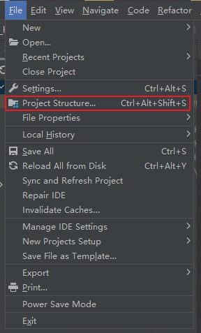
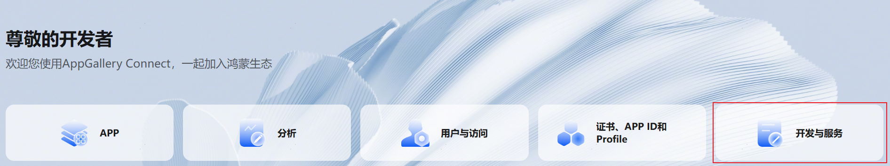
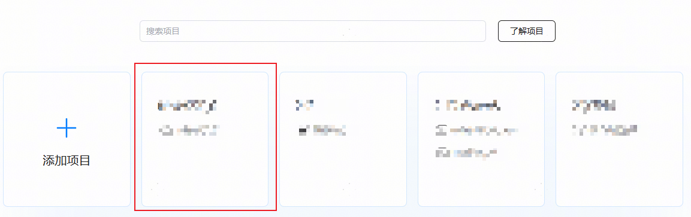
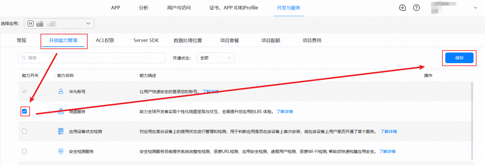

# 开发准备

更新时间：2026-06-27 10:02:54

来源：https://developer.huawei.com/consumer/cn/doc/harmonyos-guides/map-config-agc

请优先[开通地图服务](#开通地图服务)后，再参考“[应用开发准备](https://developer.huawei.com/consumer/cn/doc/harmonyos-guides/application-dev-overview)”完成基本准备工作，然后再继续进行以下开发活动。
 
> [!NOTE]
> 从HarmonyOS 5.0.2(14)版本开始，开发者无需配置公钥指纹和Client ID。 从DevEco Studio 6.0.0 Beta5版本开始，支持在DevEco Studio中开通地图服务。

  

#### 开通地图服务

Map Kit提供2种方式开通地图服务：
 
- 通过DevEco Studio开通地图服务。
- 通过AppGallery Connect网站开通地图服务。

 
方式一：通过DevEco Studio开通地图服务
 1. 登录DevEco Studio应用。

  

2. 选择文件，点击项目结构。

  

3. 进入“Signing Configs”页面，点击“Enable open capabilities”。

  

4. 勾选“Map Kit”选项，点击“OK”。

  

5. 选择“Apply”应用地图服务配置，点击“OK”完成地图服务配置。

  

 
方式二：通过AppGallery Connect网站开通地图服务。
 1. 登录[AppGallery Connect](https://developer.huawei.com/consumer/cn/service/josp/agc/index.html)网站，选择“开发与服务”。

  

2. 在项目列表中找到您的项目，在项目下的应用列表中选择需要打开“地图服务”的应用。

  

3. 选择开放能力管理，找到“地图服务”开关，打开开关。

  

4. 确认已经开启“地图服务”开放能力，并完成签名。

  
调试阶段必须[申请调试证书](https://developer.huawei.com/consumer/cn/doc/app/agc-help-add-debugcert-0000001914263178)、[注册设备](https://developer.huawei.com/consumer/cn/doc/app/agc-help-add-device-0000002283189937)、开启"地图服务"后重新[申请调试Profile文件](https://developer.huawei.com/consumer/cn/doc/app/agc-help-debug-profile-0000002248181278)，并完成[手动签名](https://developer.huawei.com/consumer/cn/doc/harmonyos-guides/ide-signing#section297715173233)。
5. 发布前请确保开通地图服务，然后请参考[发布应用](https://developer.huawei.com/consumer/cn/doc/harmonyos-guides/ide-publish-app)。
> [!NOTE]
> 若使用原有的Profile文件，请确保在申请Profile文件之前已开启“地图服务”。
