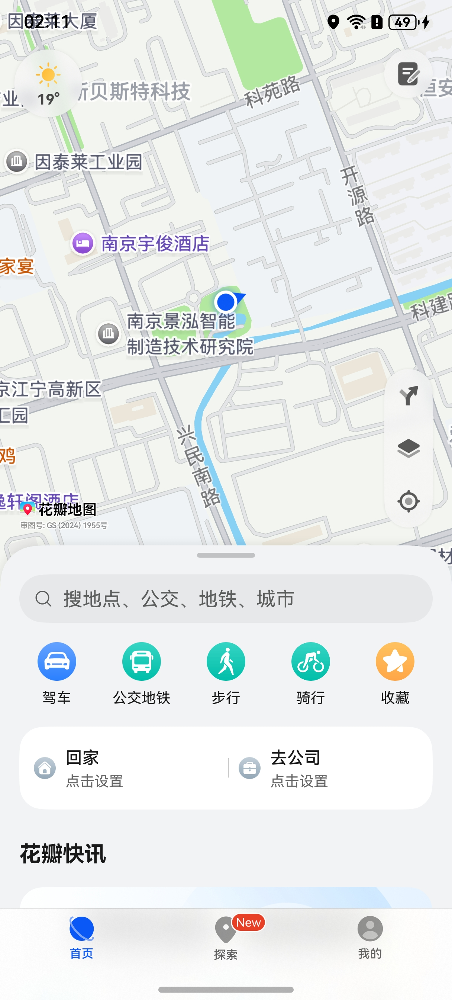
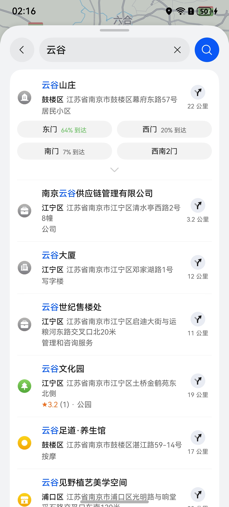
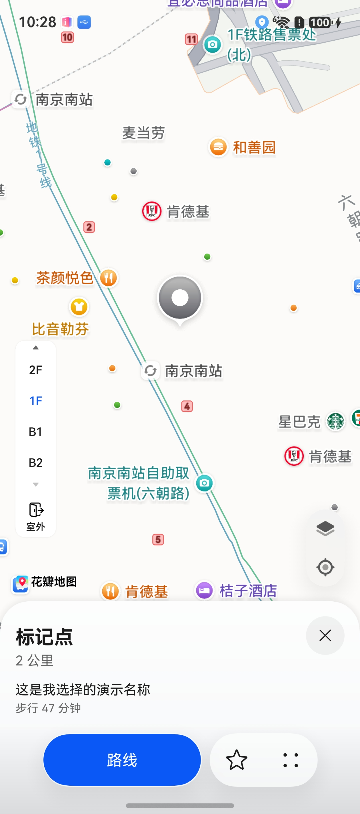
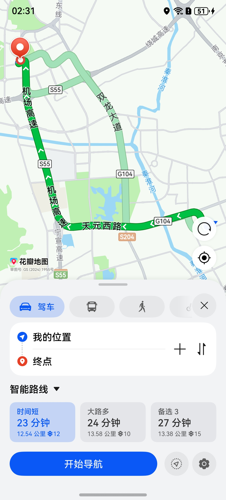
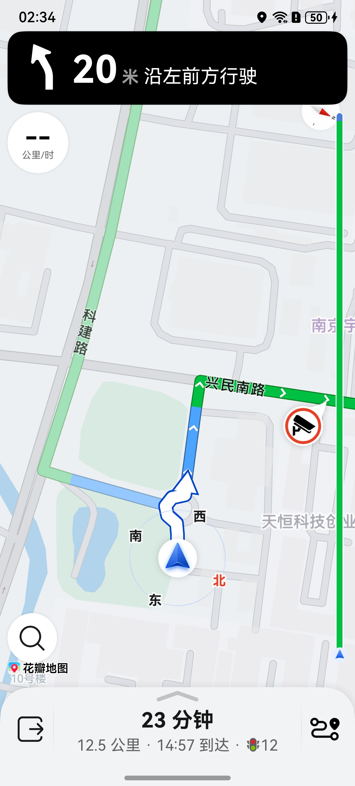
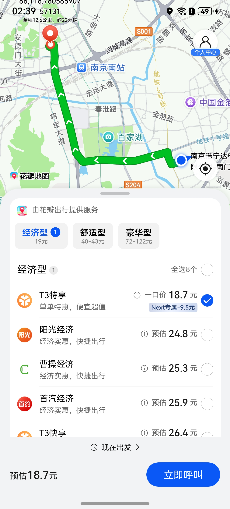
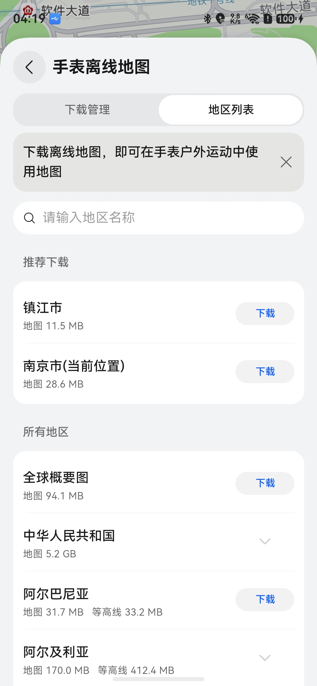
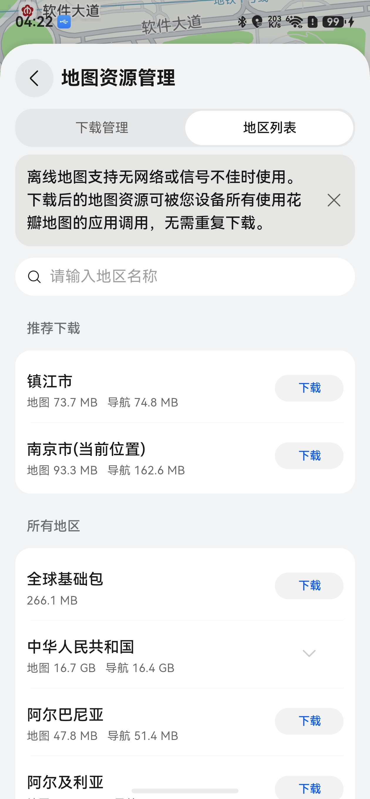
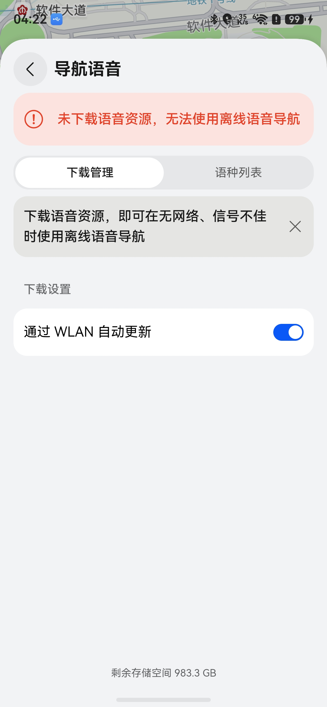

# 通过地图应用实现导航等能力

更新时间：2026-04-30 02:41:24

来源：https://developer.huawei.com/consumer/cn/doc/harmonyos-guides/map-petalmaps

## 场景介绍

从5.0.3(15)开始，支持地图应用首页、搜索地点、查看地点详情、规划路线和进行导航功能；从6.0.1(21)开始，支持地图应用发起打车功能；从6.1.1(24)开始，打开地图应用查看地点详情支持终点描述，支持拉起地图应用离线地图管理页面。 本章节将向您介绍如何打开地图应用实现如下能力： 打开地图应用首页 打开地图应用搜索地点 打开地图应用查看地点详情 打开地图应用规划路线 打开地图应用进行导航 打开地图应用发起打车 打开地图应用离线数据管理页面

## 接口说明

调用地图应用的功能主要通过[petalMaps](https://developer.huawei.com/consumer/cn/doc/harmonyos-references/map-petal-maps)命名空间下的[openMapHomePage](https://developer.huawei.com/consumer/cn/doc/harmonyos-references/map-petal-maps#openmaphomepage)、[openMapTextSearch](https://developer.huawei.com/consumer/cn/doc/harmonyos-references/map-petal-maps#openmaptextsearch)、[openMapPoiDetail](https://developer.huawei.com/consumer/cn/doc/harmonyos-references/map-petal-maps#openmappoidetail)、[openMapRoutePlan](https://developer.huawei.com/consumer/cn/doc/harmonyos-references/map-petal-maps#openmaprouteplan)、[openMapNavi](https://developer.huawei.com/consumer/cn/doc/harmonyos-references/map-petal-maps#openmapnavi)、[openMapTaxi](https://developer.huawei.com/consumer/cn/doc/harmonyos-references/map-petal-maps#openmaptaxi)、[openMapOfflineDataManagement](https://developer.huawei.com/consumer/cn/doc/harmonyos-references/map-petal-maps#openmapofflinedatamanagement)等接口实现，更多接口及使用方法请参见[接口文档](https://developer.huawei.com/consumer/cn/doc/harmonyos-references/map-petal-maps)。
| 接口说明 | 描述 |
| --- | --- |
| [TextSearchParams](https://developer.huawei.com/consumer/cn/doc/harmonyos-references/map-petal-maps#textsearchparams) | 文本搜索的参数。 |
| [PoiDetailParams](https://developer.huawei.com/consumer/cn/doc/harmonyos-references/map-petal-maps#poidetailparams) | POI详情的参数。 |
| [RoutePlanParams](https://developer.huawei.com/consumer/cn/doc/harmonyos-references/map-petal-maps#routeplanparams) | 路线规划的参数。 |
| [NaviParams](https://developer.huawei.com/consumer/cn/doc/harmonyos-references/map-petal-maps#naviparams) | 导航的参数。 |
| [TaxiParams](https://developer.huawei.com/consumer/cn/doc/harmonyos-references/map-petal-maps#taxiparams) | 打车的参数。 |
| [OfflineDataParams](https://developer.huawei.com/consumer/cn/doc/harmonyos-references/map-petal-maps#offlinedataparams) | 离线数据管理参数。 |
| [openMapHomePage](https://developer.huawei.com/consumer/cn/doc/harmonyos-references/map-petal-maps#openmaphomepage)(context: [common.Context](https://developer.huawei.com/consumer/cn/doc/harmonyos-references/js-apis-inner-application-context)): Promise | 打开地图应用首页。 |
| [openMapTextSearch](https://developer.huawei.com/consumer/cn/doc/harmonyos-references/map-petal-maps#openmaptextsearch)(context: [common.Context](https://developer.huawei.com/consumer/cn/doc/harmonyos-references/js-apis-inner-application-context), textSearchParams: [TextSearchParams](https://developer.huawei.com/consumer/cn/doc/harmonyos-references/map-petal-maps#textsearchparams)): Promise | 打开地图应用搜索地点。 |
| [openMapPoiDetail](https://developer.huawei.com/consumer/cn/doc/harmonyos-references/map-petal-maps#openmappoidetail)(context: [common.Context](https://developer.huawei.com/consumer/cn/doc/harmonyos-references/js-apis-inner-application-context), poiDetailParams: [PoiDetailParams](https://developer.huawei.com/consumer/cn/doc/harmonyos-references/map-petal-maps#poidetailparams)): Promise | 打开地图应用查看地点详情。 |
| [openMapRoutePlan](https://developer.huawei.com/consumer/cn/doc/harmonyos-references/map-petal-maps#openmaprouteplan)(context: [common.Context](https://developer.huawei.com/consumer/cn/doc/harmonyos-references/js-apis-inner-application-context), routePlanParams: [RoutePlanParams](https://developer.huawei.com/consumer/cn/doc/harmonyos-references/map-petal-maps#routeplanparams)): Promise | 打开地图应用规划路线。 |
| [openMapNavi](https://developer.huawei.com/consumer/cn/doc/harmonyos-references/map-petal-maps#openmapnavi)(context: [common.Context](https://developer.huawei.com/consumer/cn/doc/harmonyos-references/js-apis-inner-application-context), naviParams: [NaviParams](https://developer.huawei.com/consumer/cn/doc/harmonyos-references/map-petal-maps#naviparams)): Promise | 打开地图应用进行导航。 |
| [openMapTaxi](https://developer.huawei.com/consumer/cn/doc/harmonyos-references/map-petal-maps#openmaptaxi)(context: [common.Context](https://developer.huawei.com/consumer/cn/doc/harmonyos-references/js-apis-inner-application-context), taxiParams: [TaxiParams](https://developer.huawei.com/consumer/cn/doc/harmonyos-references/map-petal-maps#taxiparams)): Promise | 打开地图应用打车页面。 |
| [openMapOfflineDataManagement](https://developer.huawei.com/consumer/cn/doc/harmonyos-references/map-petal-maps#openmapofflinedatamanagement)(context: [common.Context](https://developer.huawei.com/consumer/cn/doc/harmonyos-references/js-apis-inner-application-context), offlineDataParams: [OfflineDataParams](https://developer.huawei.com/consumer/cn/doc/harmonyos-references/map-petal-maps#offlinedataparams)): Promise | 打开地图应用的离线数据管理页面。 |


## 地图应用使用的坐标类型

在国内站点，中国大陆使用GCJ02坐标系，中国台湾使用WGS84坐标系。 在海外站点，统一使用WGS84坐标系。坐标系转换参考：[坐标纠偏](https://developer.huawei.com/consumer/cn/doc/harmonyos-guides/map-convert-coordinate)。

## 开发步骤

导入相关模块
```text
import { petalMaps } from '@kit.MapKit'
```


## 打开地图应用首页

通过[openMapHomePage](https://developer.huawei.com/consumer/cn/doc/harmonyos-references/map-petal-maps#openmaphomepage)，打开地图应用首页。
```text
try {
  await petalMaps.openMapHomePage(this.getUIContext().getHostContext());
} catch (e) {
  console.error(`code:${e.code}, message:${e.message}`);
}
```

**图1** 打开地图应用首页


## 打开地图应用进行地点搜索

通过[openMapTextSearch](https://developer.huawei.com/consumer/cn/doc/harmonyos-references/map-petal-maps#openmaptextsearch)，传入搜索目标名称，打开地图应用进行地点搜索。
```text
try {
  let params: petalMaps.TextSearchParams = {
    destinationName: '云谷'
  };
  await petalMaps.openMapTextSearch(this.getUIContext().getHostContext(), params);
} catch (e) {
  console.error(`code:${e.code}, message:${e.message}`);
}
```

**图2** 打开地图应用进行地点搜索


## 打开地图应用查看地点详情

通过[openMapPoiDetail](https://developer.huawei.com/consumer/cn/doc/harmonyos-references/map-petal-maps#openmappoidetail)，传入地点的经纬度，打开地图应用查看地点详情。
```text
try {
  let params: petalMaps.PoiDetailParams = {
    destinationPosition: {
      latitude: 31.968789,
      longitude: 118.798537
    },
    destinationName: '标记点',
    zoom: 17,
    coordinateType: mapCommon.CoordinateType.GCJ02,
    destinationAddress: '这是我选择的演示名称'
  };
  await petalMaps.openMapPoiDetail(this.getUIContext().getHostContext(), params);
} catch (e) {
  console.error(`code:${e.code}, message:${e.message}`);
}
```

**图3** 打开地图应用查看地点详情


## 打开地图应用规划路线

通过[openMapRoutePlan](https://developer.huawei.com/consumer/cn/doc/harmonyos-references/map-petal-maps#openmaprouteplan)，传入终点经纬度，打开地图应用规划路线。
```text
try {
  let params: petalMaps.RoutePlanParams = {
    destinationPosition: {
      latitude: 31.983015468224288,
      longitude: 118.78058590757131
    }
  };
  await petalMaps.openMapRoutePlan(this.getUIContext().getHostContext(), params);
} catch (e) {
  console.error(`code:${e.code}, message:${e.message}`);
}
```

**图4** 打开地图应用规划路线


## 打开地图应用进行导航

通过[openMapNavi](https://developer.huawei.com/consumer/cn/doc/harmonyos-references/map-petal-maps#openmapnavi)，传入终点经纬度，打开地图应用发起导航。
```text
try {
  let params: petalMaps.NaviParams = {
    destinationPosition: {
      latitude: 31.983015468224288,
      longitude: 118.78058590757131
    }
  };
  await petalMaps.openMapNavi(this.getUIContext().getHostContext(), params);
} catch (e) {
  console.error(`code:${e.code}, message:${e.message}`);
}
```

**图5** 打开地图应用进行导航


## 打开地图应用打车页面

通过[openMapTaxi](https://developer.huawei.com/consumer/cn/doc/harmonyos-references/map-petal-maps#openmaptaxi)，传入终点经纬度，打开地图应用发起打车。
```text
try {
  let params: petalMaps.TaxiParams = {
    destinationPosition: {
      latitude: 31.983015468224288,
      longitude: 118.78058590757131
    }
  };
  await petalMaps.openMapTaxi(this.getUIContext().getHostContext(), params);
} catch (e) {
  console.error(`code:${e.code}, message:${e.message}`);
}
```

**图6** 打开地图应用进行打车


## 打开地图应用离线数据管理页面

通过[openMapOfflineDataManagement](https://developer.huawei.com/consumer/cn/doc/harmonyos-references/map-petal-maps#openmapofflinedatamanagement)，传入离线数据管理参数，打开地图应用离线数据管理页面。
```text
try {
  // 打开地图应用手表离线地图管理页面
  let params: petalMaps.OfflineDataParams = {
    scenarios: 'WATCH',
    // 推荐下载离线数据的地区集合
    recommendedRegionIds: ['1026355368865976081']
  };
  await petalMaps.openMapOfflineDataManagement(this.getUIContext().getHostContext(), params);
} catch (e) {
  console.error(`code:${e.code}, message:${e.message}`);
}

try {
  // 打开地图应用地图资源（手机离线地图）管理页面
  let params: petalMaps.OfflineDataParams = {
    scenarios: 'PHONE',
    // 推荐下载离线数据的地区集合
    recommendedRegionIds: ['1026355368865976081']
  };
  await petalMaps.openMapOfflineDataManagement(this.getUIContext().getHostContext(), params);
} catch (e) {
  console.error(`code:${e.code}, message:${e.message}`);
}

try {
  // 打开地图应用导航语音管理页面
  let params: petalMaps.OfflineDataParams = {
    scenarios: 'VOICE'
  };
  await petalMaps.openMapOfflineDataManagement(this.getUIContext().getHostContext(), params);
} catch (e) {
  console.error(`code:${e.code}, message:${e.message}`);
}
```

**图7** 打开地图应用手表离线地图管理页面

**图8** 打开地图应用地图资源（手机离线地图）管理页面

**图9** 打开地图应用导航语音管理页面

