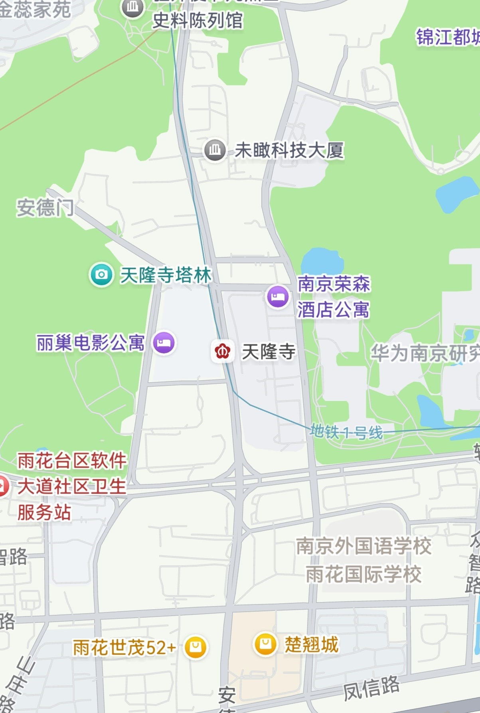
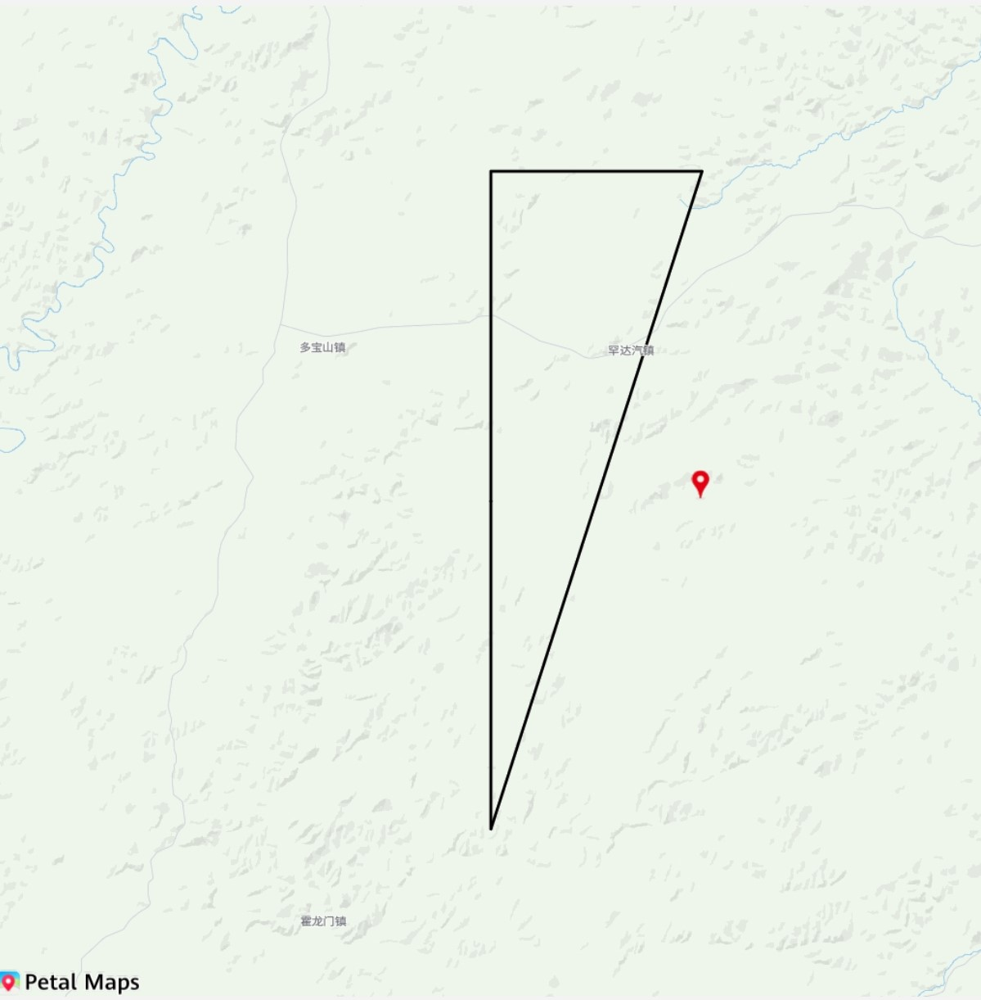

# 静态图

更新时间：2026-04-20 06:34:33

来源：https://developer.huawei.com/consumer/cn/doc/harmonyos-guides/map-static-diagram

## 场景介绍

本章节将向您介绍如何使用静态图功能。静态图功能会返回一张地图图片，您可以将地图以图片形式嵌入自己的应用/元服务中。在使用时，您可以指定请求的地图位置、图片大小。 **图1** 静态图


## 接口说明

以下是地图静态图相关接口，获取静态图功能主要由[staticMap](https://developer.huawei.com/consumer/cn/doc/harmonyos-references/map-staticmap)命名空间下的方法提供，更多接口及使用方法请参见[接口文档](https://developer.huawei.com/consumer/cn/doc/harmonyos-references/map-staticmap)。
| 接口名 | 描述 |
| --- | --- |
| [StaticMapOptions](https://developer.huawei.com/consumer/cn/doc/harmonyos-references/map-staticmap#staticmapoptions) | 用于描述静态图属性。 |
| [getMapImage](https://developer.huawei.com/consumer/cn/doc/harmonyos-references/map-staticmap#getmapimage)(options: [StaticMapOptions](https://developer.huawei.com/consumer/cn/doc/harmonyos-references/map-staticmap#staticmapoptions)): Promise | 根据提供的参数创建静态图。 |
| [getMapImage](https://developer.huawei.com/consumer/cn/doc/harmonyos-references/map-staticmap#getmapimage-1)(context: [common.Context](https://developer.huawei.com/consumer/cn/doc/harmonyos-references/js-apis-inner-application-context), options: [StaticMapOptions](https://developer.huawei.com/consumer/cn/doc/harmonyos-references/map-staticmap#staticmapoptions)): Promise | 根据提供的参数创建静态图。支持上传Context上下文。 |


## 开发步骤

导入相关模块。
```text
import { staticMap } from '@kit.MapKit';
import { BusinessError } from '@kit.BasicServicesKit';
```

创建静态图初始化参数，调用[getMapImage](https://developer.huawei.com/consumer/cn/doc/harmonyos-references/map-staticmap#getmapimage)方法获取静态图，效果如下图。
```text
@Entry
@Component
struct StaticMapDemo {
  @State image?: PixelMap = undefined;

  build() {
    Column() {
      this.buildDemoUI();
    }.width('100%')
    .margin({ bottom: 48 })
    .backgroundColor(0xf2f2f2)
    .height('100%')
  }

  @Builder
  buildDemoUI() {
    // 展示获取的静态图
    Image(this.image)
      .width('100%')
      .fitOriginalSize(false)
      .border({ width: 1 })
      .borderStyle(BorderStyle.Dashed)
      .objectFit(ImageFit.Contain)
      .height("90%")

    Row() {
      Button("getStaticMap")
        .fontSize(12)
        .onClick(async () => {
          // 设置静态图标记参数
          let markers: Array = [{
            location: {
              latitude: 50,
              longitude: 126.3
            },
            font: 'statics',
            defaultIconSize: staticMap.IconSize.TINY
          }];

          // 设置静态图绘制路径参数
          let path: staticMap.StaticMapPath = {
            locations: [
              {
                latitude: 50,
                longitude: 126
              },
              {
                latitude: 50.3,
                longitude: 126
              },
              {
                latitude: 50.3,
                longitude: 126.3
              },
              {
                latitude: 49.7,
                longitude: 126
              },
              {
                latitude: 50,
                longitude: 126
              }
            ],
            width: 3
          };

          // 拼装静态图参数
          let option: staticMap.StaticMapOptions = {
            location: {
              latitude: 50,
              longitude: 126
            },
            zoom: 10,
            imageWidth: 1024,
            imageHeight: 1024,
            scale: 1,
            markers: markers,
            path: path
          };

          try {
            // 获取静态图
            this.image = await staticMap.getMapImage(option);
            console.info("Succeeded in getting image.");
          } catch (error) {
            const err: BusinessError = error as BusinessError;
            console.error(`Failed in getting image, code: ${err.code}, message: ${err.message}`);
          }
        })
    }.margin({ top: 12 })
  }
}
```

**图2** 调用getMapImage方法获取静态图

