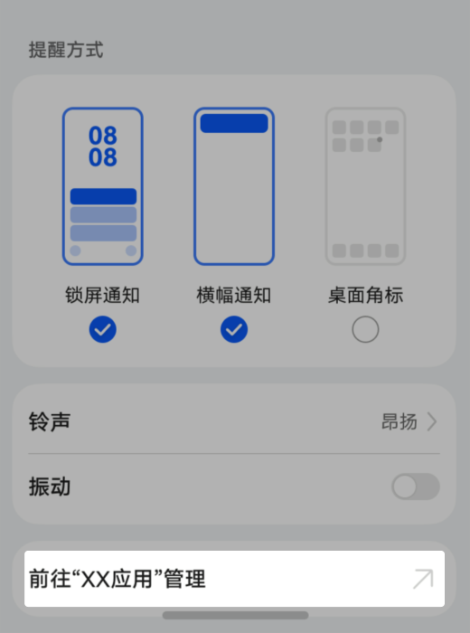
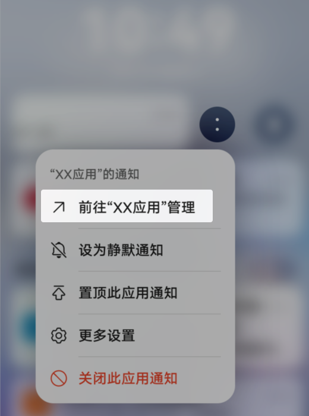

# 应用内通知设置快捷入口开发指导

更新时间：2026-04-20 06:34:33

来源：https://developer.huawei.com/consumer/cn/doc/harmonyos-guides/notification-shortcut-settings

##### 使用场景

应用的通知设置页面属于3层页面，用户查找难度较大，导致应用的通知关闭率上升。

为改善这一情况，我们在通知消息的左滑菜单和系统的应用通知设置页面中，添加了快速进入应用内通知设置功能页面的入口，直接引导用户跳转至应用内的通知分类管理页面，提升用户通知管理的体验，降低应用通知关闭率。

“设置 > 通知和状态栏 > XX应用”页面

通知中心页面

##### 开发准备

详情请参考[应用链接说明](https://developer.huawei.com/consumer/cn/doc/harmonyos-guides/app-uri-config)，其中[linkFeature](https://developer.huawei.com/consumer/cn/doc/harmonyos-guides/app-uri-config#linkfeature标签说明)使用AppNotificationMgmt即可。

##### 功能验证

 - 场景1

1. 在手机的“设置 > 通知和状态栏”页面，选择当前应用，进入应用详情页。

2. 点击“前往XX应用管理”的选项，即可跳转至应用内对应的通知设置页面。
 - 场景2

1. 在手机通知中心页面，左滑应用已发布的通知。

2. 点击“前往XX应用管理”的选项，即可跳转至应用内对应的通知设置页面。
