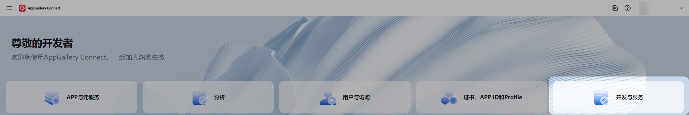
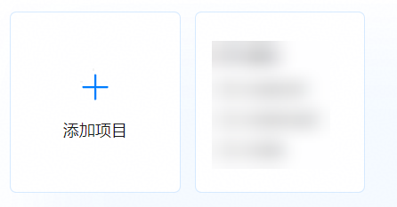
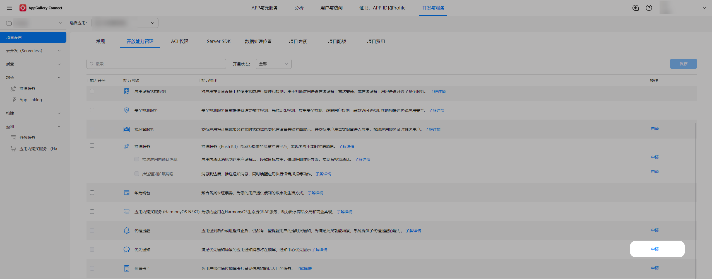
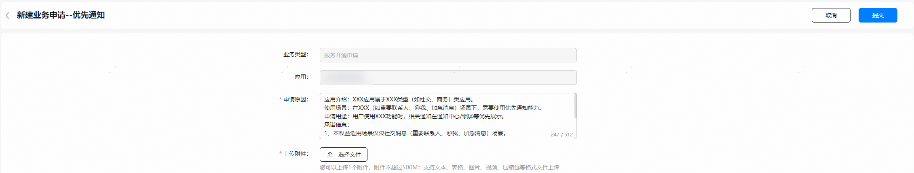
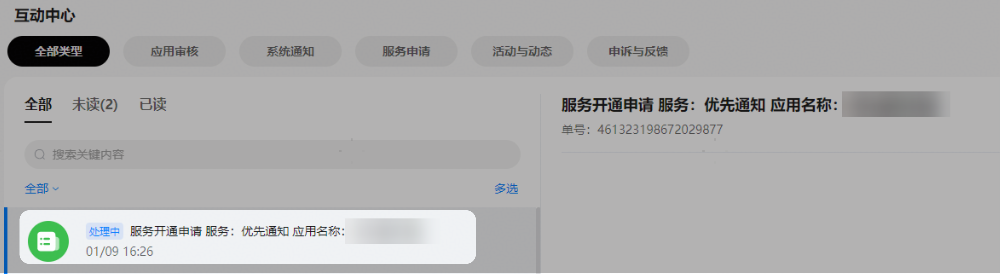
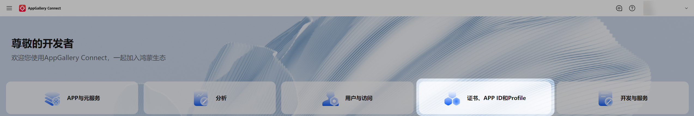
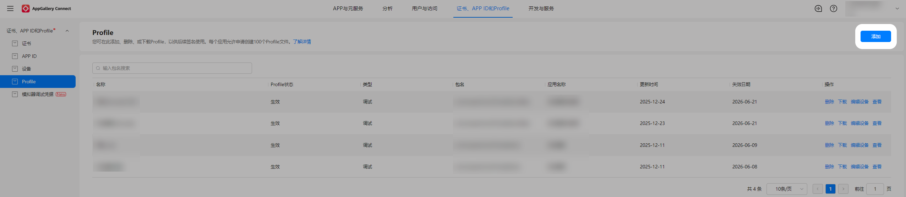
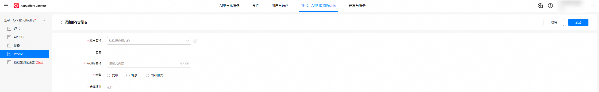

# 申请优先通知权益

更新时间：2026-04-24 08:10:21

来源：https://developer.huawei.com/consumer/cn/doc/harmonyos-guides/priority-notification-permission-guidelines

当用户终端收到携带[priorityNotificationType](https://developer.huawei.com/consumer/cn/doc/harmonyos-references/js-apis-inner-notification-notificationrequest)字段的通知消息时，系统会将其识别为优先通知并优先显示。

申请优先通知权益存在以下限制：

1）该优先通知消息仅对商务类、社交通讯类应用开放。

2）应用内需具备重要联系人、@我、加急消息提醒功能，且申请后仅在上述场景中使用该能力，申请时需提供相应功能截图/示意图。

3）重要联系人场景需同时接入跳转应用内“重要联系人列表”能力。详情请参考[应用链接说明](https://developer.huawei.com/consumer/cn/doc/harmonyos-guides/app-uri-config)，[linkFeature](https://developer.huawei.com/consumer/cn/doc/harmonyos-guides/app-uri-config#linkfeature标签说明)字段使用PrimaryContactMgmt即可。

说明：优先通知权益仅允许在审核通过的场景中使用，如果申请权限后使用的功能和场景超出申请的范围，则属于违规，平台将禁用应用的优先通知权益。

#### 申请步骤
1. 登录[AppGallery Connect](https://developer.huawei.com/consumer/cn/service/josp/agc/index.html)，选择“开发与服务”。

  

2. 在项目列表中找到您的项目，在项目下的应用列表中选择需要申请优先通知权益的应用。

  

3. 进入“项目设置 > 开放能力管理”页面，点击“优先通知”的“申请”。

  

4. 开发者可参考“申请原因”中的模板，提供申请必须的相关信息，包括应用介绍、使用场景、申请用途、附件、承诺信息，然后点击“提交”按钮。

  

5. 开发者可通过互动中心的“服务开通申请”消息获取优先通知权益申请结果。

  

  

6. 优先通知权益申请通过后，须在“证书、APP ID和Profile”页面下左侧树形菜单的“Profile”页签，点击“添加”重新生成Profile文件，并下载Profile文件到本地，然后在“[发布应用](https://developer.huawei.com/consumer/cn/doc/harmonyos-guides/ide-publish-app)”时，须将该Profile打包到应用包中。

  

  

  

