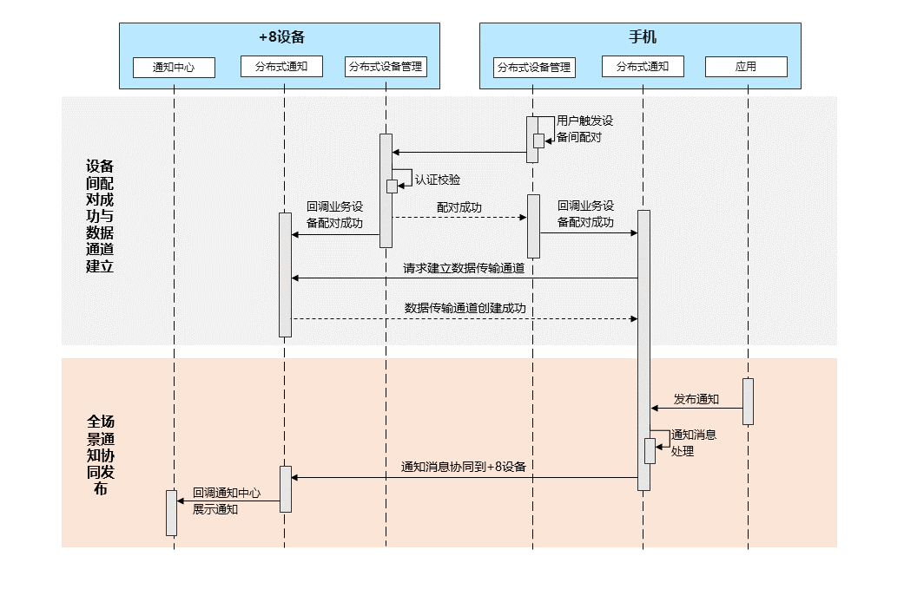

# 跨设备协同通知概述

更新时间：2026-04-29 07:35:50

来源：https://developer.huawei.com/consumer/cn/doc/harmonyos-guides/notification-distributed-overview

跨设备协同通知旨在以手机为中心，实现与手表等其他设备的通知消息协同交互。典型场景如下：

- [清除跨设备场景下的重复通知](https://developer.huawei.com/consumer/cn/doc/harmonyos-guides/notification-distributed-messageid)：清除跨设备协同消息和本地设备发布的重复消息，避免多源通知重复打扰用户。

## 约束条件

跨设备协同支持的设备：从API version 18开始，支持手机与手表之间通知消息的协同；从API version 20开始，支持手机与平板、2in1设备之间通知消息的协同。 跨设备协同支持的[通知渠道](https://developer.huawei.com/consumer/cn/doc/harmonyos-references/js-apis-notificationmanager#slottype)： 手表：带快捷回复的社交通信类通知（社交通信）、实况窗。 平板：社交通信、服务提醒、实况窗、客服消息。 2in1：社交通信、服务提醒、客服消息。

## 运作机制

