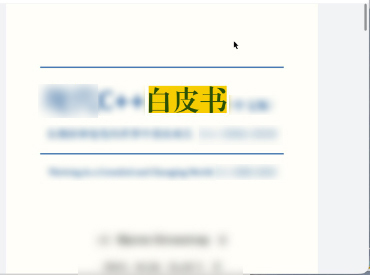

# 高亮显示PDF文档

更新时间：2026-04-28 03:31:56

来源：https://developer.huawei.com/consumer/cn/doc/harmonyos-guides/pdf-pdfview-highlight

PDF文档在预览时，可以对页面的矩形区域或文本设置高亮显示，高亮颜色可以自定义。

[setHighlightText](https://developer.huawei.com/consumer/cn/doc/harmonyos-references/pdf-arkts-pdfviewmanage#sethighlighttext)可以同时高亮多个不同的文本。





#### 接口说明

| 接口名 | 描述 |
| --- | --- |
| setHighlightText(pageIndex: number, textArray: string[], color: number): void | 高亮指定文本。 |


[setHighlightText](https://developer.huawei.com/consumer/cn/doc/harmonyos-references/pdf-arkts-pdfviewmanage#sethighlighttext)和[searchKey](https://developer.huawei.com/consumer/cn/doc/harmonyos-references/pdf-arkts-pdfviewmanage#searchkey)功能互斥。


#### 示例代码
1. 加载PDF文档。
2. 调用PdfView预览组件，渲染显示。
3. 在按钮【setHighlightText】里，调用setHighlightText方法，设置单个或多个要高亮的文本。

```text
import { pdfService, PdfView, pdfViewManager } from '@kit.PDFKit';

@Entry
@Component
struct PdfPage {
  private controller: pdfViewManager.PdfController = new pdfViewManager.PdfController();
  private context = this.getUIContext().getHostContext() as Context;
  private loadResult: pdfService.ParseResult = pdfService.ParseResult.PARSE_ERROR_FORMAT;

  aboutToAppear(): void {
    // 确保在工程目录src/main/resources/resfile里存在input.pdf文档
    let filePath = this.context.resourceDir + '/input.pdf';
    (async () => {
      this.loadResult = await this.controller.loadDocument(filePath);
    })()
  }

  build() {
    Column() {
      Row() {
        // 设置文本的高亮显示风格
        Button('setHighlightText').onClick(async () => {
          if (this.loadResult === pdfService.ParseResult.PARSE_SUCCESS) {
            this.controller.setHighlightText(0, ['白皮书'], 0xAAF9CC00);
          }
        })
      }

      // 加载PdfView组件进行预览
      PdfView({
        controller: this.controller,
        pageFit: pdfService.PageFit.FIT_WIDTH,
        showScroll: true
      })
        .id('pdfview_app_view')
        .layoutWeight(1);
    }
    .width('100%').height('100%')
  }
}
```
