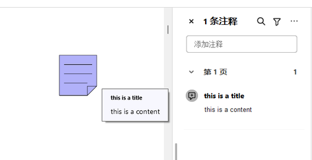

# PDF页面文本、图片和批注

更新时间：2026-04-20 06:34:33

来源：https://developer.huawei.com/consumer/cn/doc/harmonyos-guides/pdf-add-txt-img-annot

支持编辑PDF页面内容，包括：





## 接口说明


| 接口名 | 描述 |
| --- | --- |
| [addTextObject](https://developer.huawei.com/consumer/cn/doc/harmonyos-references/pdf-arkts-pdfservice#addtextobject)(text: string, x: number, y: number, style: TextStyle): void | 添加文本内容，只可按行添加。 |
| [addImageObject](https://developer.huawei.com/consumer/cn/doc/harmonyos-references/pdf-arkts-pdfservice#addimageobject)(path: string, x: number, y: number, width: number, height: number): void | 在PDF文档的页面中添加图片。 |
| [deleteGraphicsObject](https://developer.huawei.com/consumer/cn/doc/harmonyos-references/pdf-arkts-pdfservice#deletegraphicsobject)(object: GraphicsObject): void | 删除指定的GraphicsObject。 |
| [addAnnotation](https://developer.huawei.com/consumer/cn/doc/harmonyos-references/pdf-arkts-pdfservice#addannotation)(annotationInfo: PdfAnnotationInfo): PdfAnnotation | 在当前页添加批注。 |


## 添加文本和图片

调用loadDocument方法，加载PDF文档。 在【addText】按钮中调用addTextObject的方法插入文本。 在【delText】按钮中调用deleteGraphicsObject方法来删除相应的页面文本。 在【addImage】按钮中调用addImageObject的方法插入图片。
```text
import { pdfService } from '@kit.PDFKit';
import { hilog } from '@kit.PerformanceAnalysisKit';
import { Font } from '@kit.ArkUI';

@Entry
@Component
struct PdfPage {
  private pdfDocument: pdfService.PdfDocument = new pdfService.PdfDocument();
  private context = this.getUIContext().getHostContext() as Context;

  aboutToAppear(): void {
    // 确保resfile目录有input.pdf文档
    let filePath = this.context.resourceDir + '/input.pdf';
    this.pdfDocument.loadDocument(filePath);
  }

  build() {
    Column() {
      // 添加文本
      Button('addText').onClick(async () => {
        let page: pdfService.PdfPage = this.pdfDocument.getPage(0);
        let str = 'This is add text object!';
        let fontInfo = new pdfService.FontInfo();
        // 确保字体路径存在
        let font: Font = new Font()
        fontInfo.fontPath = font.getFontByName('HarmonyOS Sans')?.path;
        fontInfo.fontName = '';
        let style: pdfService.TextStyle = { textColor: 0x000000, textSize: 30, fontInfo: fontInfo };
        page.addTextObject(str, 10, 10, style);
        let outPdfPath = this.context.filesDir + '/testAddText.pdf';
        let result = this.pdfDocument.saveDocument(outPdfPath);
        hilog.info(0x0000, 'PdfPage', 'addText %{public}s!', result ? 'success' : 'fail');
      })
      // 删除文本
      Button('delText').onClick(async () => {
        let page: pdfService.PdfPage = this.pdfDocument.getPage(0);
        let graphicsObjects = page.getGraphicsObjects();
        // 找到第一个要删除的文本
        let index = graphicsObjects.findIndex(item => item.type === pdfService.GraphicsObjectType.OBJECT_TEXT);
        if (index > -1) {
          // 删除第一个文本
          page.deleteGraphicsObject(graphicsObjects[index]);
        }
        let outPdfPath = this.context.filesDir + '/testDelText.pdf';
        let result = this.pdfDocument.saveDocument(outPdfPath);
        hilog.info(0x0000, 'PdfPage', 'delText %{public}s!', result ? 'success' : 'fail');
      })
      // 添加图片
      Button('addImage').onClick(async () => {
        let page: pdfService.PdfPage = this.pdfDocument.getPage(0);
        // 插入图片，确保resfile目录有img.jpg图片
        let imagePath = this.context.resourceDir + '/img.jpg';
        page.addImageObject(imagePath, 100, 100, 100, 120);
        let outPdfPath = this.context.filesDir + '/testAddImage.pdf';
        let result = this.pdfDocument.saveDocument(outPdfPath);
        hilog.info(0x0000, 'PdfPage', 'addImage %{public}s!', result ? 'success' : 'fail');
      })
    }
  }
}
```


## 添加文本批注

调用loadDocument方法，加载PDF文档。 调用getPage方法获取指定页。 实例化TextAnnotationInfo文本批注，并设置相关属性。 调用addAnnotation或setAnnotation方法添加或修改批注。 调用removeAnnotation方法删除批注。
```text
import { pdfService } from '@kit.PDFKit';
import { hilog } from '@kit.PerformanceAnalysisKit';

@Entry
@Component
struct PdfPage {
  private pdfDocument: pdfService.PdfDocument = new pdfService.PdfDocument();
  private context = this.getUIContext().getHostContext() as Context;

  build() {
    Column() {
      // 添加批注
      Button('addTextAnnotation').onClick(async () => {
        // 确保沙箱目录有input.pdf文档
        let filePath = this.context.filesDir + '/input.pdf';
        this.pdfDocument.loadDocument(filePath);
        let page: pdfService.PdfPage = this.pdfDocument.getPage(0);
        let aInfo = new pdfService.TextAnnotationInfo();
        aInfo.iconName = 'Document';
        aInfo.content = 'this is a content';
        aInfo.subject = 'Annotation';
        aInfo.title = 'this is a title';
        aInfo.state = pdfService.TextAnnotationState.MARKED;
        aInfo.x = 200;
        aInfo.y = 200;
        aInfo.color = 0xf9b1b1;
        aInfo.flag = pdfService.AnnotationFlag.PRINTED;
        let annotation: pdfService.PdfAnnotation = page.addAnnotation(aInfo);
        let outPdfPath = this.context.filesDir + '/testAddTextAnnotation.pdf';
        let result = this.pdfDocument.saveDocument(outPdfPath);
        this.pdfDocument.releaseDocument();
        hilog.info(0x0000, 'PdfPage', 'addTextAnnotation %{public}s!', result ? 'success' : 'fail');
      })
      // 修改批注
      Button('setAnnotation').onClick(async () => {
        let filePath = this.context.filesDir + '/testAddTextAnnotation.pdf';
        let result = this.pdfDocument.loadDocument(filePath);
        if (result === pdfService.ParseResult.PARSE_SUCCESS) {
          let page: pdfService.PdfPage = this.pdfDocument.getPage(0);
          let annotations = page.getAnnotations();
          if (annotations.length > 0 && annotations[0].type === pdfService.AnnotationType.TEXT) {
            let newAnno = annotations[0];
            page.removeAnnotation(newAnno);
            let annotation = page.addAnnotation(newAnno);
            let newInfo = new pdfService.TextAnnotationInfo();
            newInfo.title = "new Title";
            newInfo.content = "new Info";
            newInfo.state = pdfService.TextAnnotationState.MARKED;
            newInfo.x = 100;
            newInfo.y = 100;
            page.setAnnotation(annotation, newInfo);
            let outPdfPath = this.context.filesDir + '/testSetAnnotation.pdf';
            let result = this.pdfDocument.saveDocument(outPdfPath);
            this.pdfDocument.releaseDocument();
            hilog.info(0x0000, 'PdfPage', 'setAnnotation %{public}s!', result ? 'success' : 'fail');
          }
        }
      })
      // 删除批注
      Button('removeAnnotation').onClick(async () => {
        let filePath = this.context.filesDir + '/testAddTextAnnotation.pdf';
        let result = this.pdfDocument.loadDocument(filePath);
        if (result === pdfService.ParseResult.PARSE_SUCCESS) {
          let page: pdfService.PdfPage = this.pdfDocument.getPage(0);
          let annotations = page.getAnnotations();
          if (annotations.length > 0 && annotations[0].type === pdfService.AnnotationType.TEXT) {
            page.removeAnnotation(annotations[0]);
            let outPdfPath = this.context.filesDir + '/testRemoveAnnotation.pdf';
            let result = this.pdfDocument.saveDocument(outPdfPath);
            this.pdfDocument.releaseDocument();
            hilog.info(0x0000, 'PdfPage', 'removeAnnotation %{public}s!', result ? 'success' : 'fail');
          }
        }
      })
    }
  }
}
```
