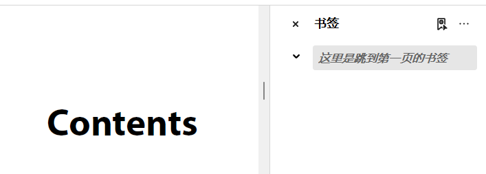

# 添加、删除书签

更新时间：2026-04-28 03:31:56

来源：https://developer.huawei.com/consumer/cn/doc/harmonyos-guides/pdf-add-bookmark

PDF Kit支持添加和删除PDF文档书签。

添加书签时，可设置标题、颜色，是否粗体、斜体、跳转信息等。





##### 接口说明

| 接口名 | 描述 |
| --- | --- |
| createBookmark(): Bookmark | 创建PDF文档书签。 |
| getRootBookmark(): Bookmark | 获取PDF文档第一个根书签。 |
| insertBookmark(bookmark: Bookmark, parent: Bookmark, position: number): boolean | 插入PDF文档书签。 |
| setBookmarkInfo(info: BookmarkInfo): void | 设置书签信息。 |
| removeBookmark(bookmark: Bookmark): boolean | 移除PDF文档书签。 |
| setDestInfo(info: DestInfo): void | 设置书签的跳转信息。 |
| getBookmarkInfo(): BookmarkInfo | 获取书签信息。 |


##### 示例代码

**添加书签**：
1. 调用loadDocument方法，加载PDF文档。
2. 调用createBookmark方法，创建书签。
3. 调用setDestInfo方法，设置书签的跳转信息。
4. 调用getBookmarkInfo方法，获取书签信息。
5. 调用setBookmarkInfo方法，设置书签内容及样式。
6. 设置保存文档沙箱路径并保存

**删除书签**：
1. 调用loadDocument方法，加载PDF文档。
2. 调用getRootBookmark方法，获取文档的第一个根书签。
3. 调用removeBookmark方法，删除书签。
4. 设置保存文档沙箱路径并保存

```text
import { pdfService } from '@kit.PDFKit';
import { hilog } from '@kit.PerformanceAnalysisKit';

@Entry
@Component
struct PdfPage {
  private pdfDocument: pdfService.PdfDocument = new pdfService.PdfDocument();
  private context = this.getUIContext().getHostContext() as Context;

  build() {
    Column() {
      // 添加书签
      Button('addBookmark').onClick(async () => {
        // 确保在工程目录src/main/resources/resfile里有input.pdf文档
        let filePath = this.context.resourceDir + '/input.pdf';
        this.pdfDocument.loadDocument(filePath);
        // 创建书签
        let mark1: pdfService.Bookmark = this.pdfDocument.createBookmark();
        let mark2: pdfService.Bookmark = this.pdfDocument.createBookmark();
        // 设置书签的跳转信息
        let destInfo: pdfService.DestInfo = mark1.getDestInfo();
        destInfo.fitMode = pdfService.FitMode.FIT_MODE_XYZ;
        destInfo.pageIndex = 1;
        destInfo.left = 20;
        destInfo.top = 30;
        destInfo.zoom = 1.5;
        mark1.setDestInfo(destInfo);
        // 设置书签内容及样式
        let bookInfo: pdfService.BookmarkInfo = mark1.getBookmarkInfo();
        bookInfo.title = '这里是跳到第一页的书签';
        bookInfo.titleColor = 12;
        bookInfo.isBold = true;
        bookInfo.isItalic = true;
        mark1.setBookmarkInfo(bookInfo);
        // 把创建的书签插入到PDF页面
        this.pdfDocument.insertBookmark(mark1, null, 1);
        this.pdfDocument.insertBookmark(mark2, mark1, 1);
        // 设置保存文档沙箱路径并保存
        let outPdfPath = this.context.filesDir + '/testAddBookmark.pdf';
        let result = this.pdfDocument.saveDocument(outPdfPath);
        hilog.info(0x0000, 'PdfPage', 'saveAddBookmark %{public}s!', result ? 'success' : 'fail');
      })
      // 删除书签
      Button('removeBookmark').onClick(async () => {
        // 确保沙箱目录有testAddBookmark.pdf文档
        this.pdfDocument.loadDocument(this.context.filesDir + '/testAddBookmark.pdf');
        let bookmarks: pdfService.Bookmark = this.pdfDocument.getRootBookmark();
        if (bookmarks.isRootBookmark()) {
          let hasRemoveBookmark: boolean = this.pdfDocument.removeBookmark(bookmarks);
          hilog.info(0x0000, 'PdfPage', 'removeBookmark %{public}s!', hasRemoveBookmark ? 'success' : 'fail');
          let outPdfPath = this.context.filesDir + '/testRemoveBookmark.pdf';
          let result = this.pdfDocument.saveDocument(outPdfPath);
          hilog.info(0x0000, 'PdfPage', 'saveRemoveBookmark %{public}s!', result ? 'success' : 'fail');
        }
      })
    }
  }
}
```
