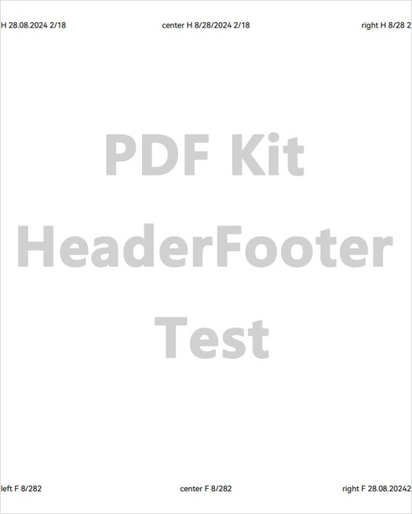

# 添加、删除页眉页脚

更新时间：2026-04-28 03:31:56

来源：https://developer.huawei.com/consumer/cn/doc/harmonyos-guides/pdf-add-headerfooter

PDF Kit支持对指定页面添加、删除页眉页脚。页眉页脚信息包含文字、日期和页码等相关内容，并可设置字体大小、颜色和间距等相关样式，具体属性参考[HeaderFooterInfo](https://developer.huawei.com/consumer/cn/doc/harmonyos-references/pdf-arkts-pdfservice#headerfooterinfo)。如下图：





#### 接口说明

| 接口名 | 描述 |
| --- | --- |
| addHeaderFooter(info: HeaderFooterInfo, startIndex: number, endIndex: number, oddPages: boolean, evenPages: boolean): void | 插入PDF文档页眉页脚。 |
| removeHeaderFooter(): boolean | 删除PDF文档页眉页脚。 |


[addHeaderFooter](https://developer.huawei.com/consumer/cn/doc/harmonyos-references/pdf-arkts-pdfservice#addheaderfooter)方法属于耗时业务，需要遍历每一页去添加页眉页脚，添加页面较多时建议放到线程里去处理。


#### 示例代码

**添加页眉页脚：**
1. 调用loadDocument方法，加载PDF文档。
2. 实例化页眉页脚HeaderFooterInfo类，并设置相关属性，包括字体大小、颜色和间距等。
3. 调用addHeaderFooter方法，添加页眉页脚到页面中。
4. 保存PDF文档到应用沙箱。

**删除页眉页脚：**
1. 调用loadDocument方法，加载PDF文档。
2. 调用removeHeaderFooter方法，删除页眉页脚。
3. 保存PDF文档到应用沙箱。

```text
import { pdfService } from '@kit.PDFKit';
import { hilog } from '@kit.PerformanceAnalysisKit';
import { Font } from '@kit.ArkUI';

@Entry
@Component
struct PdfPage {
  private pdfDocument: pdfService.PdfDocument = new pdfService.PdfDocument();
  private context = this.getUIContext().getHostContext() as Context;

  build() {
    Column() {
      Button('addHeaderFooter').onClick(async () => {
        // 确保在工程目录src/main/resources/resfile里有input.pdf文档
        let filePath = this.context.resourceDir + '/input.pdf';
        let res = this.pdfDocument.loadDocument(filePath);
        if (res === pdfService.ParseResult.PARSE_SUCCESS) {
          let hfInfo: pdfService.HeaderFooterInfo = new pdfService.HeaderFooterInfo();
          hfInfo.fontInfo = new pdfService.FontInfo();
          // 确保字体路径存在
          let font: Font = new Font()
          hfInfo.fontInfo.fontPath = font.getFontByName('HarmonyOS Sans')?.path;
          // 如果不知道字体的具体名称，可以为空字符串
          hfInfo.fontInfo.fontName = '';
          hfInfo.textSize = 10;
          hfInfo.charset = pdfService.CharsetType.PDF_FONT_DEFAULT_CHARSET;
          hfInfo.underline = false;
          hfInfo.textColor = 0x00000000;
          hfInfo.leftMargin = 1.0;
          hfInfo.topMargin = 40.0;
          hfInfo.rightMargin = 1.0;
          hfInfo.bottomMargin = 40.0;
          hfInfo.headerLeftText = 'left H <<dd.mm.yyyy>> <<1/n>>';
          hfInfo.headerCenterText = 'center H <<m/d/yyyy>> <<1/n>>';
          hfInfo.headerRightText = 'right H <<m/d>><<1>>';
          hfInfo.footerLeftText = 'left F <<m/d>><<1>>';
          hfInfo.footerCenterText = 'center F <<m/d>><<1>>';
          hfInfo.footerRightText = 'right F <<dd.mm.yyyy>><<1>>';
          this.pdfDocument.addHeaderFooter(hfInfo, 1, 5, true, true);
          let outPdfPath = this.context.filesDir + '/testAddHeaderFooter.pdf';
          let result = this.pdfDocument.saveDocument(outPdfPath);
          hilog.info(0x0000, 'PdfPage', 'addHeaderFooter %{public}s!', result ? 'success' : 'fail');
        }
        this.pdfDocument.releaseDocument();
      })
      Button('removeHeaderFooter').onClick(async () => {
        let filePath = this.context.filesDir + '/testAddHeaderFooter.pdf';
        let res = this.pdfDocument.loadDocument(filePath);
        if (res === pdfService.ParseResult.PARSE_SUCCESS && this.pdfDocument.hasHeaderFooter()) {
          let removeResult = this.pdfDocument.removeHeaderFooter();
          if (removeResult) {
            let outPdfPath = this.context.filesDir + '/removeHeaderFooter.pdf';
            let result = this.pdfDocument.saveDocument(outPdfPath);
            hilog.info(0x0000, 'PdfPage', 'removeHeaderFooter %{public}s!', result ? 'success' : 'fail');
          }
        }
        this.pdfDocument.releaseDocument();
      })
    }
  }
}
```
