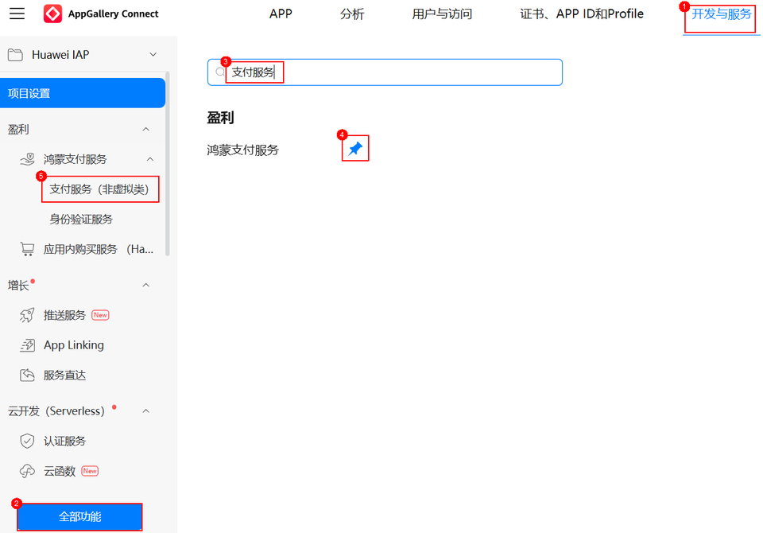

# 找不到“支付服务（非虚拟类）”菜单或AppID关联授权的页面怎么处理？

更新时间：2026-03-09 02:50:43

来源：https://developer.huawei.com/consumer/cn/doc/harmonyos-guides/payment-faq-28

登录[AppGallery Connect](https://developer.huawei.com/consumer/cn/service/josp/agc/index.html)网站选择对应的项目后，在‘全部功能’中搜索“鸿蒙支付服务”并固定到菜单导航栏中。在“支付服务（非虚拟类）> 待关联商户号”选择对应的商户点击“授权”即可。可参考下图所示：

 
