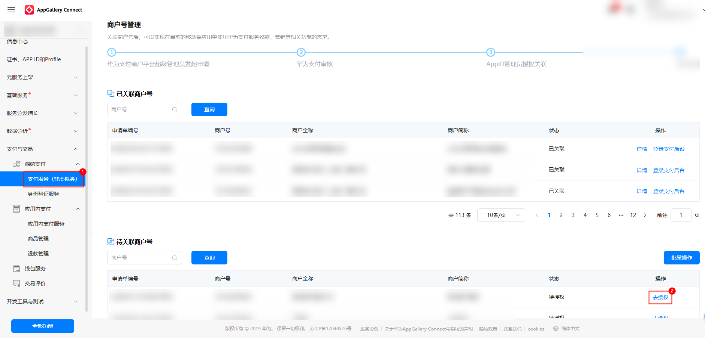
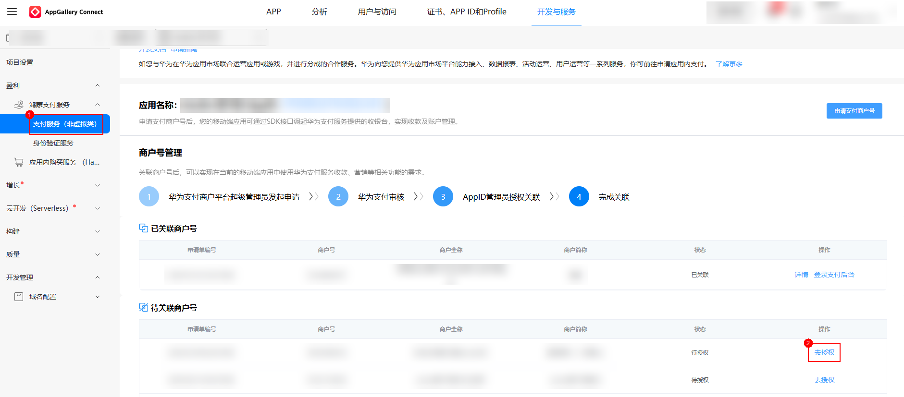
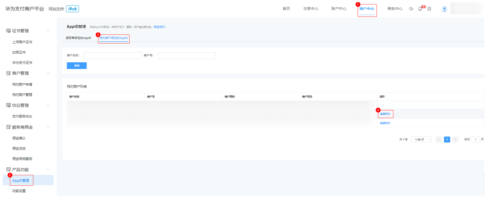
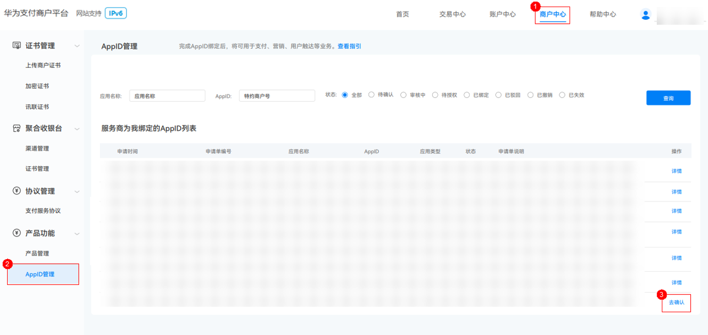

# 商户号绑定AppID

更新时间：2026-04-28 03:31:56

来源：https://developer.huawei.com/consumer/cn/doc/harmonyos-guides/payment-binding-appid-to-merc

> [!NOTE]
> 商户号绑定AppID的商户需要通过 华为支付商户平台 入网，详见 商户入网和获取商户号 。通过 华为开发者联盟官网 开通 商户服务 入网的商户暂不支持直接接入华为支付以及绑定AppID操作。

 
商户（以下所称商户均包含所有商户模型）后续支付交易依赖于[AppGallery Connect](https://developer.huawei.com/consumer/cn/service/josp/agc/index.html)中[创建应用](https://developer.huawei.com/consumer/cn/doc/app/agc-help-create-app-0000002247955506)生成的AppID与商户号的关联关系。商户在请求预下单接口传递AppID入参，后续可以在[AppGallery Connect](https://developer.huawei.com/consumer/cn/service/josp/agc/index.html)网站上基于应用维度查看交易报表数据。传递AppID参数后，华为支付侧会校验商户号与传递的AppID是否匹配，如不匹配则会直接响应异常。因此，接入鸿蒙支付服务前商户需要为商户号绑定AppID，如无商户号则需要先申请，详细介绍参考[商户入网和获取商户号](https://developer.huawei.com/consumer/cn/doc/harmonyos-guides/payment-merc-regist-apply)。
 
AppID绑定详细可参见[AppID管理及关联](https://developer.huawei.com/consumer/cn/doc/pay-docs/hwzf-appidguanli-0000001757041165)。
  

#### 基本概念

**同主体**：商户号与AppID所关联的营业主体信息一致。
 
**异主体**：商户号与AppID关联的营业主体信息不一致。
 
  

#### 绑定AppID说明
1. 暂不支持平台子商户及特约商户发起绑定AppID申请。
2. 商户发起绑定AppID申请，异主体绑定需要商户与华为支付侧沟通申请开通异主体绑定权限（可参考[产品开通操作](https://developer.huawei.com/consumer/cn/doc/harmonyos-guides/payment-product-configuration#场景一产品开通操作)）后才可在[华为支付商户平台](https://petalpay-merchant.cloud.huawei.com/)发起异主体AppID绑定操作。
3. AppID关联的营业主体与特约商户商户号或与服务商商户号关联的营业主体一致，都认为是同主体，可直接发起绑定。
4. 商户发起绑定申请后，商户应用管理员登录[AppGallery Connect](https://developer.huawei.com/consumer/cn/service/josp/agc/index.html)网站才能对商户号绑定AppID进行授权（提示“主体不一致”可[参见这里](https://developer.huawei.com/consumer/cn/doc/harmonyos-guides/payment-faq-26)）。
 
  

#### 直连商户/平台类商户绑定
1. 请登录[华为支付商户平台](https://petalpay-merchant.cloud.huawei.com/)进入“商户中心 > 产品功能 > AppID管理 > 新增关联AppID”。

  

2. 申请绑定AppID后，应用管理员登录[AppGallery Connect](https://developer.huawei.com/consumer/cn/service/josp/agc/index.html)网站选择对应的项目后，完成对应的商户“授权”操作， 操作路径如下：

  
**HarmonyOS应用**：“盈利 > 鸿蒙支付服务（可在‘全部功能’中搜索服务并固定到导航栏）> 支付服务（非虚拟类）> 待关联商户号”。

  

3. **元服务**：“支付与交易 > 鸿蒙支付服务（可在‘全部功能’中搜索服务并固定到导航栏）> 支付服务（非虚拟类）> 待关联商户号”。

  

 
  

#### 服务商绑定

服务商绑定AppID涉及如下场景：
 1. **服务商绑定**

  服务商需要绑定服务商应用AppID可直接在华为支付商户平台发起绑定申请。
2. **特约商户绑定**

  特约商户需要绑定特约商户应用AppID，需要服务商在华为支付商户平台发起邀请特约商户绑定AppID才可以进行绑定。
 
  

#### 服务商绑定
1. 服务商登录[华为支付商户平台](https://petalpay-merchant.cloud.huawei.com/)进入“商户中心 > 产品功能 > AppID管理”，在“服务商绑定的AppID”页签内点击“新增关联AppID”。

  

2. 申请绑定AppID后，应用管理员登录[AppGallery Connect](https://developer.huawei.com/consumer/cn/service/josp/agc/index.html)网站选择对应的项目后，完成对应的商户“授权”操作， 操作路径如下：

  
**HarmonyOS应用**：“盈利 > 鸿蒙支付服务（可在‘全部功能’中搜索服务并固定到导航栏）> 支付服务（非虚拟类）> 待关联商户号”。

  

3. **元服务**：“支付与交易 > 鸿蒙支付服务（可在‘全部功能’中搜索服务并固定到导航栏）> 支付服务（非虚拟类）> 待关联商户号”。

  

 
  

#### 服务商邀请特约商户绑定
1. 服务商登录[华为支付商户平台](https://petalpay-merchant.cloud.huawei.com/)进入“商户中心 > 产品功能 > AppID管理”，在“特约商户绑定的AppID”页签内根据服务商下的特约商户列表，选择特约商户发起AppID绑定申请邀请。

  

2. 特约商户登录[华为支付商户平台](https://petalpay-merchant.cloud.huawei.com/)进入“商户中心 > 产品功能 > AppID管理”选择“服务商为我绑定的AppID列表”中的数据，点击去确认，对服务商邀请绑定AppID进行确认。

  

3. 特约商户确认绑定AppID后，应用管理员登录[AppGallery Connect](https://developer.huawei.com/consumer/cn/service/josp/agc/index.html)网站选择对应的项目后，完成对应的商户“授权”操作， 操作路径如下：

  
**HarmonyOS应用**：“盈利 > 鸿蒙支付服务（可在‘全部功能’中搜索服务并固定到导航栏）> 支付服务（非虚拟类）> 待关联商户号”。

  

4. **元服务**：“支付与交易 > 鸿蒙支付服务（可在‘全部功能’中搜索服务并固定到导航栏）> 支付服务（非虚拟类）> 待关联商户号”。

  

