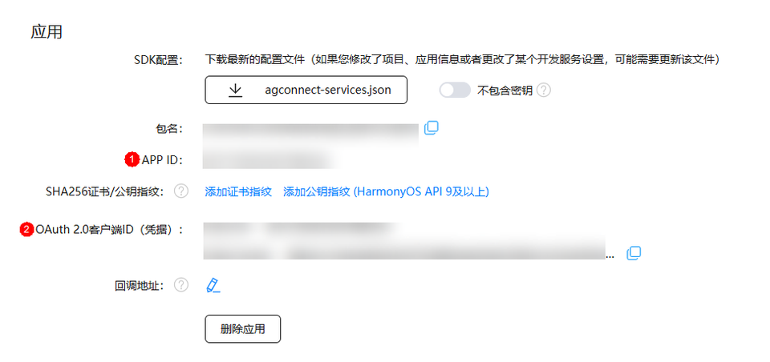

# 端侧应用配置

更新时间：2026-04-20 06:34:33

来源：https://developer.huawei.com/consumer/cn/doc/harmonyos-guides/payment-config-app-identity-info

可下载并参考[示例代码-客户端](https://gitcode.com/HarmonyOS_Samples/payment-kit-sample-code-clientdemo-arkts)，以此来快速的完成商户端侧应用开发环境的构建。

 通过下载示例代码或商户自行创建端侧应用后，需完成以下配置：


## 配置bundleName

在HarmonyOS应用/元服务“AppScope/app.json5”下的**bundleName**配置需要与开发者在[AppGallery Connect](https://developer.huawei.com/consumer/cn/service/josp/agc/index.html)中[创建应用](https://developer.huawei.com/consumer/cn/service/josp/agc/index.html)时的包名保持一致。 配置内容示例如下：
```text
{
  "app": {
    "bundleName": "com.huawei.******.******.demo",
  }
}
```


## 配置应用属性

在HarmonyOS应用/元服务“entry/src/main/module.json5”文件中**module**的**metadata**节点下增加**client_id**和**app_id**属性配置。 配置内容示例如下：
```text
{
    "module": {
        "metadata": [
            {
                "name": "app_id",
                "value": "..."
            },
            {
                "name": "client_id",
                "value": "..."
            },
        ]
    }
}
```

其中**app_id**的value值为应用的APP ID（在[AppGallery Connect](https://developer.huawei.com/consumer/cn/service/josp/agc/index.html)网站点击“开发与服务”，在项目列表中找到项目，在“项目设置 > 常规”页面的“应用”区域获取“APP ID”的值），详见下图的**标号1**处。  其中**client_id**的value值为应用的OAuth 2.0客户端ID（在[AppGallery Connect](https://developer.huawei.com/consumer/cn/service/josp/agc/index.html)网站点击“开发与服务”，在项目列表中找到项目，在“项目设置 > 常规”页面的“应用”区域获取“OAuth 2.0客户端ID（凭据）：Client ID”的值），详见下图的**标号2**处。

