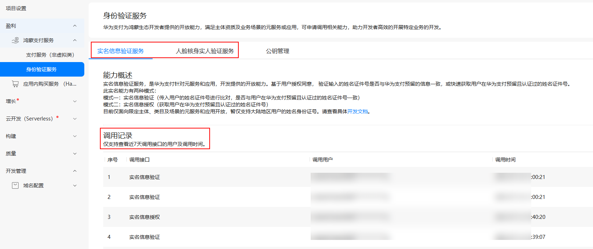

# 身份验证服务调用记录查看

更新时间：2026-03-09 02:50:43

来源：https://developer.huawei.com/consumer/cn/doc/harmonyos-guides/payment-real-name-service-req-query

开发者接入用户身份验证服务后，可登录[AppGallery Connect](https://developer.huawei.com/consumer/cn/service/josp/agc/index.html)，在“鸿蒙支付服务 > 身份验证服务”菜单的“实名信息验证服务”、“人脸核身实人验证服务”页签下的“调用记录”查看（近7日）用户信息验证、授权相关调用记录。
 

