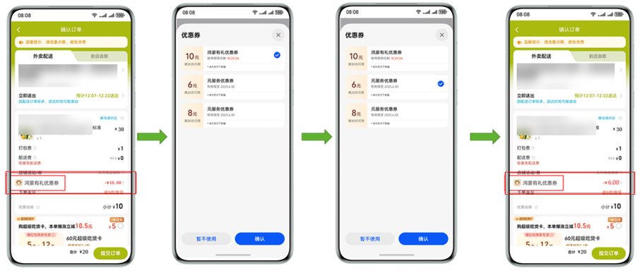
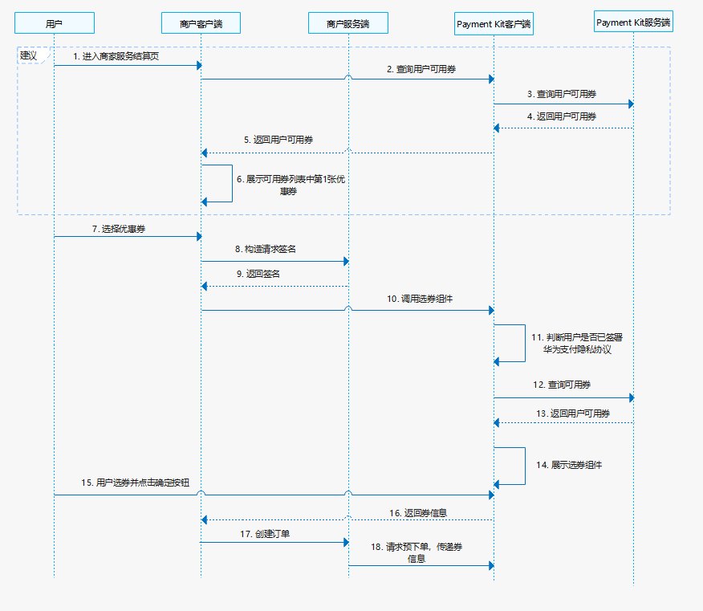

# 选券场景

更新时间：2026-04-30 02:41:24

来源：https://developer.huawei.com/consumer/cn/doc/harmonyos-guides/payment-promotion-select-coupon

##### 场景介绍

从6.1.0(23)版本开始，新增支持选券场景。

当用户在商家服务选好商品后进入订单结算页，可选券组件切换优惠券，让用户选择可用平台券进行下单。

如下图所示，首先商户应用会调用云侧接口选择1张10元优惠券，然后点击优惠券弹出选券组件，选择1张6元优惠券，最后商户应用将优惠券渲染成6元。

支持商户模型：直连商户、平台类商户、服务商

选券场景效果如下：





##### 接入流程

| 步骤 | 说明 |
| --- | --- |
| 开发准备 | 根据端侧应用配置完成开发准备。 |
| 接入选券组件 | 根据选券场景开发步骤完成接入。 |


##### 业务流程

关于选券场景的业务流程如下：




1. 用户选好商品后进入商家服务结算页。
2. 商户客户端请求Payment Kit客户端查询用户可用券。
3. Payment Kit客户端请求Payment Kit服务端查询用户可用券。
4. Payment Kit服务端返回用户可用券信息给Payment Kit客户端。
5. Payment Kit客户端给商户客户端返回券信息。
6. 商户客户端展示优惠券列表中的第1张券。
7. 用户点击优惠券进行选券。
8. 商户客户端根据订单信息请求服务端，服务端参考[签名规则](https://developer.huawei.com/consumer/cn/doc/harmonyos-references/payment-rest-overview#签名规则)构造[OrderContext](https://developer.huawei.com/consumer/cn/doc/harmonyos-references/payment-promotionservice#ordercontext) 签名信息。
9. 商户服务端返回签名信息。
10. 客户端根据签名信息组装好拉起选券组件的请求体，调用Payment Kit客户端[startUserChooseCouponsPopup](https://developer.huawei.com/consumer/cn/doc/harmonyos-references/payment-promotionservice#startuserchoosecouponspopup)接口拉起选券组件。
11. Payment Kit客户端收到调用后，判断用户是否已签署过华为支付隐私协议，如果没签署则不走后续流程。
12. 向服务端查询用户可用券。
13. Payment Kit服务端返回用户可用券信息。
14. Payment Kit客户端利用可用券信息展示出选券组件。
15. 用户选券并点击确认按钮。
16. Payment Kit客户端给商户客户端返回券信息。
17. 商户客户端请求商户服务服务端创建订单。
18. 商户服务端请求[直连商户预下单](https://developer.huawei.com/consumer/cn/doc/harmonyos-references/payment-prepay)或[平台类商户/服务商预下单](https://developer.huawei.com/consumer/cn/doc/harmonyos-references/payment-agent-prepay)接口，通过selectPromotionInfo参数传递平台券信息进行核销。


##### 接口说明

查询用户可用券场景和选券场景涉及接口如下，更详细信息详见[API接口文档](https://developer.huawei.com/consumer/cn/doc/harmonyos-references/payment-promotionservice#startpromotionentrydialog)。

| 接口名 | 描述 |
| --- | --- |
| getOrderAvailableCoupons(context: common.Context, orderContext: OrderContext): Promise<CouponDetail[]> | 查询用户可用券。 |
| startUserChooseCouponsPopup(context: common.Context, orderContext: OrderContext): Promise<CouponDetail[]> | 拉起选券组件。 |


##### 开发步骤


##### 查询用户可用券

6.1.1(24)版本前，在拉起选券组件前，商户根据[查询用户可用券](https://developer.huawei.com/consumer/cn/doc/harmonyos-references/payment-api-common-promotion-service-inquiry)接口查询用户可用券，如果用户无可用券可不拉起选券组件。业务接口请求示例代码可参考[业务接口请求](https://developer.huawei.com/consumer/cn/doc/harmonyos-guides/payment-server-connect#业务接口请求)。

从6.1.1(24)版本开始，客户端可调[getOrderAvailableCoupons](https://developer.huawei.com/consumer/cn/doc/harmonyos-references/payment-promotionservice#getorderavailablecoupons)接口查询用户可用券。示例代码如下：

```json
import { promotionService } from "@kit.PaymentKit";
 
@Component
export struct StartUserChooseCouponsPopupDemo {
  build() {
    Column() {
      Button('查询可用券')
        .type(ButtonType.Capsule)
        .width('50%')
        .margin(20)
        .onClick(() => {
          let req: promotionService.OrderContext = {
            // 商户号
            mercNo: '',
            // 订单金额，单位为分
            tradeOrderAmount: 15,
            // 商品编码
            goodsCodes: ['', ''],
            // 商户证书ID
            authId: '',
            // 签名内容调云侧接口获取
            sign: 'MEQCIEIWzdpziRyTi8vhwWHFuDdxf********************CHljer0YAMabeCgTDG77e+2XJItvq/ZkIcCN5/B20pQ=='
          }
          console.info(`req ${JSON.stringify(req)}`);
          promotionService.getOrderAvailableCoupons(this.getUIContext().getHostContext()!, req).then(res => {
            console.error(`getOrderAvailableCoupons res ${JSON.stringify(res)}.`);
          }).catch((e: BusinessError) => {
            console.error(`getOrderAvailableCoupons error ${JSON.stringify(e)}`);
          })
        })
    }
  }
}
```


##### 拉起选券组件（端侧开发）

针对选券场景，商户服务需要先选券组件引导用户选券。示例代码如下：

```json
import { promotionService } from "@kit.PaymentKit";

@Component
export struct StartUserChooseCouponsPopupDemo {
  build() {
    Column() {
      Button('选券页面')
        .type(ButtonType.Capsule)
        .width('50%')
        .margin(20)
        .onClick(() => {
          let req: promotionService.OrderContext = {
            // 商户号
            mercNo: '100000000000',
            // 订单金额，单位为分
            tradeOrderAmount: 15,
            // 商品编码
            goodsCodes: ['goodsCode0', 'goodsCode1'],
            // 商户证书ID
            authId: '123',
            // 签名内容调云侧接口获取
            sign: 'MEQCIEIWzdpziRyTi8vhwWHFuDdxf********************CHljer0YAMabeCgTDG77e+2XJItvq/ZkIcCN5/B20pQ=='
          }
          console.error(`req ${JSON.stringify(req)}`);
          promotionService.startUserChooseCouponsPopup(this.getUIContext().getHostContext()!, req).then(res => {
            console.error(`startUserChooseCouponsPopup res ${JSON.stringify(res)}.`);
          }).catch((e: BusinessError) => {
            console.error(`startUserSelectCouponsPopup error ${JSON.stringify(e)}`);
          })
        })
    }
  }
}
```


##### 使用平台券（服务端开发）

商家可以在创建订单时，请求[直连商户预下单](https://developer.huawei.com/consumer/cn/doc/harmonyos-references/payment-prepay)或[平台类商户/服务商预下单](https://developer.huawei.com/consumer/cn/doc/harmonyos-references/payment-agent-prepay)接口，通过selectPromotionInfo参数传递平台券信息进行核销。
