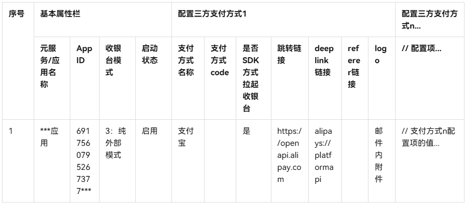

# 业务规则说明

更新时间：2026-04-28 03:31:56

来源：https://developer.huawei.com/consumer/cn/doc/harmonyos-guides/payment-common-pay-introduction

> [!NOTE]
> 接入通用收银台需先开通对应的产品，参见产品开通操作。

Payment Kit通用收银台上可以包含多种支付方式，支持自由组合。根据不同的资金处理方式可将通用收银台支付分为以下支付模式：

| 支付模式 | 资金处理 | 说明 |
| --- | --- | --- |
| [华为支付](https://developer.huawei.com/consumer/cn/doc/harmonyos-guides/payment-payment-process) | 支付方式全由华为支付处理资金 | 收银台支付方式有华为支付、三方支付，都由华为支付提供资金处理。 |
| [混合支付](https://developer.huawei.com/consumer/cn/doc/harmonyos-guides/payment-common-pay-mix) | 部分支付方式由华为支付处理资金 | 收银台支付方式有华为支付、三方支付，其中华为支付由华为支付提供资金处理，三方支付由三方支付平台提供资金处理。 |
| [纯外部支付](https://developer.huawei.com/consumer/cn/doc/harmonyos-guides/payment-common-pay-external) | 支付方式不通过华为支付处理资金 | 收银台支付方式仅包含三方支付，由三方支付平台提供资金处理。 |

## 产品开通与配置

如接入[混合支付](https://developer.huawei.com/consumer/cn/doc/harmonyos-guides/payment-common-pay-mix)、[纯外部支付](https://developer.huawei.com/consumer/cn/doc/harmonyos-guides/payment-common-pay-external)，开发者需与华为支付业务侧沟通（合作咨询可[点击此处](https://developer.huawei.com/consumer/cn/doc/harmonyos-guides/payment-service-support)）后提供以下信息给华为支付业务侧添加支付模式相关配置，配置项内容参考如下：
| 配置项 | 是否必选 | 说明 |
| --- | --- | --- |
| 元服务/应用名称 | 是 | 应用的名称（AppID关联应用的名称）。 |
| AppID | 是 | 应用的AppID（在[AppGallery Connect](https://developer.huawei.com/consumer/cn/service/josp/agc/index.html)网站点击“开发与服务”，在项目列表中找到项目，在“项目设置 > 常规”页面的“应用”区域获取“APP ID”的值）。 |
| 收银台模式 | 是 | 收银台接入的支付模式（未配置商户三方支付相关配置时，默认为[华为支付](https://developer.huawei.com/consumer/cn/doc/harmonyos-guides/payment-payment-process)模式）。          2：混合支付模式（部分交易走华为支付通道，部分走外部三方支付通道）          3：纯外部支付模式（全部交易走外部三方支付通道） |
| 启用状态 | 是 | 是否启用应用申请的三方支付相关配置。          - 启用（默认）          - 未启用 |
| 支付方式名称 | 是 | 三方支付方式配置项。 收银台展示的支付方式名称。 |
| 支付方式code | 否 | 三方支付方式配置项。当支付方式非微信支付和支付宝时需要填写该项。 |
| 拉起收银台方式 | 是 | 三方支付方式配置项。是否SDK方式拉起收银台          - 是：[基于接口拉起三方支付收银台](https://developer.huawei.com/consumer/cn/doc/harmonyos-guides/payment-launch-third-party-payment-sdk)          - 否：[基于URL跳转三方支付收银台](https://developer.huawei.com/consumer/cn/doc/harmonyos-guides/payment-launch-third-party-payment-url)。          说明： 不同的配置在[拉起三方支付收银台](https://developer.huawei.com/consumer/cn/doc/harmonyos-guides/payment-launch-third-party-payment-url)方式上有区别，当前支持[基于接口拉起方式](https://developer.huawei.com/consumer/cn/doc/harmonyos-guides/payment-launch-third-party-payment-sdk)拉起三方支付收银台支持的支付方式参见[PayMethod](https://developer.huawei.com/consumer/cn/doc/harmonyos-references/payment-third-payment-service#paymethod)。 |
| 支付方式跳转路径 | 否 | 三方支付方式配置项。[基于URL跳转三方支付收银台](https://developer.huawei.com/consumer/cn/doc/harmonyos-guides/payment-launch-third-party-payment-url)方式时必选。          常见支付方式的跳转链接如下（供参考）。          - 支付宝：https://mclient.alipay.com          - 微信支付：https://wx.tenpay.com |
| 支付方式deeplink链接 | 否 | 三方支付方式配置项。[基于URL跳转三方支付收银台](https://developer.huawei.com/consumer/cn/doc/harmonyos-guides/payment-launch-third-party-payment-url) 方式时必选。          常见支付方式的deeplink链接如下（供参考）。          - 支付宝：alipays://platformapi          - 微信支付：weixin://wap/pay |
| 支付方式referer链接 | 否 | 三方支付方式配置项。根据支付方式情况填写，若不涉及则不填。H5微信支付场景下必填，值为商户在微信支付商户管理平台申请开通微信支付H5支付时登记配置的链接。 |
| 支付方式的logo | 是 | 三方支付方式配置项。支持png、jpg、jpeg、gif、webp、bmp格式。 |

可参考如下表格格式填写配置提供：

## 约束与限制

设备类型：华为手机。 HarmonyOS系统：HarmonyOS 5.0.2(14)及以上。 HarmonyOS SDK版本：HarmonyOS 5.0.2(14)及以上。
