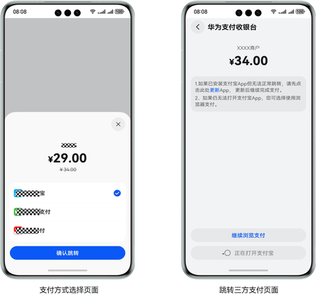
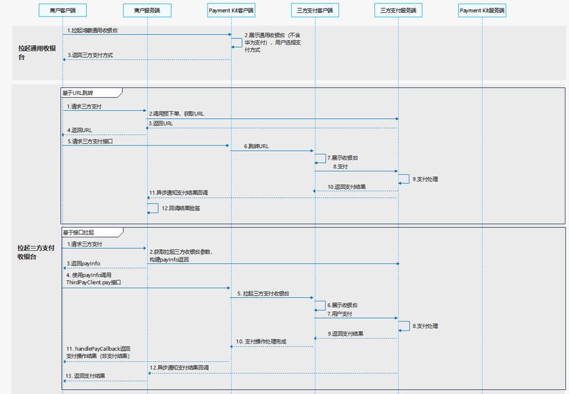

# 纯外部支付场景

更新时间：2026-04-28 03:31:56

来源：https://developer.huawei.com/consumer/cn/doc/harmonyos-guides/payment-common-pay-external

## 场景介绍

从5.0.2(14)版本开始，新增支持通用收银台纯外部支付场景。 用户在开发者的应用/元服务中选购完商品，点击下单购买，应用/元服务拉起通用收银台支付仅可以选择三方支付方式完成商品订单的支付。 支持商户模型：不涉及华为支付商户入网。 通用收银台纯外部支付页面展示：


## 接入流程

华为支付通用收银台纯外部支付接入流程如下：
| 步骤 | 说明 |
| --- | --- |
| 商户入网（非必选） | 三方支付商户入网（非必选）          由于三方支付为直接连接第三方支付平台完成支付，故可能涉及需要开发者在第三方支付平台注册、创建商户（建议开发者用新申请的商户号与现有商户号做区分）。 |
| [产品开通与配置](https://developer.huawei.com/consumer/cn/doc/harmonyos-guides/payment-common-pay-introduction#产品开通与配置) | 申请开通三方支付及完成相关支付模式配置。 |
| 通用收银台接入 | 根据纯外部支付场景[开发步骤](#开发步骤)完成通用收银台支付接入。 |


## 业务流程

纯外部支付模式下，收银台仅支持第三方平台支付，用户无法使用华为支付。具体接入流程如下：

商户客户端根据商户已开通的支付模式构建[PaymentInfo](https://developer.huawei.com/consumer/cn/doc/harmonyos-references/payment-paymentservice#paymentinfo)参数调用[cashierPicker](https://developer.huawei.com/consumer/cn/doc/harmonyos-references/payment-paymentservice#cashierpicker)接口拉起Payment Kit通用收银台。 Payment Kit通用收银台展示可用的三方支付方式，用户选择三方支付方式并确认支付。 Payment Kit客户端将用户在通用收银台选择支付方式并确认支付后的支付信息[PickerResult](https://developer.huawei.com/consumer/cn/doc/harmonyos-references/payment-paymentservice#pickerresult)返回给商户客户端。 **基于URL跳转方式拉起收银台：** 商户客户端将支付方式通知给商户服务端。 商户服务端调用三方支付的接口获取支付信息。 三方支付服务端将支付跳转链接信息返回给商户服务端。 商户服务端将支付跳转链接信息返回给商户客户端。 商户客户端构建**订单支付跳转信息**[orderStr](https://developer.huawei.com/consumer/cn/doc/harmonyos-references/payment-model#orderstr)请求Payment Kit的[requestPayment](https://developer.huawei.com/consumer/cn/doc/harmonyos-references/payment-paymentservice#requestpayment)接口跳转三方支付。 Payment Kit客户端根据传递的支付消息拉起三方支付收银台。 三方支付客户端展示支付收银台。 用户完成支付操作。 三方支付服务端处理支付。 三方支付服务端同步返回支付状态给三方支付客户端，三方支付客户端展示支付状态后返回商户客户端。 三方支付服务端通过回调接口将支付结果返回给商户服务端。 商户服务端收到支付结果回调请求后，根据三方支付服务要求对支付结果进行验签。 **基于接口拉起方式拉起收银台：** 商户客户端将返回的支付方式上送给商户服务端。 商户服务端获取拉起三方收银台参数，构建[payInfo](https://developer.huawei.com/consumer/cn/doc/harmonyos-references/payment-model#payinfo)（不同三方支付方式拉起收银台参数不同）返回。 商户服务端返回三方支付信息[payInfo](https://developer.huawei.com/consumer/cn/doc/harmonyos-references/payment-model#payinfo)给商户客户端。 商户客户端使用[payInfo](https://developer.huawei.com/consumer/cn/doc/harmonyos-references/payment-model#payinfo)调用Payment Kit的[ThirdPayClient.pay](https://developer.huawei.com/consumer/cn/doc/harmonyos-references/payment-third-payment-service#pay)接口拉起三方支付（可同步通过[ThirdPayClient.handlePayCallback](https://developer.huawei.com/consumer/cn/doc/harmonyos-references/payment-third-payment-service#handlepaycallback)接口调用，获取三方支付操作处理结果）。 Payment Kit拉起三方支付收银台。 三方支付客户端展示支付收银台。 用户完成支付操作。 三方支付服务端处理支付。 三方支付服务端同步返回支付状态给三方支付客户端，三方支付客户端展示支付状态后返回商户客户端。 三方支付客户端将用户支付操作完成同步给Payment Kit客户端。 Payment Kit客户端通过[ThirdPayClient.handlePayCallback](https://developer.huawei.com/consumer/cn/doc/harmonyos-references/payment-third-payment-service#handlepaycallback)接口，将用户支付操作结果返回给商户客户端。 三方支付服务端通过回调接口将支付结果返回给商户服务端。 商户服务端收到支付结果回调请求后，根据三方支付服务要求对支付结果进行验签，同步返回支付结果给客户端。

## 接口说明

拉起通用收银台接口通过Promise返回结果。具体API说明详见[接口文档](https://developer.huawei.com/consumer/cn/doc/harmonyos-references/payment-paymentservice)。
| 接口名 | 描述 |
| --- | --- |
| cashierPicker(context: common.UIAbilityContext, paymentInfo: PaymentInfo): Promise | 拉起Payment Kit通用收银台（不含华为支付）。 |
| requestPayment(context: common.UIAbilityContext, orderStr: string, payload: string): Promise | 跳转三方支付收银台。 |
| pay(payInfo: string): Promise; | 拉起三方支付收银台。 |
| handlePayCallback(want: Want): boolean; | 三方支付结果回调同步华为支付收银台。 |


## 开发步骤


## 拉起通用收银台（端侧开发）

商户客户端构建[PaymentInfo](https://developer.huawei.com/consumer/cn/doc/harmonyos-references/payment-paymentservice#paymentinfo)参数调用[cashierPicker](https://developer.huawei.com/consumer/cn/doc/harmonyos-references/payment-paymentservice#cashierpicker)接口拉起Payment Kit通用收银台，用户选择支付方式并确认支付后，Payment Kit客户端将支付信息[PickerResult](https://developer.huawei.com/consumer/cn/doc/harmonyos-references/payment-paymentservice#pickerresult)返回给商户客户端 。 当接口通过.then()方法返回时，则表示当前接口请求响应正常，通过.catch()方法返回表示接口请求响应异常。当此次请求有异常时，可通过**error.code**获取错误码，错误码相关信息请参见[错误码](https://developer.huawei.com/consumer/cn/doc/harmonyos-references/payment-error-code)。示例代码如下：
```text
import { BusinessError } from '@kit.BasicServicesKit';
import { paymentService } from '@kit.PaymentKit';
import { common } from '@kit.AbilityKit';

@Entry
@Component
struct Index {
  context: common.UIAbilityContext = this.getUIContext().getHostContext() as common.UIAbilityContext;
  requestCashierPickerCallBack() {
    // use your own paymentInfo
    const paymentInfo: paymentService.PaymentInfo= {
      tradeSummary: "***交易",
      amount: 100,
      currency: "CNY",
      extraInfo: '{"***":"***"}'
    }
    paymentService.cashierPicker(this.context, paymentInfo)
      .then((pickerResult: paymentService.PickerResult) => {
        // succeeded in paying
        console.info('succeeded in paying, picker result: ', pickerResult);
      })
      .catch((error: BusinessError) => {
        // failed to pay
        console.error(`failed to pay, error.code: ${error.code}, error.message: ${error.message}`);
      });
  }

  build() {
    Column() {
      Button('requestCashierPickerCallBack')
        .type(ButtonType.Capsule)
        .width('50%')
        .margin(20)
        .onClick(() => {
          this.requestCashierPickerCallBack();
        })
      }
    .width('100%')
    .height('100%')
  }
}
```


## 拉起三方支付收银台（端侧开发）

根据[产品开通与配置](https://developer.huawei.com/consumer/cn/doc/harmonyos-guides/payment-common-pay-introduction#产品开通与配置)中的所配置的支付方式，参考[拉起三方支付收银台](https://developer.huawei.com/consumer/cn/doc/harmonyos-guides/payment-launch-third-party-payment-url)进行三方支付收银台拉起处理。
