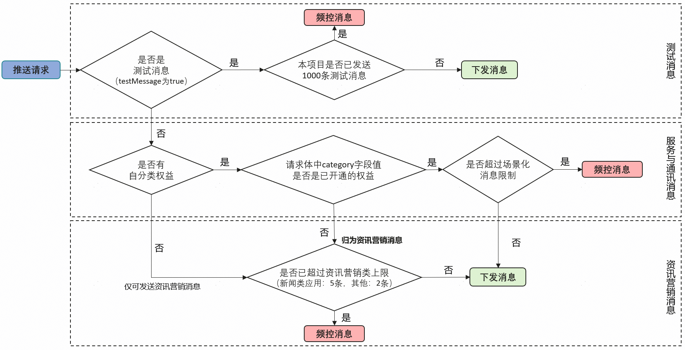

# 关于通知消息被频控的问题

更新时间：2026-04-28 03:31:56

来源：https://developer.huawei.com/consumer/cn/doc/harmonyos-guides/push-faq-5

为了给用户提供更好的消息通知体验，营造清朗网络空间，Push Kit设置了多条频控规则。若消息超出规则限制，超出的消息将会被**丢弃**，直到**次日恢复**。

## 通知消息被频控的可能原因

具体规则如下： **调测阶段**，每个项目每个自然日最多可推送1000条测试消息（非设备级，所有设备共用1000条），且不受场景化消息频控限制（即不区分通知消息类别、不区分场景化消息类别）。发送测试消息需设置[testMessage](https://developer.huawei.com/consumer/cn/doc/harmonyos-references/push-scenariozed-api-request-param#pushoptions)为true。
> [!NOTE]
> 若消息数量超出1000条频次限制，Push Kit将向您的回执服务器返回256结果码。（1000条为REST API请求成功总数，非成功到达端侧的消息总数）

**正式发布阶段**，系统会根据现网使用场景和流量进行管控，不合理的使用场景系统会进行频控，并受[场景化消息频控](https://developer.huawei.com/consumer/cn/doc/harmonyos-references/push-msg-freq-control#场景化消息频控)限制，具体频控规则见下表：
| 场景 | 频控规则 |
| --- | --- |
| 通知消息 | 若您未申请通知消息自分类权益，则推送的通知消息默认为资讯营销类（category取值为MARKETING）消息，根据[通知消息推送数量管理规则](https://developer.huawei.com/consumer/cn/doc/harmonyos-guides/push-apply-right#通知消息推送数量管理规则)限制单设备单应用下每个自然日，限制推送数量为2条或5条。若您仅需发送资讯营销类消息，则无需申请通知消息自分类权益；若您需要发送服务与通讯类消息，需要先开通[自分类权益](https://developer.huawei.com/consumer/cn/doc/harmonyos-guides/push-apply-right#申请通知消息自分类权益)。 |
| 卡片刷新消息 | 应用每个设备单个卡片已上架为2条/天，未上架为5条/天。 |
| 实况窗消息 | 单个实况窗消息每个设备每5分钟最多更新10次，每小时最多更新60次。          出行打车与赛事比分场景，5分钟最多更新30次，每小时最多更新180次。 |

> [!NOTE]
> 系统会根据现网使用场景和流量进行管控，不合理的使用场景系统会进行频控，Push Kit将向您的回执服务器返回102结果码。 若场景化消息超出对应的频控规则限制，Push Kit将向您的回执服务器返回256结果码。

频控规则详情请参见[消息频控](https://developer.huawei.com/consumer/cn/doc/harmonyos-references/push-msg-freq-control)，回执状态码详情请参考[回执状态码](https://developer.huawei.com/consumer/cn/doc/harmonyos-guides/push-msg-receipt#回执状态码)。

## 使用REST API接口单次推送消息可携带的Push Token数量是多少？

单次推送消息可携带的Push Token最多1000个，因此Push Kit服务器每次最多根据Token发送1000条消息。如果大于1000条，请求会返回错误码[80300010](https://developer.huawei.com/consumer/cn/doc/harmonyos-references/push-scenariozed-api-response#section80300010-消息体中的token数量超过系统设置的默认值) ，建议开发者分批发送。

## 推送消息最大为4KB，这是否意味着给1000个Token推送消息将超过此限制？

消息体大小限制不包括Token。
