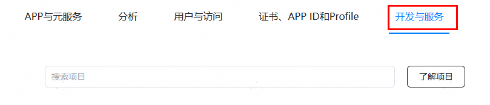
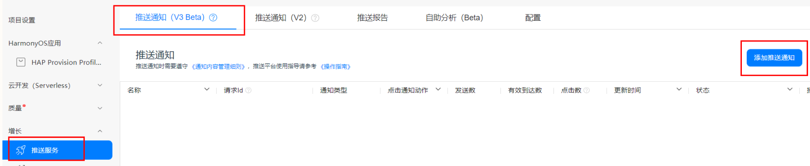
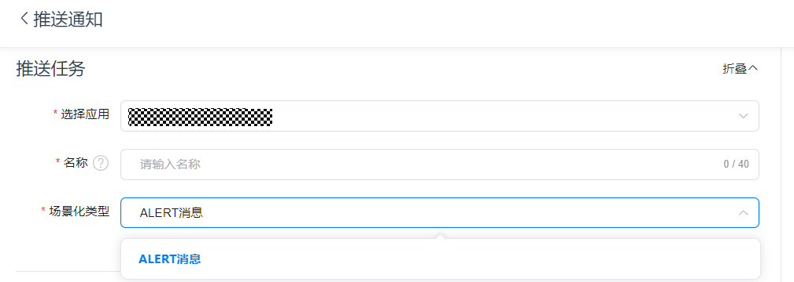
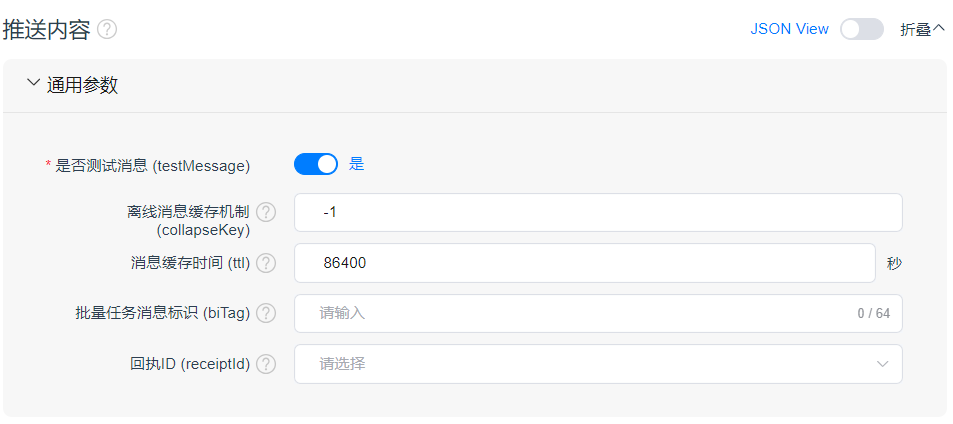
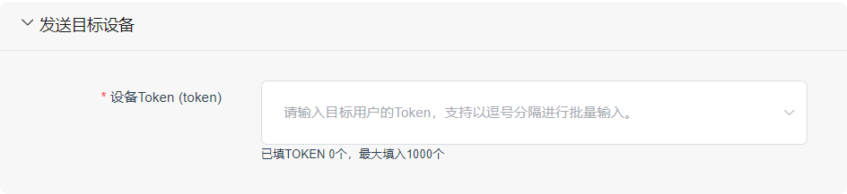
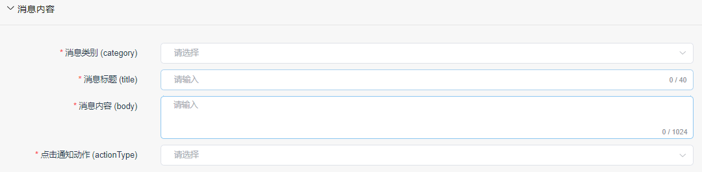
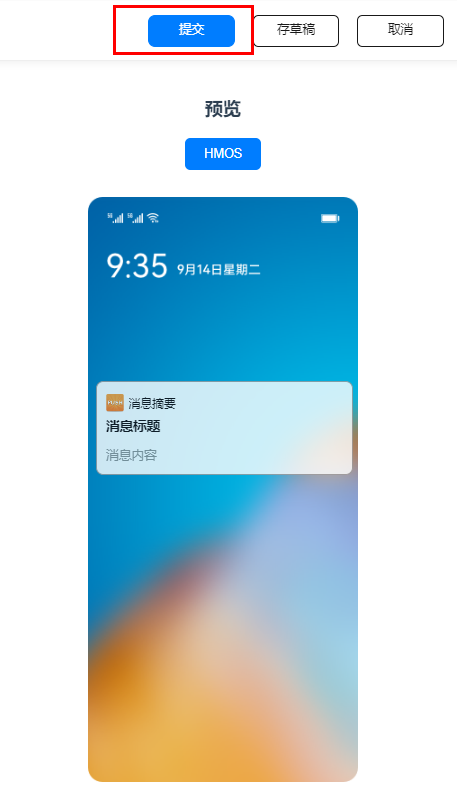

# 推送场景化消息

更新时间：2026-04-20 06:34:33

来源：https://developer.huawei.com/consumer/cn/doc/harmonyos-guides/push-scenes-send

## 场景介绍

Push Kit支持您使用HTTPS协议接入云侧，使用场景化V3接口发送场景化消息，并将不同场景定义为不同push-type。 您可发送的场景化消息类型如下表：
| push-type | 名称 |
| --- | --- |
| 0 | Alert消息（通知消息） |
| 1 | 卡片刷新消息 |
| 2 | 语音播报消息 |
| 6 | 后台消息 |
| 7 | 实况窗消息（Wearable、TV、PC/2in1不支持） |
| 10 | 应用内通话消息（Wearable、TV、PC/2in1不支持） |

有关场景化消息的更详细说明，请参见REST API-[场景化消息API接口](https://developer.huawei.com/consumer/cn/doc/harmonyos-references/push-scenariozed-api-intro#场景介绍)。

## 开发步骤

您的服务端获取鉴权令牌，详情请参见[基于服务账号生成鉴权令牌](https://developer.huawei.com/consumer/cn/doc/harmonyos-guides/push-jwt-token)。 您的服务端调用API发送Push场景化消息，更多消息内容请参见REST API-[场景化消息API接口](https://developer.huawei.com/consumer/cn/doc/harmonyos-references/push-scenariozed-api-intro#场景介绍)。 **HTTPS POST URL：**
```text
POST "https://push-api.cloud.huawei.com/v3/[projectId]/messages:send"
```

“[projectId]”请替换为您应用的项目ID。登录[AppGallery Connect](https://developer.huawei.com/consumer/cn/service/josp/agc/index.html)网站，选择“开发与服务”，在项目列表中选择对应的项目，左侧导航栏选择“项目设置”，在该页面获取“项目ID”。 **请求消息头示例：**
```text
Content-Type: application/json
Authorization: Bearer eyJr*****OiIx---****.eyJh*****iJodHR--***.QRod*****4Gp---****
push-type: 0
```

请求消息头中的Authorization参数为"Bearer "拼接上您在上一步[在线生成服务账号鉴权令牌](https://developer.huawei.com/consumer/cn/doc/harmonyos-guides/push-jwt-token)中获取的鉴权令牌。 请求消息头中的push-type参数为场景化消息类型，0代表Alert消息（通知消息）。 **通知消息体示例：**
```text
{
  "payload": {
    "notification": {
      "category": "MARKETING",
      "title": "普通通知标题",
      "body": "普通通知内容",
      "clickAction": {
        "actionType": 0
      },
      "notifyId": 12345
    }
  },
  "target": {
    "token": ["MAMzLg**********lPW"]
  },
  "pushOptions": {
    "testMessage": true
  }
}
```

更多场景化消息示例可参见[请求示例](https://developer.huawei.com/consumer/cn/doc/harmonyos-references/push-scenariozed-api-request-example)。 建议您在开发代码前先使用Postman等调试工具发送消息，测试功能。 （可选）您的应用服务器接收Push Kit的消息回执，详情请参见[消息回执](https://developer.huawei.com/consumer/cn/doc/harmonyos-guides/push-msg-receipt)。
> [!NOTE]
> Push Kit提供了基于Java语言的服务端示例代码（包括申请鉴权令牌、发送通知消息、卡片刷新消息等功能），方便您参考使用，详情请参见示例代码。


## AppGallery Connect在线推送通知消息


> [!NOTE]
> 当前仅支持配置Alert消息。

登录[AppGallery Connect](https://developer.huawei.com/consumer/cn/service/josp/agc/index.html)网站，点击“开发与服务”，在项目列表中选择对应的项目，左侧导航栏选择“项目设置”。

在项目列表中找到您的项目，通过“增长 > 推送服务 > 推送通知（V3 Beta）”导航到“推送通知（V3 Beta）”页签。在该页签下点击“添加推送通知”新建推送任务。

这里以Alert消息举例，配置参数如下。 **配置推送任务**

| 字段值 | 说明 |
| --- | --- |
| 选择应用 | 消息发送的目标应用，此字段为必填字段。 |
| 名称 | 用于在管理台中标识通知，此名称不会给用户显示，此字段为必填字段。 |
| 场景化类型 | 场景化消息类型，当前仅支持Alert消息。 |

**配置推送内容-通用参数**

| 字段值 | 说明 |
| --- | --- |
| 是否测试消息 (testMessage) | 测试消息标识，对应场景化接口中的testMessage参数，此字段为必填字段。              测试消息标识：              false：正式消息              true：测试消息 （默认值） |
| 离线消息缓存机制 (collapseKey) | 离线消息缓存控制方式，，对应场景化接口中的collapseKey参数，此字段为可选字段。              离线消息缓存控制方式，取值范围-1~100。              -1：对所有离线消息都缓存（默认值） ；              0~100：离线消息缓存分组标识，对离线消息进行分组缓存，每个应用每一组只缓存一条最新的离线消息。 |
| 消息缓存时间 (ttl) | 对应场景化接口中的ttl参数，此字段为可选字段。              消息缓存时间，单位是秒。在用户设备离线时，消息在Push服务器进行缓存，在消息缓存时间内用户设备上线，消息会下发，超过缓存时间后消息会丢弃，默认值为86400秒（1天） ，最大值为15天。 |
| 批量任务消息标识 (biTag) | 对应场景化接口中的biTag参数，此字段为可选字段。              批量任务消息标识，[消息回执](https://developer.huawei.com/consumer/cn/doc/harmonyos-guides/push-msg-receipt)时会返回给应用服务器，长度最大64字节。 |
| 回执ID (receiptId) | 对应场景化接口中的receiptId参数，此字段为可选字段。              回执ID指定本次下行消息的回执地址及配置。该回执ID可以在[配置回执参数](https://developer.huawei.com/consumer/cn/doc/harmonyos-guides/push-msg-receipt#配置回执参数)中查看。 |

**配置推送内容-发送目标设备**

| 字段值 | 说明 |
| --- | --- |
| 设备Token (token) | 对应场景化接口中的token参数，此字段为必填字段。              按照Token向目标用户推送消息。              样例：MAMzL******* |

**配置推送内容-消息内容**

| 字段值 | 说明 |
| --- | --- |
| 消息类别 (category) | 对应场景化接口中的category参数，此字段为必填字段。              通知消息类别。完成[申请通知消息自分类权益](https://developer.huawei.com/consumer/cn/doc/harmonyos-guides/push-apply-right#申请通知消息自分类权益)后，用于标识消息类型，不同的通知消息类型影响消息展示和提醒方式。取值如下：              · 即时聊天：IM              · 音视频通话：VOIP              · 订阅：SUBSCRIPTION              · 出行：TRAVEL              · 健康：HEALTH              · 工作事项提醒：WORK              · 账号动态：ACCOUNT              · 订单&物流：EXPRESS              · 财务：FINANCE              · 设备提醒：DEVICE_REMINDER              · 邮件：MAIL              · 新闻、内容推荐、社交动态、产品促销、财经动态、生活资讯、调研、功能推荐、运营活动（仅对内容进行标识，不会加快消息发送），统称为资讯营销类消息：MARKETING              · PLAY_VOICE：语音播报 |
| 消息标题 (title) | 对应场景化接口中的title参数，此字段为必填字段。              通知消息标题。 |
| 消息内容 (body) | 对应场景化接口中的body参数，此字段为必填字段。              通知消息内容。 |
| 点击通知动作 (actionType) | 对应场景化接口中的clickAction中actionType参数，此字段为必填字段。              点击消息后触发的动作，可选择打开应用首页、自定义action页面或自定义intentUri页面。 |

当您完成上述步骤后，点击右上方“提交”按钮即可推送消息。

> [!NOTE]
> 预览效果仅供参考，请以客户端实际效果为准。
