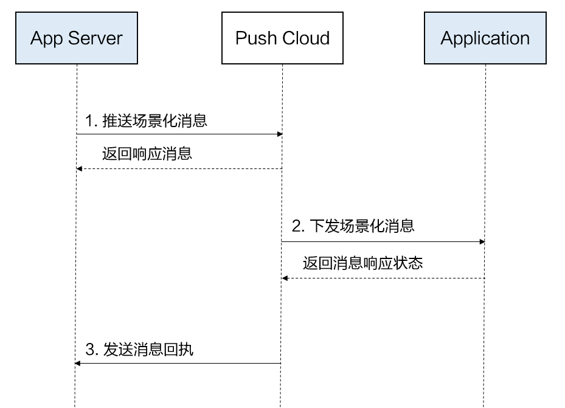

# 端云调试概述

更新时间：2026-04-20 06:34:33

来源：https://developer.huawei.com/consumer/cn/doc/harmonyos-guides/push-server-intro

[推送场景化消息](https://developer.huawei.com/consumer/cn/doc/harmonyos-guides/push-scenes-send)章节中囊括了Push Kit的所有推送场景，每个推送场景的开发可大致分为两大步骤：
 1. 获取Push Token，完成端侧基于推送场景的ArkTS代码开发。
2. 向Push Kit服务侧请求，发送场景化消息。
 
本章则在其基础上提供了更详细的服务侧（以下简称“云侧”）开发内容，以便您在完成端侧开发后更好地进行端云联调。阅读本章节时，请确保您至少已成功[获取Push Token](https://developer.huawei.com/consumer/cn/doc/harmonyos-guides/push-get-token)。
  

#### 业务流程

 
Push Kit云侧主要业务流程如下：
 1. 应用服务端向华为Push Kit云侧[推送场景化消息](https://developer.huawei.com/consumer/cn/doc/harmonyos-guides/push-scenes-send)，发送后应用服务端将收到云侧返回的响应消息。
2. Push Kit云侧将应用的场景化消息下发给应用终端，终端（Push Kit端侧）向云侧返回消息响应状态。
3. Push Kit云侧将消息响应状态回执给应用服务端。开发者可以选择[（可选）开发消息回执](https://developer.huawei.com/consumer/cn/doc/harmonyos-guides/push-msg-receipt)，以便您的服务端能收到云侧消息下发到端侧后的响应状态。未开通消息回执不会影响消息下发。
