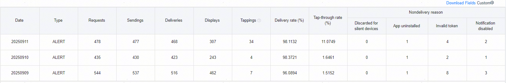
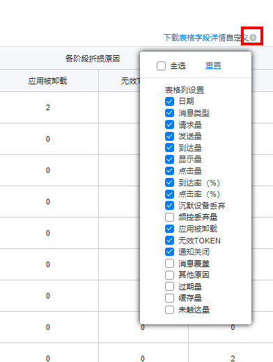
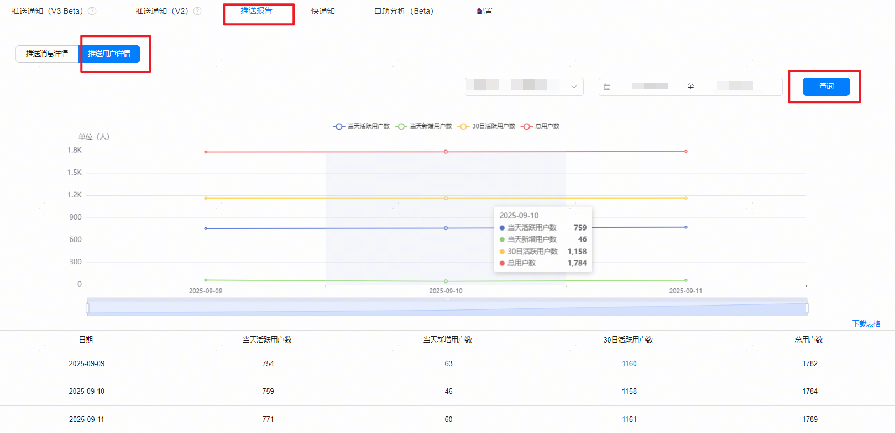

# （可选）推送报告

更新时间：2026-04-20 06:34:33

来源：https://developer.huawei.com/consumer/cn/doc/harmonyos-guides/push-delivery-report

登录[AppGallery Connect](https://developer.huawei.com/consumer/cn/service/josp/agc/index.html)网站，点击“开发与服务”，在项目列表中找到您的项目，通过“增长 > 推送服务 > 推送报告”，您可以在“推送报告”中查看推送消息详情和推送用户详情。
 
> [!NOTE]
> 推送报告数据不是实时数据，当天生成的数据在控制台次日才能查看到。

  

##### 推送消息详情

您可以查看推送消息的详情，场景化消息的统计图和对应表格，同时可以按照通道维度进行查看，有“通过AGC控制台”、“通过API方式”和“全部通道”；也可以按照消息类型维度进行查看。
 

 

 
点击自定义后的

，可自定义推送消息报表展示的表格列，默认展示的表格列有：日期、消息类型、请求量、发送量、到达量、显示量、点击量、到达率（%）、点击率（%）、沉默设备丢弃、应用被卸载、无效TOKEN、通知关闭。全选可展示全部表格列，重置则恢复默认表格列。
 

 
报表数据条目说明：
 
- 请求量：该推送任务预计覆盖的设备数量。
- 发送量：在请求量的基础上剔除不符合下发条件的消息数量，实际下发的消息数量。
- 到达量：扣除未触达量后实际到达的数量。
- 显示量：消息展示在通知栏的数量。
- 点击量：用户点击推送消息的数量。
- 到达率（%）：到达量/发送量。
- 点击率（%）：点击量/显示量。
- 沉默设备丢弃：终端设备超过30天没有联网的数量。
- 频控丢弃量：向单个设备发送消息超出上限，超出部分被丢弃的数量。
- 应用被卸载：用户已经卸载该应用并且没有重新安装的数量。
- 无效TOKEN：消息从云端发送到终端设备过程中，由于Token无效不展示的数量。
- 通知关闭：用户关闭了应用的消息通知权限的数量。
- 消息覆盖：待发送消息被覆盖的数量。针对待发送消息，只保留最新一条，其余待发送消息会被覆盖不下发。
- 其他原因：其他不满足触达条件的情况，如推送链接无法正常访问等。
- 过期量：目标设备离线，在消息有效期内设备未上线导致消息过期的数量。
- 缓存量：目标设备离线，消息仍在有效期内的数量。
- 未触达量：消息未到达终端设备的数量。

 
> [!NOTE]
> 不符合下发条件的消息数量包括：沉默设备丢弃、频控丢弃量、应用被卸载、无效TOKEN、通知关闭、消息覆盖、其他原因、过期量、缓存量。

 
  

##### 推送用户详情

您可以查看推送用户的详情，根据时间维度查看活跃用户、新增用户和总用户的统计数据。
 

 
报表数据条目说明：
 
- 当天活跃用户数：当天设备与Push服务端建立连接的用户数量。
- 当天新增用户数：当天新安装的用户数量。不统计重复卸载安装应用场景。
- 30日活跃用户数：查询日往前30日内设备与Push服务端建立连接的用户数量。
- 总用户数：已安装的总用户数量。
