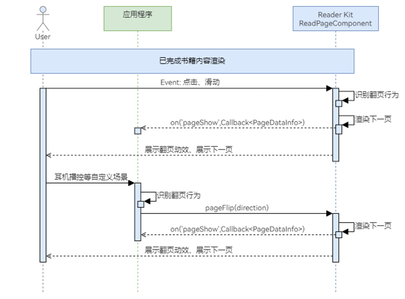

# 手动触发翻页

更新时间：2026-04-20 06:34:33

来源：https://developer.huawei.com/consumer/cn/doc/harmonyos-guides/reader-flip-page

Reader Kit的交互能力已经集成了手指点击和触摸滑动翻页，如果开发者需要增加其它翻页场景时（如：耳机播控翻页），可使用手动翻页接口实现自定义翻页场景。


#### 业务流程





#### 接口说明

手动触发场景只涉及1个翻页接口，具体介绍如下表所示。

| 接口名 | 描述 |
| --- | --- |
| flipPage(isNext: boolean): void | 触发ReadPageComponent组件进行翻页。 |


#### 开发准备

在进行手动触发翻页之前，请先确保已经“[构建阅读器](https://developer.huawei.com/consumer/cn/doc/harmonyos-guides/reader-read-page)”。


#### 开发步骤
1. 在调用翻页接口之前，需要应用先构建需要手动触发翻页的场景，如耳机播控场景等。
2. 当自定义翻页场景调用触发翻页时，调用flipPage接口即可实现翻页能力。

  
```text
let isNext: boolean = true; // true为下一页, false为上一页
this.readerComponentController.flipPage(isNext);
```
