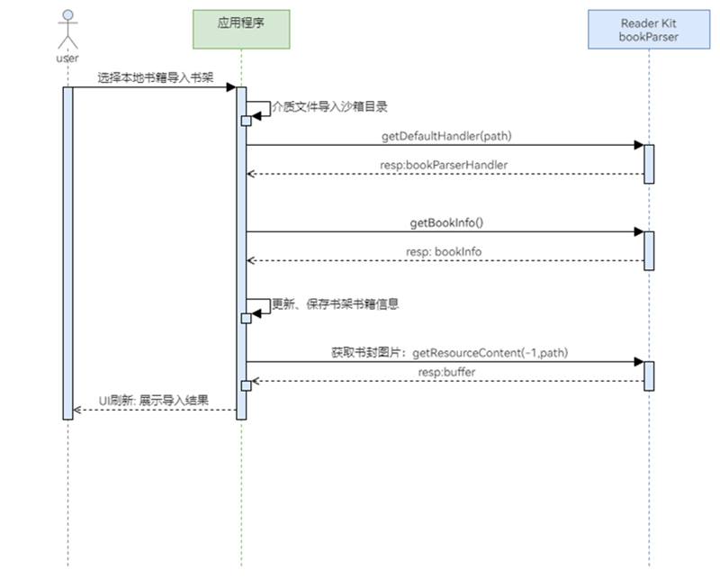

# 获取书籍信息

更新时间：2026-04-20 06:34:33

来源：https://developer.huawei.com/consumer/cn/doc/harmonyos-guides/reader-book-info

在导入本地书籍到书架时，开发者需通过[DocumentViewPicker](https://developer.huawei.com/consumer/cn/doc/harmonyos-references/js-apis-file-picker#documentviewpicker)先将书籍文件导入到[应用沙箱目录](https://developer.huawei.com/consumer/cn/doc/harmonyos-guides/app-sandbox-directory)，然后利用解析能力获取书籍信息，包括书封、书名及作者等，以完成书架内容的展示。


##### 业务流程





##### 接口说明

获取书籍信息共涉及3个接口，具体API说明请参考下表。

| 接口名 | 描述 |
| --- | --- |
| getDefaultHandler(path: string): Promise&lt;BookParserHandler&gt; | 获取书籍默认解析器。 |
| getBookInfo(): BookInfo | 获取书籍信息。 |
| getResourceContent(spineIndex: number, filePath: string): ArrayBuffer | 获取书籍内容资源。 |


##### 开发步骤
1. 导入相关模块。

  
```text
import { common } from '@kit.AbilityKit';
import { bookParser } from '@kit.ReaderKit';
import { hilog } from '@kit.PerformanceAnalysisKit';
import { image } from '@kit.ImageKit';
```

2. 通过提前导入到[应用沙箱目录](https://developer.huawei.com/consumer/cn/doc/harmonyos-guides/app-sandbox-directory)中的书籍文件，初始化书籍解析器。

  
```text
private defaultHandler: bookParser.BookParserHandler | null = null;

aboutToAppear(): void {
  this.init().then(() => {
  });
}

private async init() {
  let context = this.getUIContext().getHostContext() as common.UIAbilityContext;
  let path: string = `${context.filesDir}/abc.epub`;
  try {
    this.defaultHandler = await bookParser.getDefaultHandler(path);
  } catch (error) {
    hilog.error(0x0000, "testTAG", `getDefaultHandler failed, Code: ${error.code}, message: ${error.message}`);
  }
}
```

3. 获取书名、作者、书封信息并进行展示。

  
```json
@State bookCover: PixelMap | null = null;
@State bookTitle: string = '';
@State author: string = '';

aboutToAppear(): void {
  this.init().then(() => {
    this.getBookInfo();
  });
}

private async getBookInfo() {
  try {
    let bookInfo: bookParser.BookInfo | undefined = this.defaultHandler?.getBookInfo();
    if (bookInfo) {
      this.bookTitle = bookInfo.bookTitle || '';
      this.author = bookInfo?.bookCreator || '';
      // SpineIndex is not required for obtaining the book cover.
      let buffer = this.defaultHandler?.getResourceContent(-1, bookInfo.bookCoverImage);
      let imageSource: image.ImageSource = image.createImageSource(buffer);
      this.bookCover = await imageSource.createPixelMap();
      imageSource.release();
    }
    hilog.info(0x0000, 'testTAG', 'getBookInfo bookInfo is: ' + JSON.stringify(bookInfo));
  } catch (error) {
    hilog.error(0x0000, 'testTAG', `getBookInfo failed, Code: ${error.code}, message: ${error.message}`);
  }
}

build() {
  Column() {
    Text('书名：' + this.bookTitle)
      .fontSize(20)
      .fontColor("#E6000000")
      .margin({ top: 50 })
    Text('作者：' + this.author)
      .fontSize(20)
      .fontColor("#E6000000")
      .margin({ top: 10 })
    Image(this.bookCover)
      .width(200)
      .aspectRatio(3 / 4)
      .borderRadius(5)
      .margin({ top: 10 })
  }
  .alignItems(HorizontalAlign.Start)
  .margin({ left: 10, right: 10 })
}
```
