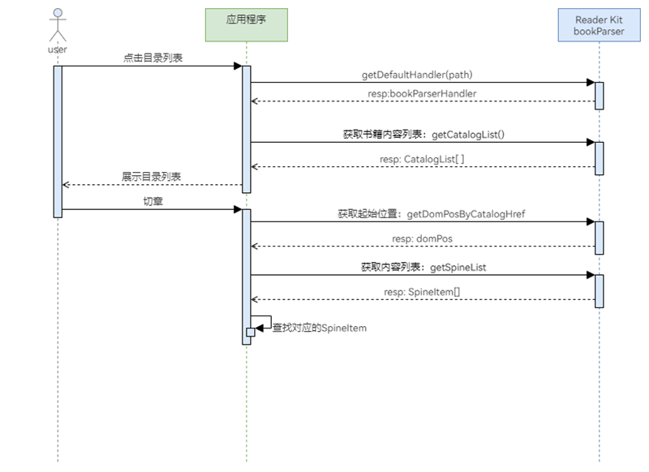

# 获取目录列表

更新时间：2026-04-20 06:34:33

来源：https://developer.huawei.com/consumer/cn/doc/harmonyos-guides/reader-catalog-list

当应用需要展示书籍目录列表时，开发者可通过解析能力获取目录节点列表，实现目录列表中章节名称按顺序、层级的展示。当用户点击目录节点时，开发者也需要获取目录位置及资源信息，用于跳转到指定位置。


## 业务流程



## 接口说明

获取目录列表及获取指定目录位置及资源信息共涉及4个接口，具体API说明请参考下表。
| 接口名 | 描述 |
| --- | --- |
| [getDefaultHandler](https://developer.huawei.com/consumer/cn/doc/harmonyos-references/reader-book-parser#getdefaulthandler)(path: string): Promise | 获取书籍默认解析器。 |
| [getCatalogList](https://developer.huawei.com/consumer/cn/doc/harmonyos-references/reader-book-parser#getcataloglist)(): CatalogItem[] | 获取书籍目录列表。 |
| [getDomPosByCatalogHref](https://developer.huawei.com/consumer/cn/doc/harmonyos-references/reader-book-parser#getdomposbycataloghref)(href: string): string | 获取阅读起始位置domPos。 |
| [getSpineList](https://developer.huawei.com/consumer/cn/doc/harmonyos-references/reader-book-parser#getspinelist)(): SpineItem[] | 获取书脊内容列表。 |


## 开发步骤

导入相关模块。
```text
import { common } from '@kit.AbilityKit';
import { bookParser } from '@kit.ReaderKit';
import { hilog } from '@kit.PerformanceAnalysisKit';
```

通过提前导入到[应用沙箱目录](https://developer.huawei.com/consumer/cn/doc/harmonyos-guides/app-sandbox-directory)中的书籍文件，初始化书籍解析器。
```text
private defaultHandler: bookParser.BookParserHandler | null = null;

aboutToAppear(): void {
  this.init().then(() => {
  });
}

private async init() {
  let context = this.getUIContext().getHostContext() as common.UIAbilityContext;
  let path: string = `${context.filesDir}/abc.epub`;
  try {
    this.defaultHandler = await bookParser.getDefaultHandler(path);
  } catch (error) {
    hilog.error(0x0000, "testTAG", `getDefaultHandler failed, Code: ${error.code}, message: ${error.message}`);
  }
}
```

获取目录列表并进行展示。
```text
@State catalogItemList: bookParser.CatalogItem[] = [];

aboutToAppear(): void {
  this.init().then(() => {
    this.getCatalogList();
  });
}

private getCatalogList() {
  try {
    this.catalogItemList = this.defaultHandler?.getCatalogList() || [];
  } catch (error) {
    hilog.error(0x0000, "testTAG", `getCatalogList failed, Code: ${error.code}, message: ${error.message}`);
  }
}

build() {
  Column() {
    List() {
      ForEach(this.catalogItemList, (item: bookParser.CatalogItem) => {
        ListItem() {
          Column() {
            Row() {
              Row() {
                Text(' · ')
                  .fontSize(14)
                Text(item.catalogName)
                  .fontSize(14)
                  .textOverflow({ overflow: TextOverflow.Ellipsis })
                  .padding({ top: 8, bottom: 8 })
                  .maxLines(2)
                  .layoutWeight(1)
              }

            }
            .width('100%')
            .height(48)
            .justifyContent(FlexAlign.Center)
            .alignItems(VerticalAlign.Center)

            Divider()
          }
          .padding({
            left: item.catalogLevel ? item.catalogLevel * 26 : 10,
            right: item.catalogLevel ? item.catalogLevel * 26 : 10,
            top: 6,
            bottom: 6
          })
          .onClick(async () => {
            // 在此实现点击目录跳转到指定章节功能
            this.jumpToCatalogItem(item);
          })
        }
      })
    }
    .scrollBar(BarState.Off)
    .width('100%')
    .height('100%')
  }
  .width('100%')
  .height('100%')
}
```

获取跳转用的目录位置及资源信息。
```text
private jumpToCatalogItem(catalogItem: bookParser.CatalogItem) {
  let domPos = this.getDomPos(catalogItem);
  let resourceIndex = this.getResourceItemByCatalog(catalogItem).index;
  // 通过domPos及resourceIndex信息，即可通过startPlay接口跳转到指定位置
  hilog.info(0x0000, "testTAG", `jumpToCatalogItem domPos:${domPos}, resourceIndex:${resourceIndex}`);
}

private getDomPos(catalogItem: bookParser.CatalogItem): string {
  try {
    let domPos: string = this.defaultHandler?.getDomPosByCatalogHref(catalogItem.href || '') || '';
    return domPos;
  } catch (error) {
    hilog.error(0x0000, "testTAG", `getDomPos failed, Code: ${error.code}, message: ${error.message}`);
  }
  return '';
}

/**
 * 获取书籍目录对应的资源条目
 *
 * @param catalogItem 目录条目
 */
private getResourceItemByCatalog(catalogItem: bookParser.CatalogItem): bookParser.SpineItem {
  let resourceFile = catalogItem.resourceFile || '';
  try {
    let spineList: bookParser.SpineItem[] = this.defaultHandler?.getSpineList() || []
    // 查找目录对应的资源条目
    let resourceItemArr = spineList.filter(item => item.href === resourceFile);
    if (resourceItemArr.length > 0) {
      hilog.info(0x0000, 'testTag', 'getResourceItemByCatalog get resource ', resourceItemArr[0]);
      let resourceItem = resourceItemArr[0];
      return resourceItem;
    } else if (spineList.length > 0) {
      // 如果查找不到，则默认返回第1个资源条目
      hilog.info(0x0000, 'testTag', 'getResourceItemByCatalog get resource in resourceList', spineList[0]);
      return spineList[0];
    }
  } catch (error) {
    hilog.error(0x0000, "testTAG", `getDomPos failed, Code: ${error.code}, message: ${error.message}`);
  }
  // 如果没有资源条目，则返回默认值
  hilog.info(0x0000, 'testTag', 'getResourceItemByCatalog get resource in escape');
  return {
    idRef: '',
    index: 0,
    href: '',
    properties: ''
  };
}
```
