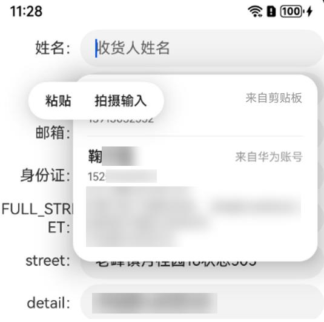

# 剪贴板粘贴框遮挡智能填充选择框

更新时间：2026-04-20 06:34:33

来源：https://developer.huawei.com/consumer/cn/doc/harmonyos-guides/scenario-fusion-faq-3

**现象描述**

 

 **解决措施**

 在代码文件中设置.selectionMenuHidden(true)，使剪贴板粘贴框隐藏。


```text
Row() {
        Text('收货人：').textAlign(TextAlign.End).width('25%')
        TextInput().width('75%').contentType(ContentType.PERSON_FULL_NAME).selectionMenuHidden(true)
      }
```
