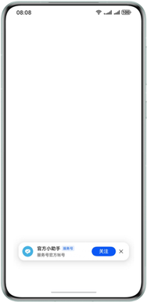
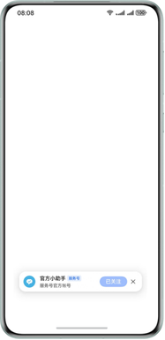

# 通过API展示关注组件

更新时间：2026-04-28 03:31:56

来源：https://developer.huawei.com/consumer/cn/doc/harmonyos-guides/scenario-fusion-api-followcomponent

## 场景介绍

从6.0.1(21)版本开始，支持关注组件API功能。 Scenario Fusion Kit提供服务号关注组件功能，调用该接口可以在业务应用/元服务页面展示服务号关注组件，用户点击关注按钮可关注上对应服务号。 用户关注服务号成功，按钮会变为已关注并置灰，在1.5秒后关注组件会自动消失。 用户关注服务号失败，则会出现错误提示。



## 前提条件

在[华为开发者联盟服务号管理首页](https://developer.huawei.com/consumer/cn/console/service/FastService/service/1063)，申请华为服务号，并获取服务号id。 使用企业开发者账号登录，并完成企业认证。 申请服务号并完成认证。 元服务/应用须与服务号处于同一个开发者账号下。

## 接口说明

以下是关注组件的接口说明，更多接口及使用方法请参见[atomicService（融合场景化API）](https://developer.huawei.com/consumer/cn/doc/harmonyos-references/scenario-fusion-atomicservice)。
| 接口名 | 描述 |
| --- | --- |
| [showFollowComponent](https://developer.huawei.com/consumer/cn/doc/harmonyos-references/scenario-fusion-atomicservice#showfollowcomponent)(ctx: [UIContext](https://developer.huawei.com/consumer/cn/doc/harmonyos-references/ts-custom-component-api#uicontext), params: [FollowComponentParams](https://developer.huawei.com/consumer/cn/doc/harmonyos-references/scenario-fusion-atomicservice#followcomponentparams), callback: [FollowComponentCallback](https://developer.huawei.com/consumer/cn/doc/harmonyos-references/scenario-fusion-atomicservice#followcomponentcallback)): Promise | 调用该方法展示关注组件。 |


## 开发步骤

导入Scenario Fusion Kit模块以及相关公共模块。
```text
import { atomicService } from '@kit.ScenarioFusionKit';
import { hilog } from '@kit.PerformanceAnalysisKit';
import { BusinessError } from '@kit.BasicServicesKit';
```

在需要添加关注组件的页面，调用接口展示关注组件，示例代码如下：
```text
@Entry
@Component
struct Index {
  aboutToAppear(): void {
    // 一键关注组件。
    // pubId：服务号id，此处以官方小助手服务号id为例。
    const pubId: string = '0cca1c645526449fb89d4a83e3bc25df';
    // channelId：渠道id，长度限制32，只能是数字或字母组成；offset：设置关注组件的位置坐标。
    const params: atomicService.FollowComponentParams =
      { pubId: pubId, channelId: '', offset: { x: 0, y: 300 } };
    // 点击关注按钮的关注结果回调。
    const callbacks: atomicService.FollowComponentCallback = {
      onFollowComplete: (err, result) => {
        if (err) {
          // 错误日志处理。
          hilog.error(0x0000, "testTag", "error: %{public}d %{public}s", err.code, err.message);
          return;
        }
        hilog.info(0x0000, "testTag", "follow result: %{public}d", result.code);
        if (result.code === atomicService.FollowResult.SUCCESS) {
          hilog.info(0x0000, "testTag", "follow succeeded handle");
        } else {
          hilog.info(0x0000, "testTag", "follow failed handle");
        }
      }
    }
    // 展示关注组件。
    atomicService.showFollowComponent(this.getUIContext(), params, callbacks).catch((error: BusinessError) => {
      hilog.error(0x0000, 'testTag', 'showFollowComponent failReason: %{public}d %{public}s:', error.code,
        error.message);
    })
  }

  build() {
  }
}
```
