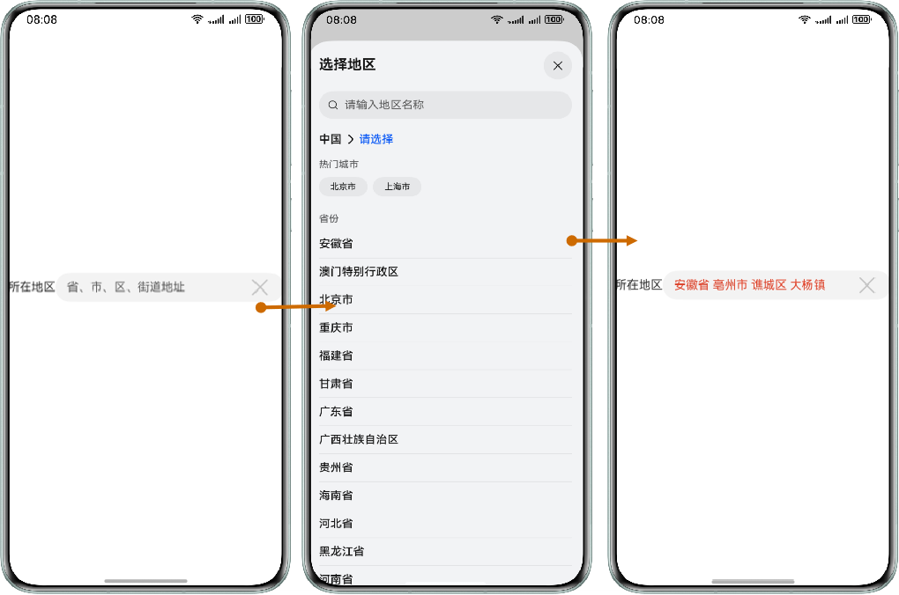

# 省市区选择器Input

更新时间：2026-04-20 06:34:33

来源：https://developer.huawei.com/consumer/cn/doc/harmonyos-guides/scenario-fusion-input-zone-selectors

##### 场景介绍

从5.1.0(18)开始，支持省市区选择器Input功能。

省市区选择器Input功能可以帮助开发者调用对应FunctionalInput组件快速拉起选择地区页面，供用户选择地区信息。

运行示例代码后单击“所在地区”文本框，拉起选择地区页面，按照需求选择地址信息，选择完成后将所选地址回填至文本框中。





##### 前提条件

参见[开发准备](https://developer.huawei.com/consumer/cn/doc/harmonyos-guides/map-config-agc)。


##### 开发步骤
1. 导入Scenario Fusion Kit模块以及相关公共模块。

  
```text
import { FunctionalInput, functionalInputComponentManager } from '@kit.ScenarioFusionKit';
import { hilog } from '@kit.PerformanceAnalysisKit';
import { SymbolGlyphModifier, TextInputModifier } from '@kit.ArkUI';
```

2. 在容器中声明FunctionalInput，指定FunctionalInput的inputType，并设置对应的回调函数，代码如下：

  
```text
@Entry
@Component
struct Index {
  @State inputContent: string = '';

  build() {
    Column() {
      Row() {
        Text('所在地区').width(64)
        // 构建FunctionalInput组件实例。
        FunctionalInput({
          params: {
            // InputType.SELECT_DISTRICT表示输入类型为省/市/区选择器类型。
            inputType: functionalInputComponentManager.InputType.SELECT_DISTRICT,
            textInputValue: {
              text: this.inputContent,
              placeholder: '省、市、区、街道地址',
            },
            // 调整TextInput样式。
            inputAttributeModifier: new TextInputModifier()
              .fontColor($r('sys.color.ohos_id_color_badge_red'))
              .onChange((value) => {
                if (value !== this.inputContent) {
                  this.inputContent = value;
                }
              }),
            // 将图标设置在末尾。
            icon: $r('sys.symbol.xmark'),
            // 设置符号图标的事件和样式。
            iconSymbolModifier: new SymbolGlyphModifier()
              .onClick(() => {
                this.inputContent = '';
              })
              .fontSize(32),
          },
          // 当InputType为SELECT_DISTRICT时，回调必须为onSelectDistrict。
          controller: new functionalInputComponentManager.FunctionalInputController().onSelectDistrict((err,
            data: functionalInputComponentManager.DistrictSelectResult) => {
            if (err) {
              // 错误日志处理。
              hilog.error(0x0000, "testTag", "error: %{public}d %{public}s", err.code, err.message);
              return;
            }
            // 成功日志处理。
            hilog.info(0x0000, "testTag", "succeeded in selecting district");
            // 在输入组件中显示所选区域信息。
            this.inputContent = data.inputContent;
          })
        })
          .layoutWeight(1)
      }.height('100%')
    }.width('100%')
  }
}
```

> [!NOTE]
> inputType参数填写"functionalInputComponentManager.InputType.SELECT_DISTRICT"指定Input为省市区选择器类型。 controller参数必须对应填写"new functionalInputComponentManager.FunctionalInputController().onSelectDistrict"。 可从返回结果中自行处理结果回填至组件中。 组件支持显示两种类型的图标：symbol和image，"icon"设置为symbol资源时，请使用" iconSymbolModifier "进行图标事件、样式的设置；设置为image资源时，请使用" iconImgModifier "进行图标事件、样式的设置。 functionalInput支持 智能填充 ，对应支持的 ContentType 为"ADDRESS_CITY_AND_STATE"。 其他参数请参考： FunctionalInput（Input组件） 。
