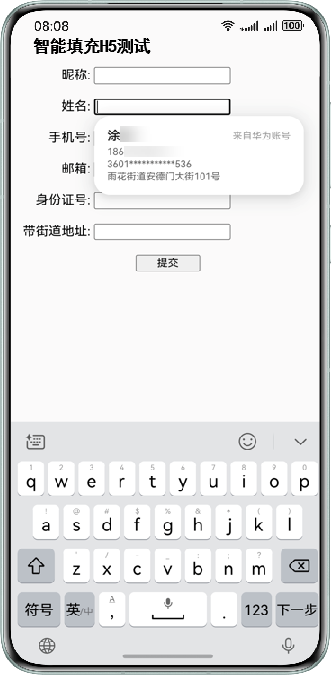

# H5接入智能填充

更新时间：2026-04-20 06:34:33

来源：https://developer.huawei.com/consumer/cn/doc/harmonyos-guides/scenario-fusion-h5

本章节介绍在ArkWeb的Web组件加载H5文件如何实现智能填充功能。
  

##### 前提条件

- 设备智能填充开关必须处于打开状态，请前往“设置 > 隐私和安全 > 智能填充”页面开启开关。
- 设备已连接互联网并且登录华为账号。
- 该应用需已接入[智能填充服务](https://developer.huawei.com/consumer/cn/doc/harmonyos-guides/scenario-fusion-introduction-to-smart-fill#申请接入智能填充服务)。

 
  

##### 效果图




 
  

##### 示例代码一

通过ArkWeb的[Web组件](https://developer.huawei.com/consumer/cn/doc/harmonyos-references/arkts-basic-components-web)加载H5文件。
 
```text
import { webview } from '@kit.ArkWeb';

@Entry
@Component
struct Index {
  controller: webview.WebviewController = new webview.WebviewController();
  build() {
    Column() {
      // 在组件创建过程中加载HTML5文件。
      Web({ src: $rawfile("autofill_h5.html"), controller: this.controller })
    }
  }
}
```
 
  

##### 示例代码二

autofill_h5.html如下所示。其中通过给form表单的input输入框（form表单的子节点）配置[autocomplete](https://developer.huawei.com/consumer/cn/doc/harmonyos-guides/scenario-fusion-mappingrelationship#h5-autocomplete和harmonyos的contenttype的映射关系)属性来支持智能填充，action需要配置表单提交接口链接，当form表单提交后，页面导航发生变化时，满足历史表单输入保存的条件时会触发对应弹窗。参考下面示例：
 
```text
<!DOCTYPE html>
<html>
<head>
    <meta content="width=device-width, initial-scale=1.0, maximum-scale=1.0, user-scalable=0;" name="viewport"/>
    <title>智能填充H5测试</title>
</head>
<body>
<h4>智能填充H5测试</h4>
<!--The link of the form submission interface must be configured for the value of the action tag.-->
<form method="POST" action="">
    <label for="nickname" style="width: 90px; display: inline-block; text-align: end;">昵称:</label>
    <!--Smart fill is supported by configuring the autocomplete attribute.-->
    <input type="text" id="nickname" autocomplete="nickname"/><br/><br/>
    <label for="name" style="width: 90px; display: inline-block; text-align: end;">姓名:</label>
    <input type="text" id="name" autocomplete="name"/><br/><br/>
    <label for="tel-national" style="width: 90px; display: inline-block; text-align: end;">手机号:</label>
    <input type="number" id="tel-national" autocomplete="tel-national"/><br/><br/>
    <label for="email" style="width: 90px; display: inline-block; text-align: end;">邮箱:</label>
    <input type="text" id="email" autocomplete="email"/><br/><br/>
    <label for="id-card-number" style="width: 90px; display: inline-block; text-align: end;">身份证号:</label>
    <input type="number" id="id-card-number" autocomplete="id-card-number"/><br/><br/>
    <label for="street-address" style="width: 90px; display: inline-block; text-align: end;">带街道地址:</label>
    <input type="text" id="street-address" autocomplete="street-address"/><br/><br/>
    <div align="center">
        <button type="submit" style="width: 80px">提交</button>
    </div>
</form>
</body>
</html>
```
