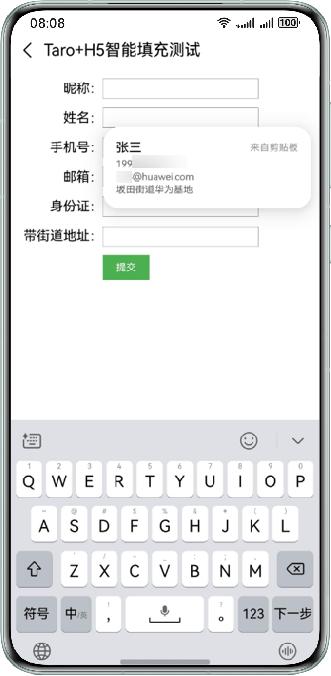

# Taro框架+H5接入智能填充

更新时间：2026-04-20 06:34:33

来源：https://developer.huawei.com/consumer/cn/doc/harmonyos-guides/scenario-fusion-taro

> [!NOTE]
> 目前仅支持已适配HarmonyOS的三方框架应用使用。  Taro及HarmonyOS版工程的搭建请参考官方文档Harmony Hybrid | Taro 文档。


## 前提条件

基于Web开发HarmonyOS应用。  设备智能填充开关必须处于打开状态，请前往“设置 > 隐私和安全 > 智能填充”页面开启开关。  设备已连接互联网并且登录华为账号。  该应用需已接入[智能填充服务](https://developer.huawei.com/consumer/cn/doc/harmonyos-guides/scenario-fusion-introduction-to-smart-fill#申请接入智能填充服务)。

## 开发准备

配置Taro已适配HarmonyOS的开发环境。

## 效果图



## 示例代码

示例代码仅展示接入智能填充相关部分，请按照实际场景修改后使用。在Taro的Input组件（Form表单的子节点）中添加nativeProps属性，并配置nativeProps中[autocomplete](https://developer.huawei.com/consumer/cn/doc/harmonyos-guides/scenario-fusion-mappingrelationship#h5-autocomplete和harmonyos的contenttype的映射关系)属性来支持智能填充，Form表单提交后，当页面导航发生变化时，满足历史表单输入保存的条件时会触发对应弹窗（建议使用HTML  标签进行Form表单提交）。代码如下：
```text
import { View, Text, Input, Form } from "@tarojs/components";
import Taro, { useLoad } from "@tarojs/taro";
import "./index.scss";

export default function Demo() {
  useLoad(() => {
    console.info("Page loaded.");
  });
  function handleSubmit(e) {
    Taro.request({
      // 将URL设置为实际的接口路径。
      url: "",
      method: "POST",
    });
  }
  return (


          昵称：


          姓名：


          手机号：


          邮箱：


          身份证：


          带街道地址：


         提交


  );
}
```

 index.scss如下：
```text
.form-item {
  display: flex;
  flex-wrap: wrap;
  flex-direction: row;
  align-items: center;
  justify-content: flex-start;
  margin-top: 20px;
  .col-md-4 {
    width: 30%;
    text-align: right;
    font-size: 32px;
  }
  .col-md-6 {
    width: 50%;
    .form-value {
      width: 100%;
      border-style: solid;
      border-width: 1px;
      border-color: #333333;
      font-size: 32px;
    }
  }
}
.button {
  width: 15%;
  background-color: #4caf50;
  border: none;
  color: white;
  padding: 16px 32px;
  text-align: center;
  text-decoration: none;
  display: inline-block;
  font-size: 24px;
  margin-left: 30%;
  margin-top: 20px;
}
```
