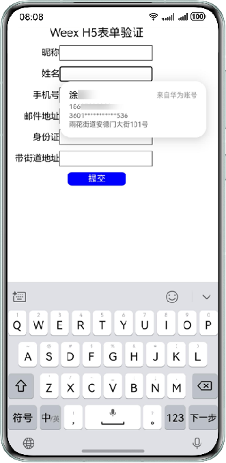

# Weex框架+H5接入智能填充

更新时间：2026-04-20 06:34:33

来源：https://developer.huawei.com/consumer/cn/doc/harmonyos-guides/scenario-fusion-weex

> [!NOTE]
> 目前仅支持已适配HarmonyOS的三方框架应用使用。


## 前提条件

设备智能填充开关必须处于打开状态，请前往“设置 > 隐私和安全 > 智能填充”页面开启开关。  设备已连接互联网并且登录华为账号。  该应用需已接入[智能填充服务](https://developer.huawei.com/consumer/cn/doc/harmonyos-guides/scenario-fusion-introduction-to-smart-fill#申请接入智能填充服务)。

## 开发准备

配置Weex已适配HarmonyOS的工程。

## 效果图



## 示例代码

在Weex的form表单中给input输入框（form表单的子节点）配置[autocomplete](https://developer.huawei.com/consumer/cn/doc/harmonyos-guides/scenario-fusion-mappingrelationship#h5-autocomplete和harmonyos的contenttype的映射关系)属性以实现智能填充，代码中action需要配置表单提交接口链接，当form表单提交后，页面导航发生变化时，满足历史表单输入保存的条件时会触发对应弹窗。代码如下：
```text


    Weex H5表单验证


        昵称


        姓名


        手机号


        邮件地址


        身份证


        带街道地址


        提交


export default {
  data() {
    return {};
  }
};


.header {
  width: 100%;
  display: flex;
  justify-content: center;
  font-size: 40px;
}
.form-item {
  display: flex;
  flex-wrap: wrap;
  flex-direction: row;
  align-items: center;
  justify-content: flex-start;
  margin-top: 20px;
  .label {
    width: 30%;
    line-height: 1.6;
    text-align: right;
  }
  .input {
    width: 50%;
    .form-value {
      width: 100%;
      line-height: 1.6;
      border-style: solid;
      border-width: 1px;
      border-color: #333333;
    }
  }
}
.form-button {
  width: 100%;
  margin-top: 20px;
  display: flex;
  align-items: center;
  .button {
    background-color:  blue;
    color: white;
    height: 47px;
    border: 0;
    font-size: 30px;
    border-radius: 15px;
    width: 200px;
    text-align: center;
  }
}

```
