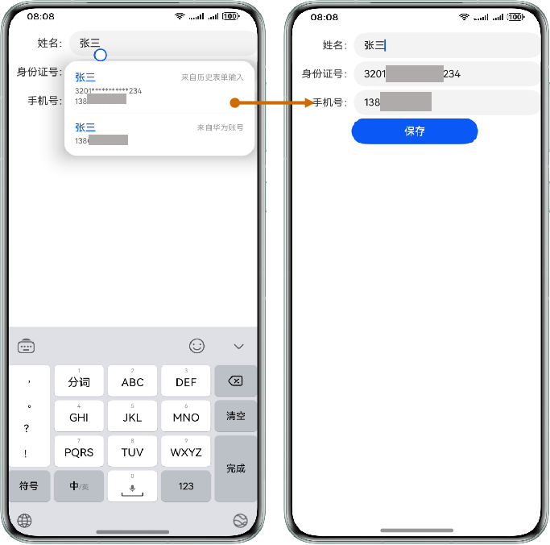
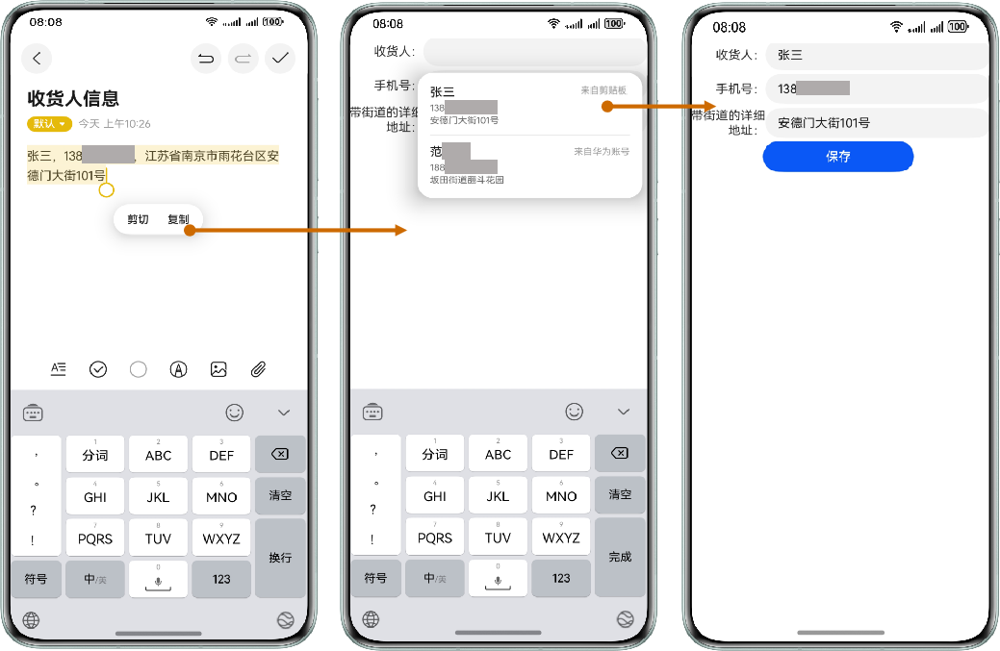

# 典型场景展示

更新时间：2026-04-20 06:34:33

来源：https://developer.huawei.com/consumer/cn/doc/harmonyos-guides/scenario-fusion-introduction-typical-scenario

如下展示两种智能填充的典型场景。
  

##### 实名购票场景

示例一：智能识别剪贴板内容，一键复制，一键填充。
 
> [!NOTE]
> 剪贴板数据源推荐场景目前仅支持中文姓名和中文地址。

 



 
示例二：根据用户输入，智能关联设备上历史表单输入、华为账号等信息提供输入建议，一键填充。
 



 
  

##### 填写收货地址场景

示例一：智能识别剪贴板内容，一键复制，一键填充。
 
> [!NOTE]
> 剪贴板数据源推荐场景目前仅支持中文姓名和中文地址。

 


 
示例二：根据用户输入，智能关联设备上历史表单输入、华为账号等信息提供输入建议，一键填充。
 


 
  

##### 示例代码

```text
import { autoFillManager } from '@kit.AbilityKit';
import { hilog } from '@kit.PerformanceAnalysisKit';
import { BusinessError } from '@kit.BasicServicesKit';

@Entry
@Component
struct SmartFill {
  @State isClicked: boolean = false;

  build() {
    Column({ space: 5 }) {
      Row() {
        Text('昵称：').textAlign(TextAlign.End).width('25%')
        TextInput().width('75%').contentType(ContentType.NICKNAME).selectionMenuHidden(true)
      }

      Row() {
        Text('姓名：').textAlign(TextAlign.End).width('25%')
        TextInput().width('75%').contentType(ContentType.PERSON_FULL_NAME).selectionMenuHidden(true)
      }

      Row() {
        Text('手机号码：').textAlign(TextAlign.End).width('25%')
        TextInput().width('75%').contentType(ContentType.PHONE_NUMBER).selectionMenuHidden(true)
      }

      Row() {
        Text('邮箱：').textAlign(TextAlign.End).width('25%')
        TextInput().width('75%').contentType(ContentType.EMAIL_ADDRESS).selectionMenuHidden(true)
      }

      Row() {
        Text('身份证号：').textAlign(TextAlign.End).width('25%')
        TextInput().width('75%').contentType(ContentType.ID_CARD_NUMBER).selectionMenuHidden(true)
      }

      Row() {
        Text('地址：').textAlign(TextAlign.End).width('25%')
        TextInput().width('75%').contentType(ContentType.FORMAT_ADDRESS).selectionMenuHidden(true)
      }

      Button('保存')
        .onClick(() => {
          if (!this.isClicked) {
            // 主动触发保存历史表单输入。
            try {
              autoFillManager.requestAutoSave(this.getUIContext())
            } catch (err) {
              let e: BusinessError = err as BusinessError;
              hilog.error(0x0000, 'DemoTest', 'error: %{public}d %{public}s', e.code, e.message);
            }
            this.isClicked = true;
            // 设置超时时间以防止重复点击按钮保存历史表单输入。
            setTimeout(() => {
              this.isClicked = false;
            }, 1000)
            // 或者通过路由跳转其他页面触发保存历史表单输入。
            this.getUIContext().getRouter().pushUrl({
              url: 'xxx'
            })
          }
        })
        .width("50%")
    }
    .alignItems(HorizontalAlign.Center)
    .height('100%')
    .width('100%')
  }
}
```
 
> [!NOTE]
> 智能填充在页面发生跳转的时候，或者手动触发保存逻辑的时候，方可触发保存表单逻辑。 剪贴板文本内容识别功能现已实现超过90%的准确率。尽管如此，我们认识到在特定场景下仍可能出现识别误差。为了提升填表数据的准确性，我们建议在关键环节引入增强校验。这些校验措施包括但不限于： 格式校验：自动检测输入格式，确保数据符合预设标准。 确认提示：在提交前通过弹窗提示用户再次确认信息，避免输入错误。 若在页面中也提供了弹窗提醒填充建议的功能，为避免弹窗冲突，建议将对应输入组件的 enableAutoFill 属性设置为"false"以关闭智能填充功能。
