# 智能填充概述

更新时间：2026-04-29 07:35:50

来源：https://developer.huawei.com/consumer/cn/doc/harmonyos-guides/scenario-fusion-introduction-to-smart-fill

智能填充服务提供场景化的输入建议，完善应用/元服务的系统开发能力，实现用户对复杂表单的一键填充，助力打造HarmonyOS极致输入效率。开发ArkUI输入组件后（[TextInput](https://developer.huawei.com/consumer/cn/doc/harmonyos-references/ts-basic-components-textinput)、[TextArea](https://developer.huawei.com/consumer/cn/doc/harmonyos-references/ts-basic-components-textarea)以下统称输入组件），一行代码配置快速启用功能。

## 约束与限制

智能填充支持Phone、Tablet设备，并且从5.1.0(18)版本开始，新增支持PC/2in1设备。

## 申请接入智能填充服务

## 接入须知

智能填充服务仅提供给[已完成认证的企业开发者](https://developer.huawei.com/consumer/cn/doc/start/edrna-0000001062678489)使用。  智能填充支持的填充字段满足应用使用智能填充的业务场景需求。字段请参考[ContentType使用场景说明](https://developer.huawei.com/consumer/cn/doc/harmonyos-guides/scenario-fusion-intelligentfilling-appendix)。

## 接入操作

智能填充服务开放能力接入需要申请与审批，申请接入流程如下： 请参考[创建HarmonyOS应用/元服务](https://developer.huawei.com/consumer/cn/doc/app/agc-help-createharmonyapp-0000001945392297)完成为HarmonyOS应用/元服务创建APP ID工作。  登录[AppGallery Connect](https://developer.huawei.com/consumer/cn/service/josp/agc/index.html)，选择“**开发与服务**”。  选择应用后，在“开放能力管理”栏，找到智能填充服务的开放能力，点击右侧“申请”。
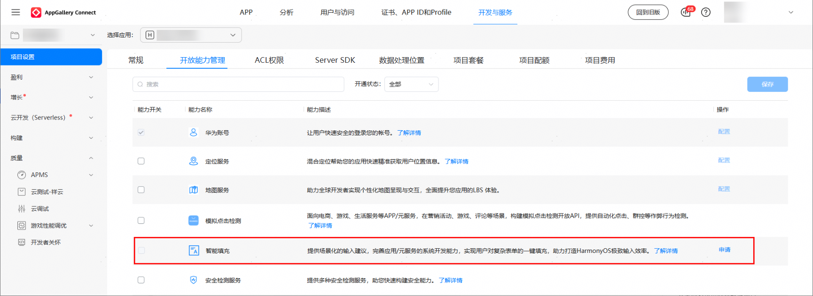
在“新建业务申请”窗口填写申请原因，选择上传附件，然后点击“提交”。  申请原因：请详细描述使用**智能填充的具体场景**。（例如：***应用是***（应用简介），希望在***场景中使用智能填充***字段信息，以提升用户表单填写效率。）字段信息请参考[ContentType使用场景说明](https://developer.huawei.com/consumer/cn/doc/harmonyos-guides/scenario-fusion-intelligentfilling-appendix)。上传附件：提供接入智能填充场景的页面图片或视频。
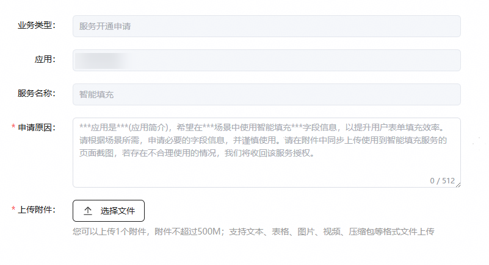
> [!NOTE]
> 请根据场景所需，申请必要的字段信息，并谨慎使用。若存在不合理使用的情况，我们将收回该服务授权。

进入互动中心页面，可看到申请已提交的消息。  返回“开放能力管理”页面，能力开关置灰，“申请”显示为“申请中”状态。  申请审批通过后，互动中心将收到通知。至此，已成功接入智能填充服务。
> [!NOTE]
> 审批通过后，预计30分钟生效。

## 前提条件

设备智能填充开关必须处于打开状态，请前往“设置 > 隐私和安全 > 智能填充”页面开启开关，页面中可查看“关于智能填充与隐私的声明”和“权限使用说明”。
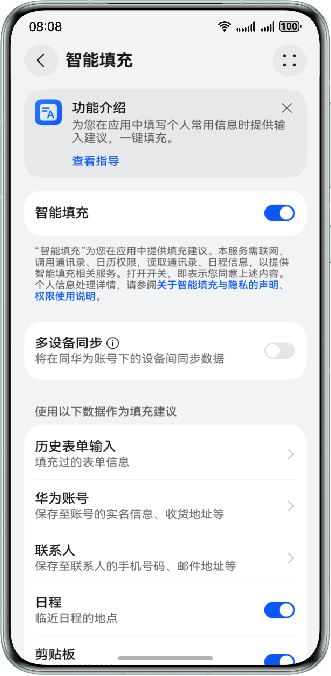
应用/元服务的输入组件的[ContentType](https://developer.huawei.com/consumer/cn/doc/harmonyos-guides/scenario-fusion-intelligentfilling-appendix)属性配置对应场景，即可触发智能填充功能。  设备已连接互联网。

## 表单智能填充

## 表单填充推荐场景

点击表单中任一配置了ContentType属性的输入组件，将在其下方弹窗展示推荐的填充数据，填充数据来源请参考[推荐数据源及推荐逻辑说明](https://developer.huawei.com/consumer/cn/doc/harmonyos-guides/scenario-fusion-intelligentfilling-explain)。 点击表单中ContentType为“PERSON_FULL_NAME”（姓名）或“PERSON_LAST_NAME”（姓氏）、“PERSON_FIRST_NAME”（名字）的输入组件时，将同时推荐表单中其他ContentType类型的数据（以下统称多输入框场景）。
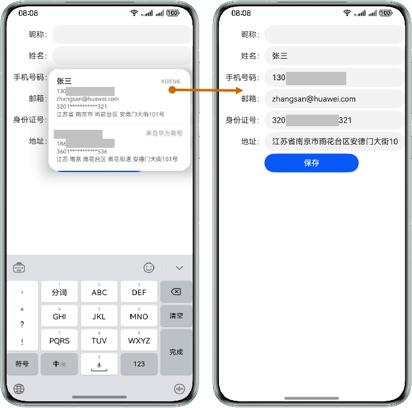
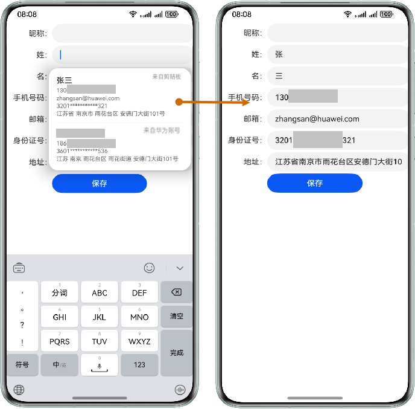
点击其他ContentType的输入组件时，只会推荐对应场景数据。例如点击ContentType为“NICKNAME”（昵称）的输入组件时，仅会在弹窗中推荐昵称数据（以下统称单输入框场景）。
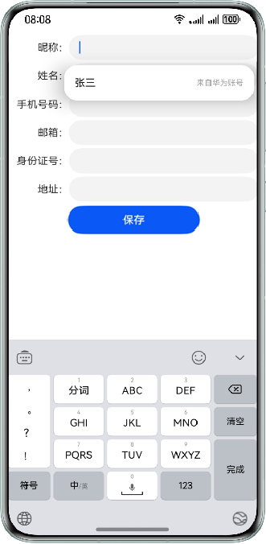
表单中存在ContentType为“PERSON_FULL_NAME”（姓名）或“PERSON_LAST_NAME”（姓氏）、“PERSON_FIRST_NAME”（名字）的输入组件且其中已填入信息，在点击其他已配置ContentType的输入组件时，将根据已填入的姓名信息进行信息匹配推荐。例如姓名填写“张三”，点击“手机号码”输入组件仅推荐数据源中“张三”相关的信息。
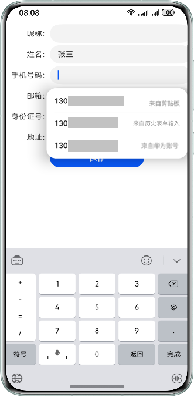
表单中存在ContentType为“PERSON_FULL_NAME”（姓名）或“PERSON_LAST_NAME”（姓氏）、“PERSON_FIRST_NAME”（名字）的输入组件且存在地址输入组件，在点击用户姓名类和地址信息类的ContentType输入组件时，若推荐的数据包含华为账号数据源的数据，且华为账号数据源的推荐数目少于推荐的华为账号收货地址数据时，可点击“更多地址”按钮拉起选择其他收货地址页面。
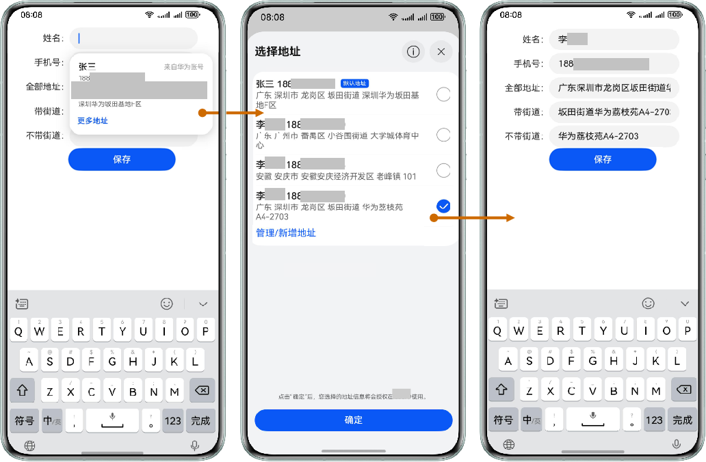

## 昵称填写推荐场景

当表单中需要昵称填写时，可从华为账号信息来源获取。

## 日程信息推荐场景

当表单中的输入组件仅配置了ContentType为“FORMAT_ADDRESS”（全量地址）时，会从日程信息中获取2小时内的数据进行填充推荐。
> [!NOTE]
> 日程数据源推荐场景目前仅支持中文地址。

 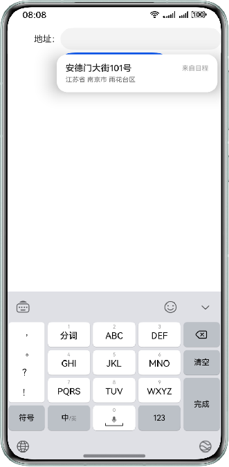

## 联系人信息推荐场景

点击配置了ContentType为“PHONE_NUMBER”（手机号）的输入组件时，若表单中存在ContentType为“PERSON_FULL_NAME”（姓名）或“PERSON_LAST_NAME”（姓氏）、“PERSON_FIRST_NAME”（名字）的输入组件且已填入信息，将根据其填入的信息来推荐联系人数据。
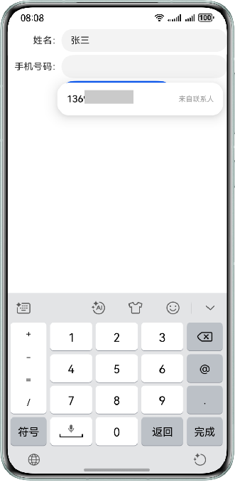

## 车牌信息推荐场景

从5.1.0(18)开始，支持智能填充的推荐车牌号场景。 当表单中需要车牌号填写时，可从历史表单输入数据源中获取机主本人的车牌信息。
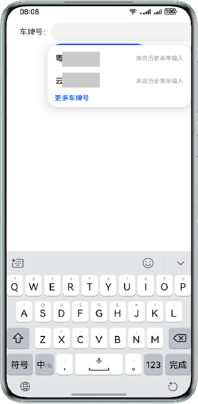

## 护照信息推荐场景

从5.1.0(18)开始，支持智能填充的护照信息推荐场景。 表单中存在ContentType为“COUNTRY_ADDRESS”（国籍）、“PASSPORT_NUMBER”（护照号）、“VALIDITY”（有效期至）、“ISSUE_AT”（签发地）的输入组件，在点击姓名类输入组件时，可从历史表单输入数据源中推荐护照信息。
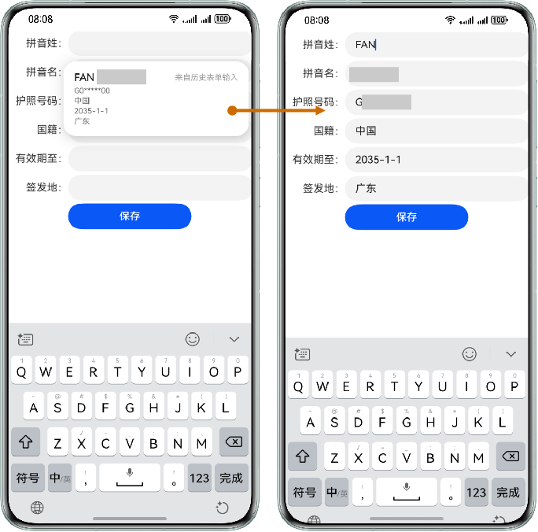

## 发票抬头推荐场景

从5.1.0(18)开始，支持智能填充的发票抬头推荐场景。 当表单中存在ContentType为“ORGANIZATION”（名称）和“TAX_ID”（税号）时，点击名称框可从华为账号数据源获取数据进行主动推荐，或根据输入内容进行匹配推荐，名称单框不支持推荐；税号框则根据名称框内容进行匹配推荐，名称框为空则进行主动推荐，税号单框不支持匹配推荐。
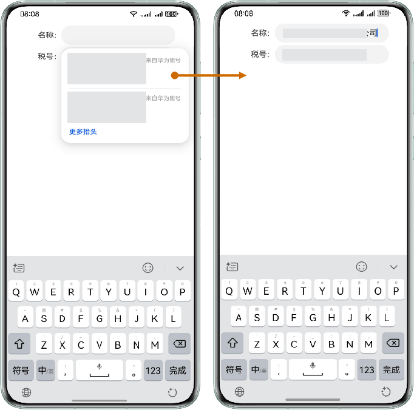

## 历史表单输入

保存在应用/元服务中填写的表单信息，用于后续表单填充推荐。

## 保存历史表单输入场景

填写表单信息时，表单中存在配置了ContentType属性的输入组件触发历史表单输入保存页面，选择“保存”后智能填充弹窗提示开通服务，开启智能填充开关后填写表单进行一键填充。
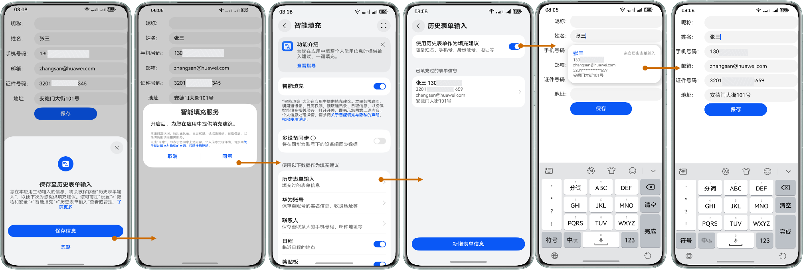
> [!NOTE]
> 当使用智能填充功能的表单页面在切换或退出时，会自动触发requestAutoSave接口进行历史表单输入保存请求，将弹出“保存至历史表单输入”页面。也可主动调用该接口触发历史表单输入保存。  “保存至历史表单输入”页面在点击“保存信息”按钮之后，若智能填充功能开关未打开，则弹出智能填充服务打开引导弹窗，点击“同意”按钮之后，智能填充开关会打开并将表单输入数据保存到历史表单输入中。  “保存至历史表单输入”页面在点击“忽略”按钮后，该应用24小时之内不会再次询问。该设备累计忽略5次后，页面中将显示“忽略后不再询问”勾选框，勾选之后点击“忽略”按钮，后续将不再询问。

## 更新已有历史表单输入记录

当表单中存在ContentType为“PERSON_FULL_NAME”（姓名）的输入组件时，且表单还存在其他任一配置了ContentType的输入组件，在触发保存时若历史表单输入记录中存在该姓名的记录且其他数据存在差异，则拉起页面提示“更新已有记录”或“保存为新记录”。
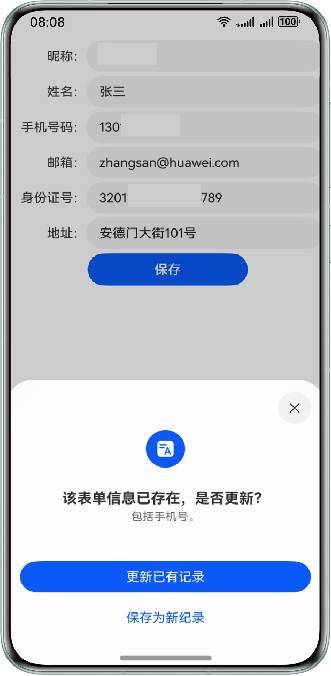

## 手动新增/修改历史表单输入场景

在智能填充页面或个人信息页面可以对历史表单输入进行管理。当历史表单输入中无数据，可点击“新增表单信息”进行新增；也可对已保存的信息进行修改或删除（当设备设置锁屏密码，进入历史表单输入时，需要输入锁屏密码）。
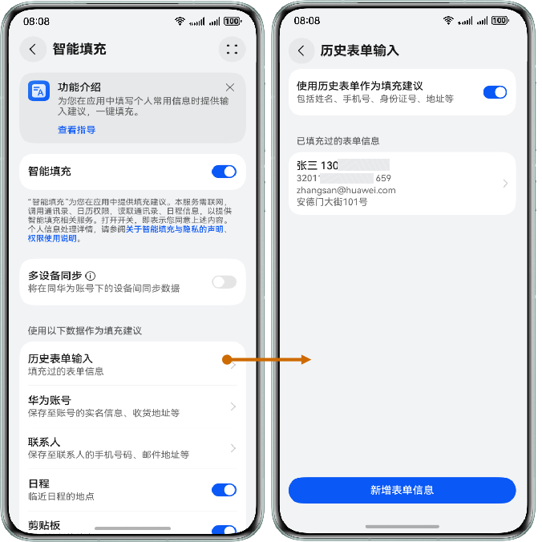

## 云空间同步数据

同一华为账号下通过云空间实现数据上云保存，用于多设备数据同步。

## 云空间多设备同步数据场景

登录华为账号后“云空间服务 ”中 智能填充开关默认开启，可以实现多设备同步历史表单输入数据。

