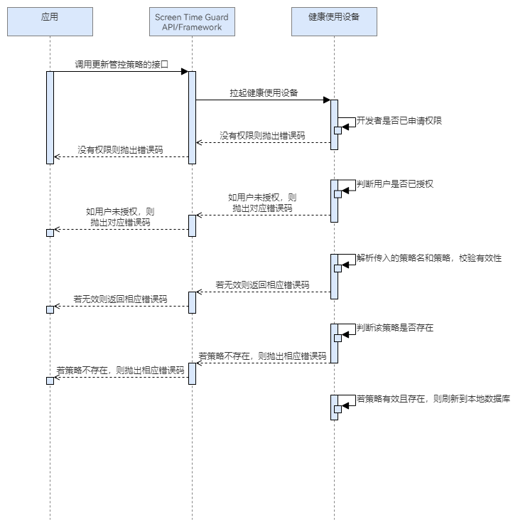

# 修改策略

更新时间：2026-04-30 02:41:24

来源：https://developer.huawei.com/consumer/cn/doc/harmonyos-guides/screentimeguard-update-guard-strategy

##### 场景介绍

当用户希望调整现有的屏幕时间守护规则时，可以调用更新管控策略的接口。我们kit支持根据参数中传入的策略名以及修改策略的方案，用户可以修改各种策略，如调整各个应用的停用起止时间。一旦修改完成并保存，系统将根据新的规则对用户的屏幕使用行为进行管控。


##### 业务流程





流程说明：
1. 应用调用更新管控策略的接口时，会拉起健康使用设备查询本应用是否已申请权限，以及用户是否对本应用授权。
2. 若没有权限，则抛出相应错误码；若有权限，则解析参数中传入的策略，并判断策略是否有效、是否存在。
3. 若策略有效，则记录到本地数据库，策略完成修改；否则，抛出相应错误码。

> [!NOTE]
> 更新管控策略的策略名需和当前已有的策略一致，否则会抛出策略不存在错误。


##### 接口说明

修改策略的关键接口如下表所示：

| 接口名 | 描述 |
| --- | --- |
| updateGuardStrategy(strategyName: string, guardStrategy: GuardStrategy): Promise&lt;void&gt; | 修改屏幕时间管控策略。 |


##### 开发前提

修改管控策略需要申请用户授权，请先参考[请求用户授权](https://developer.huawei.com/consumer/cn/doc/harmonyos-guides/screentimeguard-request-user-auth)章节完成用户授权。


##### 开发步骤
1. 导入相关模块。

  
```text
import { guardService } from '@kit.ScreenTimeGuardKit';
import { hilog } from '@kit.PerformanceAnalysisKit';
import { BusinessError } from '@kit.BasicServicesKit';
```

2. 调用updateGuardStrategy，修改管控策略。

  
```text
private async updateStrategy(strategyName: string, guardStrategy: guardService.GuardStrategy): Promise<void> {
   try {
      await guardService.updateGuardStrategy(strategyName, guardStrategy);
   } catch (error) {
      let err: BusinessError = error as BusinessError;
      hilog.error(0x0000, 'GuardService',
         `updateGuardStrategy failed, errCode is ${err.code}, errMessage is ${err.message}`);
      }
}
```
