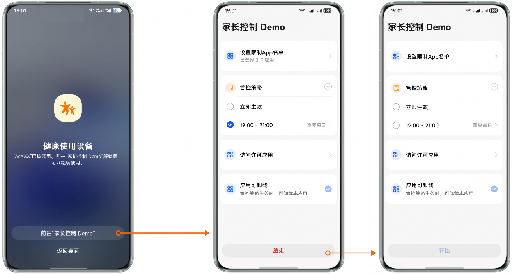
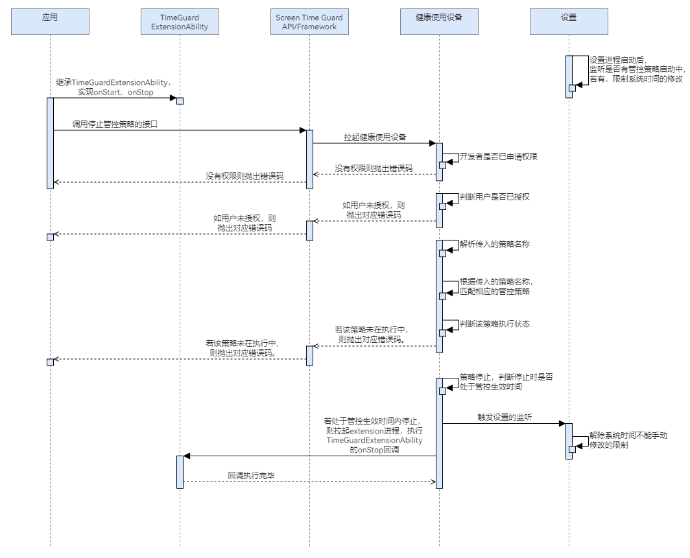

# 停止策略

更新时间：2026-04-30 02:41:24

来源：https://developer.huawei.com/consumer/cn/doc/harmonyos-guides/screentimeguard-stop-guard-strategy

#### 场景介绍

当用户希望停止某个管控规则时，可以调用停止管控策略的接口。根据参数中传入的策略名，应用可以停止对应管控策略。一旦策略被停止，系统将不再根据该规则对用户的屏幕使用行为进行监管。


#### 用户体验设计





#### 业务流程





流程说明：
1. 应用继承TimeGuardExtensionAbility，实现onStop方法，此步非必需。
2. 应用调用停止管控策略的接口，会拉起健康使用设备查询本应用是否已申请权限、用户是否已给本应用授权。
3. 若没有权限，则抛出相应错误码。若有权限，则解析参数中传入的策略名称，判断策略是否存在。
4. 若策略不存在，则抛出相应错误码；若存在，则查询该策略是否正在执行。
5. 若停止策略时正在执行策略，则策略会正常停止，健康使用设备会记录策略停止状态；若停止策略时策略并未执行，该接口将抛出策略未在执行中的错误码。
6. 策略生效期间停止策略，会拉起extension进程，执行TimeGuardExtensionAbility的onStop回调。在非策略生效期间停止策略，不会触发onStop回调。
7. 停止该策略后，若该应用不存在任何启动状态的策略，则该应用被设置为可卸载。
8. 停止该策略后，若设备中不存在任何启动状态的策略，则系统时间设置为可修改。


#### 接口说明

停止策略的关键接口如下表所示：

| 接口名 | 描述 |
| --- | --- |
| stopGuardStrategy(strategyName: string): Promise&lt;void&gt; | 根据策略名称，停止其管控策略。 |
| onStop(strategyName: string): Promise&lt;void&gt; | 在策略结束时执行特定逻辑。 |


#### 开发前提

停止管控策略需要申请用户授权，请先参考[请求用户授权](https://developer.huawei.com/consumer/cn/doc/harmonyos-guides/screentimeguard-request-user-auth)章节完成用户授权。


#### 停止管控策略
1. 导入相关模块。

  
```text
import { guardService } from '@kit.ScreenTimeGuardKit';
import { hilog } from '@kit.PerformanceAnalysisKit';
import { BusinessError } from '@kit.BasicServicesKit';
```

2. 调用stopGuardStrategy，停止管控策略。

  
```text
private async stopStrategy(strategyName: string): Promise<void> {
 try {
   await guardService.stopGuardStrategy(strategyName);
   // ...
 } catch (error) {
   let err: BusinessError = error as BusinessError;
   hilog.error(0x0000, 'GuardService',
     `stopGuardStrategy failed, errCode is ${err.code}, errMessage is ${err.message}`);
 }
}
```


#### 接收管控策略结束回调（可选）

开发者若需要在策略结束时执行特定逻辑（如发送通知提醒用户），可以通过接收策略结束时的回调来实现。
1. 导入相关模块。

  
```text
import { TimeGuardExtensionAbility } from '@kit.ScreenTimeGuardKit';
import { hilog } from '@kit.PerformanceAnalysisKit';
```

2. 继承TimeGuardExtensionAbility，重写onStop回调。

  
```text
export default class TimeGuardExtAbility extends TimeGuardExtensionAbility {
   async onStop(strategyName: string): Promise<void> {
      hilog.info(0x0000, 'TimeGuardExtensionAbility', `Strategy-${strategyName} onStop`);
   }
}
```

3. 在工程中entry模块的module.json5文件中的"extensionAbilities"节点添加如下代码。

  
```ArkTS
"extensionAbilities": [
   {
     "name": "TimeGuardExtAbility",
     "type": "screenTimeGuard",
     "srcEntry": "./ets/timeguardextability/TimeGuardExtAbility.ets",
     "exported": false,
     "skills": [
       {
         "actions": [
           "action.ohos.timeGuard.listener"
         ]
       }
     ],
   }
 ],
```
