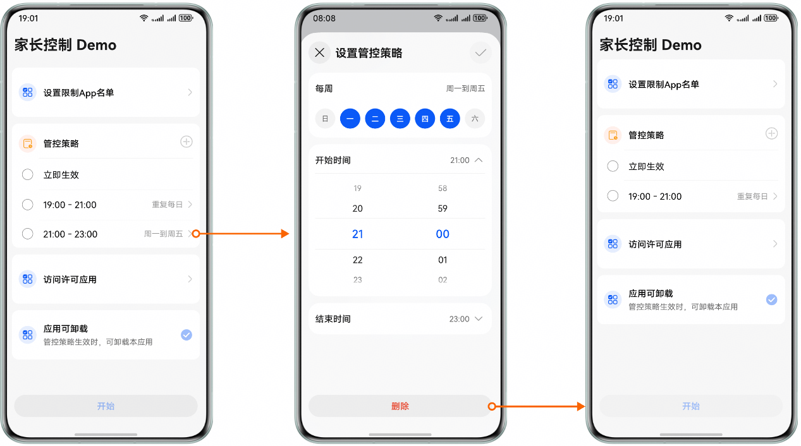
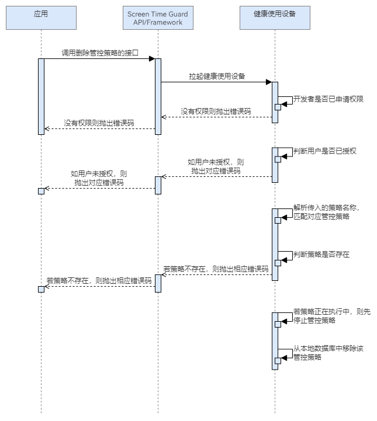

# 删除策略

更新时间：2026-04-30 02:41:24

来源：https://developer.huawei.com/consumer/cn/doc/harmonyos-guides/screentimeguard-remove-guard-strategy

#### 场景介绍

当应用希望删除现有的屏幕时间守护规则时，可以调用删除管控策略的接口。根据参数中传入的策略名删除对应的策略。一旦策略被删除，系统将不再根据该规则对用户的屏幕使用行为进行监管。


#### 用户体验设计





#### 业务流程





流程说明：
1. 应用调用删除管控策略的接口，拉起健康使用设备查询本应用是否已申请权限，以及用户是否对本应用授权。
2. 若没有权限，则抛出相应错误码。若有权限，则解析参数中传入的策略名称，判断策略是否存在。
3. 若策略不存在，则抛出相应错误码；若存在，则查询该策略是否正在执行。
4. 若策略在执行，则会先停止管控策略再删除。


#### 接口说明

删除策略的关键接口如下表所示：

| 接口名 | 描述 |
| --- | --- |
| removeGuardStrategy(strategyName: string): Promise&lt;void&gt; | 删除管控策略。 |


#### 开发前提

删除管控策略需要申请用户授权，请先参考[请求用户授权](https://developer.huawei.com/consumer/cn/doc/harmonyos-guides/screentimeguard-request-user-auth)章节完成用户授权。


#### 开发步骤
1. 导入相关模块。

  
```text
import { guardService } from '@kit.ScreenTimeGuardKit';
import { hilog } from '@kit.PerformanceAnalysisKit';
import { BusinessError } from '@kit.BasicServicesKit';
```

2. 调用removeGuardStrategy，删除管控策略。

  
```text
private async removeStrategy(strategyName: string): Promise<void> {
   try {
      await guardService.removeGuardStrategy(strategyName);
   } catch (error) {
      let err: BusinessError = error as BusinessError;
      hilog.error(0x0000, 'GuardService',
         `removeGuardStrategy failed, errCode is ${err.code}, errMessage is ${err.message}`);
   }
}
```
