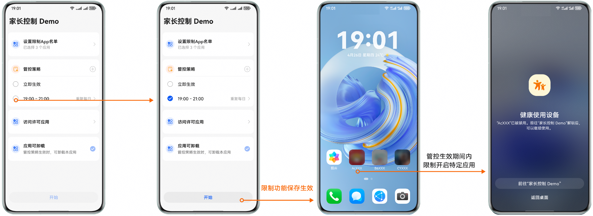
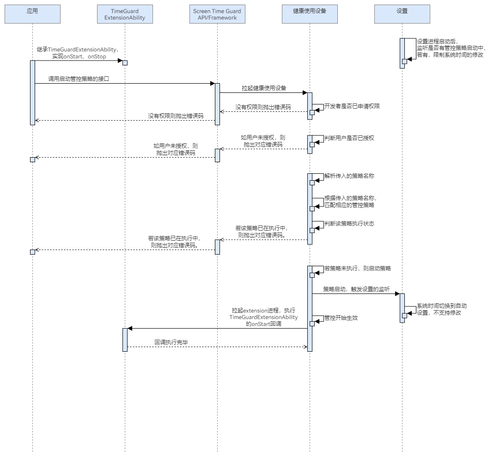

# 启动策略

更新时间：2026-04-30 02:41:24

来源：https://developer.huawei.com/consumer/cn/doc/harmonyos-guides/screentimeguard-start-guard-strategy

## 场景介绍

当应用希望启动某个管控规则时，可以调用启动管控策略的接口。根据参数中传入的策略名，应用可以启动对应管控策略。一旦策略被创建并启用，系统将根据规则对用户的屏幕使用行为进行监管。

## 用户体验设计



## 业务流程


流程说明： 继承TimeGuardExtensionAbility，实现onStart方法，此步非必需。 调用启动管控策略的接口，拉起健康使用设备查询开发者是否已申请权限，以及用户是否授权。 若开发者没有权限或用户未授权，则抛出相应错误码。若开发者有权限且用户已授权，则解析参数中传入的策略名称，判断策略是否存在。 若策略不存在，则抛出相应错误码；若存在，则查询该策略是否正在执行。 若查询的策略未执行，则正常启动策略，并记录启动状态；否则，抛出策略已在执行中的错误码。 策略启动后，系统时间被设置为不可修改，若管控发起应用在[请求用户授权](https://developer.huawei.com/consumer/cn/doc/harmonyos-guides/screentimeguard-request-user-auth#接口说明)时没有设置应用配置信息或应用配置为不可卸载，会被设置为不可卸载。 当到了管控生效的时间，管控开始生效，拉起extension进程，执行TimeGuardExtensionAbility的onStart回调。

## 接口说明

启动策略的关键接口如下表所示：
| 接口名 | 描述 |
| --- | --- |
| [startGuardStrategy](https://developer.huawei.com/consumer/cn/doc/harmonyos-references/screentimeguard-guardservice#startguardstrategy)(strategyName: string): Promise | 根据策略名称，启动其管控策略。 |
| [onStart](https://developer.huawei.com/consumer/cn/doc/harmonyos-references/screentimeguard-timeguardextensionability#onstart)(strategyName: string): Promise | 在策略启动时执行特定逻辑。 |


## 开发前提

启动管控策略需要申请用户授权，请先参考[请求用户授权](https://developer.huawei.com/consumer/cn/doc/harmonyos-guides/screentimeguard-request-user-auth)章节完成用户授权。

## 启动管控策略

导入相关模块。
```text
import { guardService } from '@kit.ScreenTimeGuardKit';
import { hilog } from '@kit.PerformanceAnalysisKit';
import { BusinessError } from '@kit.BasicServicesKit';
```

调用startGuardStrategy，启动管控策略。
```text
private async startStrategy(strategyName: string): Promise {
   try {
      await guardService.startGuardStrategy(strategyName);
      // ...
   } catch (error) {
      let err: BusinessError = error as BusinessError;
      hilog.error(0x0000, 'GuardService',
         `startGuardStrategy failed, errCode is ${err.code}, errMessage is ${err.message}`);
   }
}
```


## 接收管控策略生效回调（可选）

开发者若需要在策略生效时执行特定逻辑（如发送通知提醒用户），可以通过接收策略生效时的回调来实现。 导入相关模块。
```text
import { TimeGuardExtensionAbility } from '@kit.ScreenTimeGuardKit';
import { hilog } from '@kit.PerformanceAnalysisKit';
```

继承TimeGuardExtensionAbility，重写onStart回调。
```text
export default class TimeGuardExtAbility extends TimeGuardExtensionAbility {
   async onStart(strategyName: string): Promise {
      hilog.info(0x0000, 'TimeGuardExtensionAbility', `Strategy-${strategyName} onStart`);
   }
}
```

在工程中entry模块的module.json5文件中的"extensionAbilities"节点添加如下代码。
```text
"extensionAbilities": [
   {
     "name": "TimeGuardExtAbility",
     "type": "screenTimeGuard",
     "srcEntry": "./ets/timeguardextability/TimeGuardExtAbility.ets",
     "exported": false,
     "skills": [
       {
         "actions": [
           "action.ohos.timeGuard.listener"
         ]
       }
     ],
   }
 ],
```
