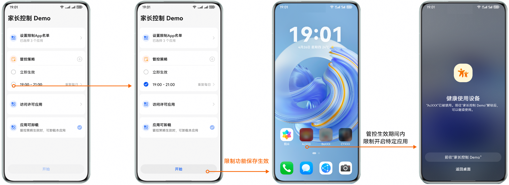
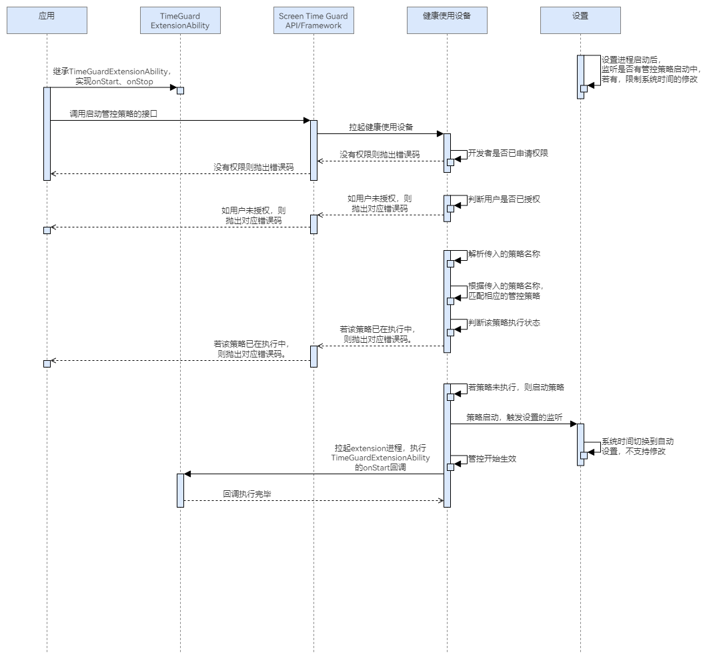

# 启动策略

更新时间：2026-06-12 06:54:11

来源：https://developer.huawei.com/consumer/cn/doc/harmonyos-guides/screentimeguard-start-guard-strategy

#### 场景介绍

配置管控策略完成后，需要启动管控策略，才能确保管控策略生效。启动管控策略后，系统将根据规则对用户的屏幕使用行为进行管控。当前支持的启动策略方式包括立即启动、指定未来的某一时间启动。

从26.0.0版本开始，新增支持在指定时间启动管控策略。


#### 用户体验设计





#### 业务流程





流程说明：
1. 继承TimeGuardExtensionAbility，实现onStart方法，此步非必需。
2. 调用启动管控策略的接口，拉起健康使用设备查询开发者是否已申请权限，以及用户是否授权。
3. 若开发者没有权限或用户未授权，则抛出相应错误码。若开发者有权限且用户已授权，则解析参数中传入的策略名称，判断策略是否存在。
4. 若策略不存在，则抛出相应错误码；若存在，则查询该策略是否正在执行。
5. 若查询的策略正在执行，则抛出相应的错误码；若不在执行，则查询接口参数是否传入启动时间。
6. 若参数传入了启动时间，则在该时间启动管控策略；若参数没有传入启动时间，立即启动管控策略，并记录启动状态。
7. 策略启动后，系统时间被设置为不可修改，若管控发起应用在[请求用户授权](https://developer.huawei.com/consumer/cn/doc/harmonyos-guides/screentimeguard-request-user-auth#接口说明)时没有设置应用配置信息或应用配置为不可卸载，会被设置为不可卸载。
8. 当到了管控生效的时间，管控开始生效，拉起extension进程，执行TimeGuardExtensionAbility的onStart回调。


#### 接口说明

启动策略的关键接口如下表所示：

| 接口名 | 描述 |
| --- | --- |
| startGuardStrategy(strategyName: string): Promise&lt;void&gt; | 根据策略名称，立即启动其管控策略。 |
| startGuardStrategy(strategyName: string, startDate: Date): Promise&lt;void&gt; | 根据策略名称，在设置的时间启动其管控策略。 |
| onStart(strategyName: string): Promise&lt;void&gt; | 在策略启动时执行特定逻辑。 |


> [!NOTE]
> startGuardStrategy接口支持应用指定策略的启用时间，如果设置的时间小于等于当前时间，直接生效；如果大于当前时间，等设置时间到达后生效。 ScreenTimeGuard Kit取指定的startDate分钟级别的时刻进行启动管控策略操作。


#### 开发前提

启动管控策略需要申请用户授权，请先参考[请求用户授权](https://developer.huawei.com/consumer/cn/doc/harmonyos-guides/screentimeguard-request-user-auth)章节完成用户授权。


#### 启动管控策略
1. 导入相关模块。

  
```text
import { guardService } from '@kit.ScreenTimeGuardKit';
import { hilog } from '@kit.PerformanceAnalysisKit';
import { BusinessError } from '@kit.BasicServicesKit';
```

2. 调用startGuardStrategy，启动管控策略。

  
```text
private async startStrategy(strategyName: string): Promise<void> {
  try {
    // 从6.0.0(20)版本开始，支持调用此接口，立即启动管控策略。
    await guardService.startGuardStrategy(strategyName);
    // ...
  } catch (error) {
    let err: BusinessError = error as BusinessError;
    hilog.error(0x0000, 'GuardService',
      `startGuardStrategy failed, errCode is ${err.code}, errMessage is ${err.message}`);
  }
}

private async startStrategyAtSpecificTime(strategyName: string): Promise<void> {
  try {
    // 从26.0.0版本开始，支持调用此接口，在未来的某一时间启动管控策略。
    const now = new Date();
    const startDate = new Date(now.getTime() + 5 * 60 * 1000);
    await guardService.startGuardStrategy(strategyName, startDate);
    // ...
  } catch (error) {
    let err: BusinessError = error as BusinessError;
    hilog.error(0x0000, 'GuardService',
      `startGuardStrategy failed, errCode is ${err.code}, errMessage is ${err.message}`);
  }
}
```


#### 接收管控策略生效回调（可选）

开发者若需要在策略生效时执行特定逻辑（如发送通知提醒用户），可以通过接收策略生效时的回调来实现。
1. 导入相关模块。

  
```text
import { TimeGuardExtensionAbility } from '@kit.ScreenTimeGuardKit';
import { hilog } from '@kit.PerformanceAnalysisKit';
```

2. 继承TimeGuardExtensionAbility，重写onStart回调。

  
```text
export default class TimeGuardExtAbility extends TimeGuardExtensionAbility {
  async onStart(strategyName: string): Promise<void> {
    hilog.info(0x0000, 'TimeGuardExtensionAbility', `Strategy-${strategyName} onStart`);
  }

  // ...
}
```

3. 在工程中entry模块的module.json5文件中的"extensionAbilities"节点添加如下代码。

  
```ArkTS
"extensionAbilities": [
  {
    "name": "TimeGuardExtAbility",
    "type": "screenTimeGuard",
    "srcEntry": "./ets/timeguardextability/TimeGuardExtAbility.ets",
    "exported": false,
    "skills": [
      {
        "actions": [
          "action.ohos.timeGuard.listener"
        ]
      }
    ],
  }
],
```
