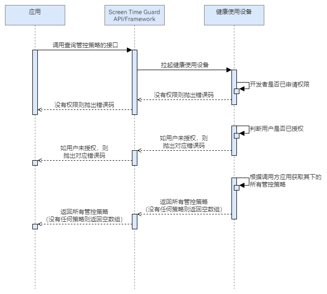

# 查询策略配置数据

更新时间：2026-06-27 10:02:54

来源：https://developer.huawei.com/consumer/cn/doc/harmonyos-guides/screentimeguard-query-guard-strategies

#### 场景介绍

当管控应用希望查看已添加的所有管控策略时，可以调用查询管控策略的接口。调用成功后，管控应用可以查看所有已添加管控策略的配置数据，如查看被管控应用的停用时间或可使用时长。


#### 业务流程





流程说明：
1. 应用调用查询管控策略的接口，拉起健康使用设备查询本应用是否已申请权限，以及用户是否对本应用授权。
2. 若没有权限，则抛出相应错误码；若有权限，则返回对应应用下的所有管控策略。


#### 接口说明

查询策略的关键接口如下表所示：

| 接口名 | 描述 |
| --- | --- |
| queryGuardStrategies(): Promise<GuardStrategy[]> | 查询该应用下的所有管控策略。 |


#### 开发前提

查询管控策略需要申请用户授权，请先参考[请求用户授权](https://developer.huawei.com/consumer/cn/doc/harmonyos-guides/screentimeguard-request-user-auth)章节完成用户授权。


#### 开发步骤
1. 导入相关模块。

  
```text
import { guardService } from '@kit.ScreenTimeGuardKit';
import { hilog } from '@kit.PerformanceAnalysisKit';
import { BusinessError } from '@kit.BasicServicesKit';
```

2. 调用queryGuardStrategies，查询对应应用下的所有管控策略。

  
```text
private async isStrategyExist(strategyName: string): Promise<boolean> {
  try {
    let guardStrategies: guardService.GuardStrategy[] = await guardService.queryGuardStrategies();
    for (let i = 0; i < guardStrategies.length; i++) {
      if (guardStrategies[i].name === strategyName) {
        return true;
      }
    }
  } catch (error) {
    let err: BusinessError = error as BusinessError;
    hilog.error(0x0000, 'GuardService',
      `queryGuardStrategies failed, errCode is ${err.code}, errMessage is ${err.message}`);
  }
  return false;
}
```
