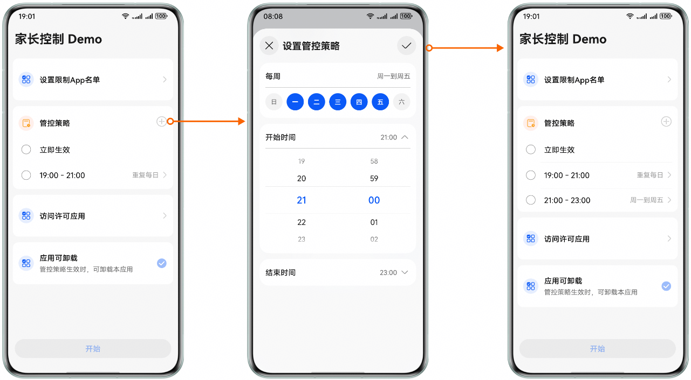
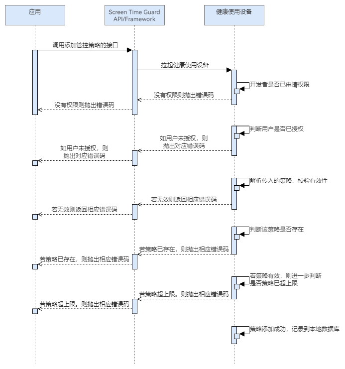

# 添加策略

更新时间：2026-04-30 02:41:24

来源：https://developer.huawei.com/consumer/cn/doc/harmonyos-guides/screentimeguard-add-guard-strategy

## 场景介绍

当用户希望创建新的屏幕时间守护规则时，可以调用添加管控策略的接口。根据参数中传入的策略，用户可以添加各种策略，如设置各个应用的停用起止时间。一旦策略被创建并启用，系统将根据规则对用户的屏幕使用行为进行监管。

## 用户体验设计



## 业务流程


流程说明： 应用调用添加管控策略的接口，拉起健康使用设备查询本应用是否已申请权限，以及用户是否已给本应用授权。 若没有权限，则抛出相应错误码；若有权限，则解析参数中传入的策略，判断策略是否有效、是否重复、数量是否超限。 若策略正常，则记录到本地数据库；否则，抛出相应错误码。
> [!NOTE]
> 管控策略可以设置为起止时间策略，表示策略在一天内配置的起始时间和结束时间内生效；也可以设置为总时长策略类型，表示一天内策略生效的总时长；也可以设置为共享时长策略类型，表示策略关联的所有应用共享同一可用时长配额。具体可参考TimeStrategyType 。 管控策略可以设置限制类型，按允许清单做限制表示对传入的应用之外的应用进行管控，按禁止清单做限制表示对传入的应用进行限制。具体可参考RestrictionType 。 管控策略可以设置一周内重复执行时间，支持填写含有1-7数字的number数组，表示在周一到周日的某些天重复执行。具体可参考TimeStrategy 。


## 接口说明

添加策略的关键接口如下表所示：
| 接口名 | 描述 |
| --- | --- |
| [addGuardStrategy](https://developer.huawei.com/consumer/cn/doc/harmonyos-references/screentimeguard-guardservice#addguardstrategy)(guardStrategy: [GuardStrategy](https://developer.huawei.com/consumer/cn/doc/harmonyos-references/screentimeguard-guardservice#guardstrategy)): Promise | 添加屏幕时间管控策略。 |


## 开发前提

添加管控策略需要申请用户授权，请先参考[请求用户授权](https://developer.huawei.com/consumer/cn/doc/harmonyos-guides/screentimeguard-request-user-auth)章节完成用户授权。

## 开发步骤

导入相关模块。
```text
import { guardService } from '@kit.ScreenTimeGuardKit';
import { hilog } from '@kit.PerformanceAnalysisKit';
import { BusinessError } from '@kit.BasicServicesKit';
```

定义屏幕时间管理策略。
```text
guardStrategy: guardService.GuardStrategy = {
      name: 'GuardStrategy',
      timeStrategy: {
      type: guardService.TimeStrategyType.START_END_TIME_TYPE,
      startTime: '19:00',
      endTime: '21:00',
      repeat: [1, 2, 3, 4, 5, 6, 7]
   },
   appInfo: { appTokens: [] }, // 可通过startAppPicker接口获取
   appRestrictionType: guardService.RestrictionType.BLOCKLIST_TYPE
};
```

调用addGuardStrategy，添加屏幕时间管控策略。
```text
private async addStrategy(guardStrategy: guardService.GuardStrategy): Promise {
   try {
   await guardService.addGuardStrategy(guardStrategy);
   } catch (error) {
      let err: BusinessError = error as BusinessError;
      hilog.error(0x0000, 'GuardService',
         `addGuardStrategy failed, errCode is ${err.code}, errMessage is ${err.message}`);
   }
}
```
