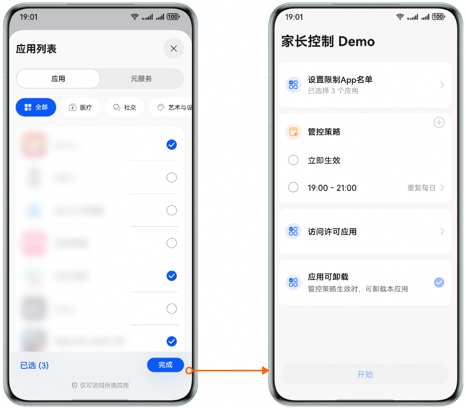

# 概述

更新时间：2026-06-12 06:54:11

来源：https://developer.huawei.com/consumer/cn/doc/harmonyos-guides/screentimeguard-apps-restriction-overview

Screen Time Guard Kit中的应用访问限制功能，支持根据接口传入的应用token，实现对指定应用设置访问限制或解除访问限制。
  

#### 用户体验设计

