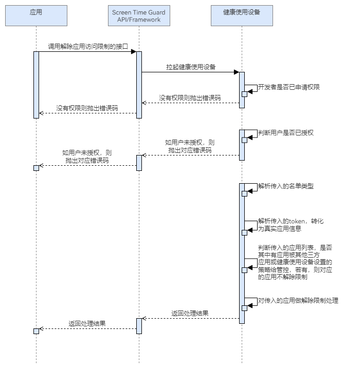

# 解除应用访问限制

更新时间：2026-04-30 02:41:24

来源：https://developer.huawei.com/consumer/cn/doc/harmonyos-guides/screentimeguard-release-apps-restriction

##### 场景介绍

当用户希望解除用户访问某些特定应用的限制时，可以调用解除应用访问限制的接口。根据参数中传入的token以及限制类型（允许/禁用），将允许/禁用清单解析后，解除对应的应用的限制。


##### 业务流程





流程说明：
1. 应用调用解除应用访问限制的接口，拉起健康使用设备查询开发者是否已申请权限，以及用户是否授权。
2. 若开发者没有权限或用户没有授权，则抛出相应错误码。若开发者有权限且用户已授权，则解析参数中传入的限制类型以及token。
3. 该接口判断传入的应用列表，是否其中有应用被其他三方应用或健康使用设备设置的策略给管控，若有，则对应的应用不解除限制。
4. 对剩余的应用解除限制，返回处理结果。


##### 接口说明

解除应用访问限制的关键接口如下表所示：

| 接口名 | 描述 |
| --- | --- |
| releaseAppsRestriction(appInfo: AppInfo, restrictionType: RestrictionType): Promise&lt;void&gt; | 根据传入的应用token数组和限制类型（允许/禁用清单），解除对应应用的访问限制。 |


> [!NOTE]
> 定义释义： 限制类型为禁用清单时，对应用数组中的应用做解除限制。 限制类型为允许清单时，对应用数组以外的应用做解除限制。 边界场景： 1、如果传入的应用数组为空，限制类型为禁用清单，则不对任何应用做解除限制。 2、如果传入的应用数组为空，限制类型为允许清单，则对除了系统内置允许清单应用（电话、联系人、设置、未成年人模式）、管控发起应用本身、已授权的管控应用之外的所有应用做解除限制。 3、同一个管控应用的限制和解除限制需对称使用，即解除限制必须和其限制的类型匹配上，如不匹配，则为参数错误；如果之前没有做过setAppsRestriction管控，也为参数错误。 4、如果要对之前用禁用清单方式做限制的应用做解除限制，则传入的应用数组需包含所有的禁用清单应用，才可全部解除。 5、传入的应用数组中如果包含了限制时传入的应用数组以外的应用（或包含无效token），则为参数错误。


##### 开发前提

解除应用访问限制需要申请用户授权，请先参考[请求用户授权](https://developer.huawei.com/consumer/cn/doc/harmonyos-guides/screentimeguard-request-user-auth)章节完成用户授权。


##### 开发步骤
1. 导入相关模块。

  
```text
import { guardService } from '@kit.ScreenTimeGuardKit';
import { hilog } from '@kit.PerformanceAnalysisKit';
import { BusinessError } from '@kit.BasicServicesKit';
```

2. 调用releaseAppsRestriction，解除应用访问限制。

  
```text
private async releaseApps(appInfo: guardService.AppInfo): Promise<void> {
   try {
      await guardService.releaseAppsRestriction(appInfo, guardService.RestrictionType.BLOCKLIST_TYPE);
      // ...
   } catch (error) {
      let err: BusinessError = error as BusinessError;
      hilog.error(0x0000, 'GuardService',
         `releaseAppsRestriction failed, errCode is ${err.code}, errMessage is ${err.message}`);
   }
}
```
