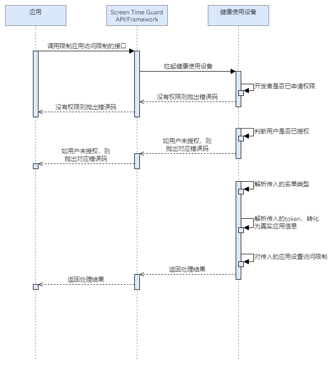

# 设置应用访问限制

更新时间：2026-04-30 02:41:24

来源：https://developer.huawei.com/consumer/cn/doc/harmonyos-guides/screentimeguard-set-apps-restriction

##### 场景介绍

当用户希望限制用户访问某些特定应用时，可以调用限制应用访问的接口。根据参数中传入的token以及限制类型（允许/禁用），可以限制用户对禁用名单中应用的访问，或只允许用户访问允许清单中的应用。


##### 业务流程





流程说明：
1. 应用调用设置应用访问限制的接口，拉起健康使用设备查询开发者是否已申请权限，以及用户是否授权。
2. 若开发者没有权限或用户没有授权，则抛出相应错误码。若开发者有权限且用户已授权，则解析参数中传入的限制类型以及token，对应用做限制处理，返回处理结果。


##### 接口说明

限制应用访问的关键接口如下表所示：

| 接口名 | 描述 |
| --- | --- |
| setAppsRestriction(appInfo: AppInfo, restrictionType: RestrictionType): Promise&lt;void&gt; | 根据传入的应用token数组和限制类型（禁用/允许清单），确定是否限制对应应用的访问。 |


> [!NOTE]
> 定义释义： 限制类型为禁用清单时，对应用数组中的应用做限制。 限制类型为允许清单时，对应用数组以外的应用做限制。 边界场景： 1、如果传入的应用数组为空，限制类型为禁用清单，则不对任何应用做限制。该场景相当于没有开启有效管控。 2、如果传入的应用数组为空，限制类型为允许清单，则对系统内置允许清单应用（电话、联系人、设置、未成年人模式）、管控发起应用本身、已授权的管控应用之外的所有应用做限制。 3、对同一个管控应用，如果反复调用该接口做限制（不管是允许清单还是禁用清单），均以最新的一次的限制来生效。 4、传入的应用数组中如果包含无效token，则为参数错误。


##### 开发前提

设置应用访问限制需要申请用户授权，请先参考[请求用户授权](https://developer.huawei.com/consumer/cn/doc/harmonyos-guides/screentimeguard-request-user-auth)章节完成用户授权。


##### 开发步骤
1. 导入相关模块。

  
```text
import { guardService } from '@kit.ScreenTimeGuardKit';
import { hilog } from '@kit.PerformanceAnalysisKit';
import { BusinessError } from '@kit.BasicServicesKit';
```

2. 调用setAppsRestriction，设置应用访问限制。

  
```text
private async restrictApps(appInfo: guardService.AppInfo): Promise<void> {
   try {
      await guardService.setAppsRestriction(appInfo, guardService.RestrictionType.BLOCKLIST_TYPE);
      // ...
   } catch (error) {
      let err: BusinessError = error as BusinessError;
      hilog.error(0x0000, 'GuardService',
         `setAppsRestriction fail, errCode is ${err.code}, errMessage is ${err.message}`);
   }
}
```
