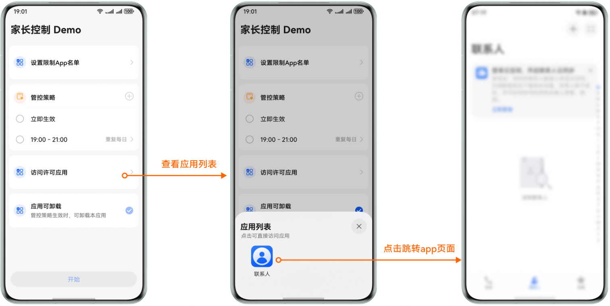
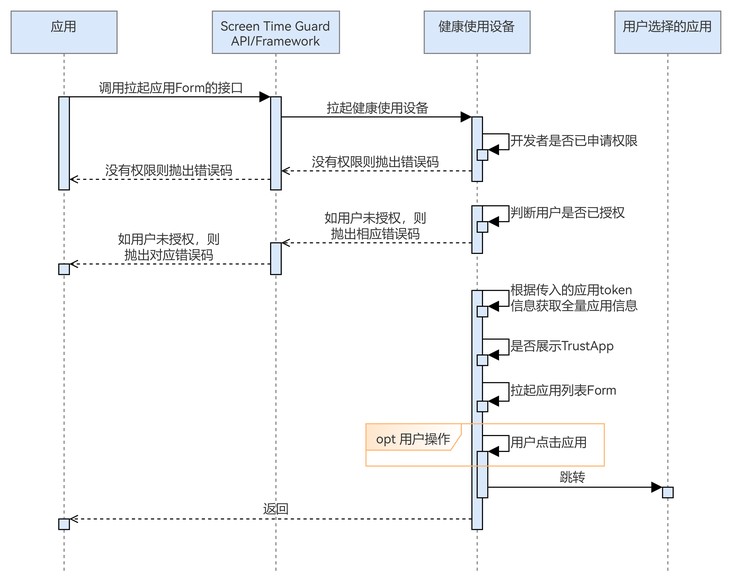

# 拉起许可应用跳转页

更新时间：2026-04-30 02:41:24

来源：https://developer.huawei.com/consumer/cn/doc/harmonyos-guides/screentimeguard-start-app-form

##### 场景介绍

从6.0.2(22)版本开始，新增支持拉起许可应用跳转页功能。为实现用户在被管控期间快速跳转到许可应用的诉求，开发者可调用startAppForm接口拉起应用跳转页，页面中将展示通过接口参数传入的许可应用token对应的应用列表。用户点击其中的应用图标后能跳转到该应用。


##### 用户体验设计





##### 业务流程





流程说明：
1. 应用调用拉起许可应用跳转页的接口，拉起健康使用设备查询开发者是否已申请权限，以及用户是否授权。
2. 若状态为未授权，则抛出对应错误码；若状态为已授权，应用将根据传入的应用token信息获取全量应用信息，判断是否展示TrustApp，并拉起应用列表Form。
3. 用户点击跳转页中的应用，跳转到相应的应用。


##### 接口说明

拉起许可应用跳转页的关键接口如下表所示：

| 接口名 | 描述 |
| --- | --- |
| startAppForm(context: common.Context, appSelection: guardService.AppInfo, appSubTitle: string, displayTrustApp: boolean): Promise&lt;void&gt; | 拉起许可应用跳转页。 |


##### 开发前提

拉起许可应用跳转页需要申请用户授权，请先参考[请求用户授权](https://developer.huawei.com/consumer/cn/doc/harmonyos-guides/screentimeguard-request-user-auth)章节完成用户授权。


##### 开发步骤
1. 导入相关模块。

  
```text
import { appPicker } from '@kit.ScreenTimeGuardKit';
import { hilog } from '@kit.PerformanceAnalysisKit';
import { BusinessError } from '@kit.BasicServicesKit';
```

2. 调用startAppForm，拉起许可应用跳转页。

  
```text
private async jumpTo3rdApp(selectedAppTokens: string[], subtitle: string): Promise<void> {
   try {
      await appPicker.startAppForm(
         this.getUIContext().getHostContext(), { appTokens: selectedAppTokens }, subtitle, true);
   } catch(error) {
      let err: BusinessError = error as BusinessError;
      hilog.error(this.domainId, this.logTag,
         `startAppForm fail, errCode is ${err.code}, errMessage is ${err.message}`);
   }
}
```
