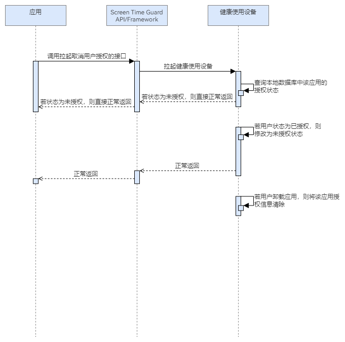

# 取消用户授权

更新时间：2026-04-30 02:41:24

来源：https://developer.huawei.com/consumer/cn/doc/harmonyos-guides/screentimeguard-revoke-user-auth

## 场景介绍

当开发者希望取消应用的Screen Time Guard Kit授权时，可以通过调用取消用户授权的接口进行取消。一旦权限被取消，应用将无法再访问或使用对用户设备的时间管理等功能。如果应用尝试继续调用与屏幕守护时间模块相关的接口，系统会返回用户未授权使用的错误码，以确保功能的安全性和隐私保护。

## 业务流程


流程说明： 应用想要取消访问Screen Time Guard Kit的权限，需要调用拉起取消用户授权的接口，拉起健康使用设备查询本地数据库中该应用的授权状态。 若状态为未授权，则直接正常返回；若状态为已授权，修改为未授权状态后正常返回。

## 接口说明

取消用户授权关键接口如下表所示：
| 接口名 | 描述 |
| --- | --- |
| [revokeUserAuth](https://developer.huawei.com/consumer/cn/doc/harmonyos-references/screentimeguard-guardservice#revokeuserauth)(): Promise | 取消用户授权访问Screen Time Guard Kit的相关管控接口。 |
| [getUserAuthStatus](https://developer.huawei.com/consumer/cn/doc/harmonyos-references/screentimeguard-guardservice#getuserauthstatus)(): Promise | 获取用户授权状态。 |


## 开发步骤

导入相关模块。
```text
import { guardService } from '@kit.ScreenTimeGuardKit';
import { hilog } from '@kit.PerformanceAnalysisKit';
import { BusinessError } from '@kit.BasicServicesKit';
```

调用revokeUserAuth，取消用户授权。
```text
public async revokeUserAuth(): Promise {
   try {
      await guardService.revokeUserAuth();
   } catch (error) {
      let err: BusinessError = error as BusinessError;
      hilog.error(0x0000, 'GuardService',
         `revokeUserAuth failed, errCode is ${err.code}, errMessage is ${err.message}`);
   }
}
```

获取用户授权状态。
```text
public async getUserAuthStatus(): Promise {
   try {
      const status = await guardService.getUserAuthStatus();
      hilog.info(0x0000, 'GuardService', `user auth status: ${status}`);
   } catch (error) {
      let err: BusinessError = error as BusinessError;
      hilog.error(0x0000, 'GuardService',
         `removeGuardStrategy failed, errCode is ${err.code}, errMessage is ${err.message}`);
   }
}
```
